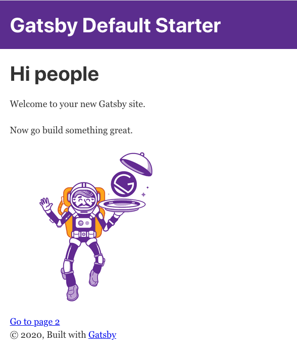

Now it's time for you to deploy your static app to the Cloud. 

Start by opening up a terminal and locate your application in the file system.

## Push your app to a Git repository


The Azure Static Web App service is able to help us deploy our app to the Cloud. However, the service expects our app to exist as a GitHub repository, currently your app live on your machine.

To prepare the app for deploy, we will need to take the following steps:

1. Create a Git repository
2. Create a GitHub repository and push to the local Git repository to it

### Create a Git repository

In the console, navigate to root of your project, then run the following commands to initialize a Git repository and commit all of your files to it:"

```bash
git init
```


### Create a GitHub repo and push the code

Next, go to GitHub and log on. You should now be on a URL like so `https://github.com/<your username>?tab=repositories`

Now click the `new` button as indicated below:


Now give your repository a suitable name and click `Create repository` as indicated below:


Next you should be faced with two sets of instructions. One if you are starting fresh and another one if you have an existing repo, which we do.

```bash
git remote add origin https://github.com/<user>/gatsby-app.git
git push -u origin master
```

Now we can configure the GitHub remote in our repo and push our code there:

```bash
git remote add origin https://github.com/<user>/gatsby-app.git
```

Replace the `<user>` above with your GitHub user name. Next, run the `push` command like so:

```bash
git push -u origin master
```

Congratulations, you are now ready to deploy!

## Deploy your app

Next, you'll create an Azure Static Web App to host the app.


We need to fill in the following information:

- **Subscription**, select the appropriate subscription
- **Resource group**, all things provisioned need to belong to a logical bucket, a resource group. Either create one or select an existing
- **Name**, this field is the name your app will get
- **Region**, this field is what Azure region you want to deploy the app on
- **SKU**, SKU stands for Stock Keeping Unit. It's a pricing tier that indicates how much you will be charged
- **GitHub**, we need to authorize Static apps service as a third-party application to read this information from GitHub. Once authorized, we are able to select the specific GitHub repository we want to use as the template.

Now that we filled in all the needed fields. Click `Sign in with GitHub`. Clicking this button  will show an area below where we you are asked to select values for the following fields:

- **Organization**, select the organization you belong to
- **Repository**, select the specific repository that you want to deploy
- **Branch**, select the branch you want to deploy from


Once you filled in your GiHub data click `Next: Build`. It should take you to a screen looking like this:


The important field to fill in is `App artifact location`. This field needs the location of the folder containing our static assets. In Gatsby's case, a built Gatsby project ends up in the folder `/build`. We don't need to do anything more in this screen as The Static apps service will call the `build` command in our `package.json` that carries out `gatsby build`. Next we click `Review + create` and we should see the following image:


The above image is an overview of all the choices made. If you are happy with all the selections made, then click `Create`. Clicking `Create` will start to provision your Static app. Once done you will come to a portal screen looking like so:


Click the link displayed in the `URL` field and you should see your working app:



You did it! You've managed to deploy a static app to the Cloud.
