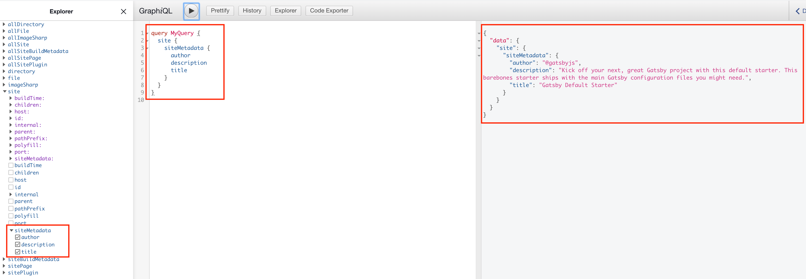
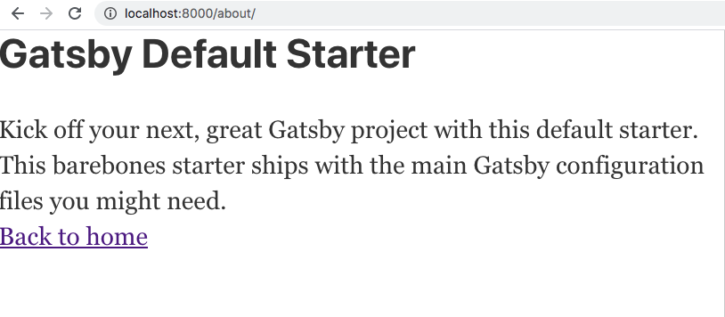

Now you will learn to create a Gatsby app with page components that queries the built-in data graph.

## Add data to your component

The way you work with data in Gatsby is powerful. Gatsby can query for data from almost anywhere, from your files, from static data and even data from API endpoints and databases. To query for data, we'll use GraphQL.

`gatsby-config.js` is where you store metadata for your site along with configurations of the plugins in a JavaScript object. There's a property in said JavaScript object called `siteMetadata`. This property along with its values gets read into the data graph as part of the build process and gets stored in a node called `site`. You'll see how querying for data works by constructing an `About` component to query for title and description.

Below is depiction of how the `siteMetadata` property looks like:

```javascript
siteMetadata: {
  title: `Gatsby Default Starter`,
  description: `Kick off your next, great Gatsby project with this default starter. This barebones starter ships with the main Gatsby configuration files you might need.`,
  author: `@gatsbyjs`,
}
```

We can construct a query given the above, read out the data and, have a component render it. Before get as far let's start by creating a Gatsby app.

### Create a Gatsby app

Create a Gatsby app by typing the following command in the terminal:

```bash
gatsby new <your app name>
```

This will create a Gatsby project, a set of directories and files that you can extend and configure.

### Start development server

Start the development server by typing the following command at the root of your project:

```bash
gatsby develop
```

You should now have two routes up and running:

- `http://localhost:8000/`, this is where your app is rendered
- `http://localhost:8000/___graphql`, this is where the built-in data graph is displayed through a visual tool called GraphiQL

### Construct a query

Go to `http://localhost:8000/___graphql` in your browser so you can get help creating the query.



In the above image, you have the `Explorer` section to the left, you are able to drill down into our Graph until you find the data we need. In the  middle section, you can see how the query is written for you as you do selections on the left. On the right, you see the result of running the query. You can run the query by clicking the *play* button in the middle section.

Make a note of the constructed query:

```bash
site {
  siteMetadata {
    author,
    description,
    title
  }
}
```

Let's now return back to our editor and add the file `about.js` in the `pages/` directory. Change its content to the following code:

```jsx
import React from 'react';
import { Link, graphql } from 'gatsby';

export default ({ data }) => (
  <React.Fragment>
    <h2>{data.site.siteMetadata.title}</h2>
    <div>{data.site.siteMetadata.description}</div>
    <Link to="/">Back to home</Link>
  </React.Fragment>
)

export const query = graphql `
  query {
    site {
      siteMetadata {
        author,
        description,
        title
      }
    }
  }
`
```

The constructed query has been added as input to the so-called fragment function `graphql` using the query as an argument. Thereafter the result of that function invocation has been assigned to a variable `query`. It's important that its called `query` so Gatsby knows to process it and put the result into the component and build time:

```javascript
export const query = graphql `
  query {
    site {
      siteMetadata {
        author,
        description,
        title
      }
    }
  }
`
```

During build time Gatsby will input the query result into the components `data` property as indicated below:

```jsx
export default ({ data }) => (
```

Finally you can now decide on how to lay out the data response in the components rendering section, like so:

```jsx
<h2>{data.site.siteMetadata.title}</h2>
<div>{data.site.siteMetadata.description}</div>
```

If you go to the URL `http://localhost:8000/about`, you should see the following:



Congrats, you've managed to add data to your component and you've learned some basic GraphQL querying in the process, using our GraphQL visual tool called *GraphiQL*.
