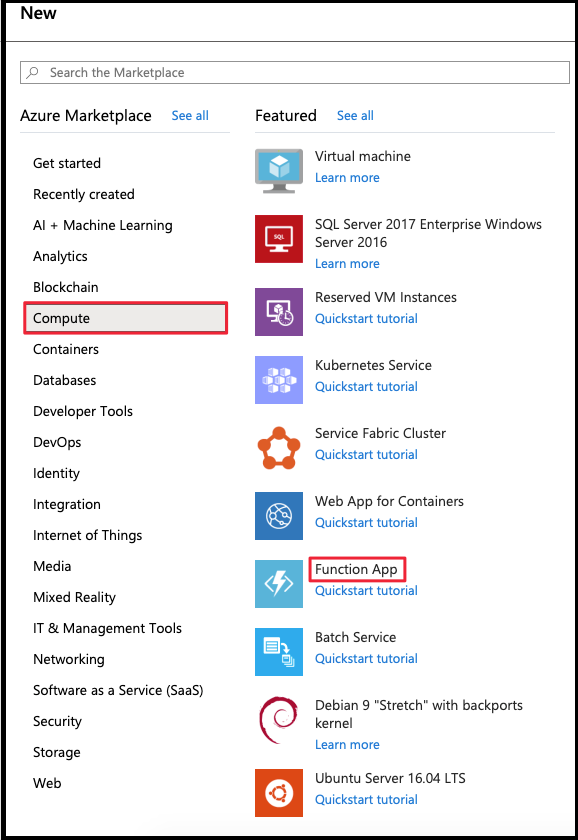

You are now ready to start implementing the temperature service. In the previous unit, you determined that a serverless solution would best fit your needs. Let's start by creating a function app to hold our Azure Function.

## What is a function app?

Functions are hosted in an execution context called a **function app**. You define function apps to logically group and structure your functions and a compute resource in Azure. In our elevator example, you would create a function app to host the escalator drive gear temperature service. There are a few decisions that need to be made to create the function app; you need to choose a service plan and select a compatible storage account.

### Choose a service plan

Function apps may use one of two types of service plans. The first service plan is the **Consumption service plan**. This is the plan that you choose when using the Azure serverless application platform. The Consumption service plan provides automatic scaling and bills you when your functions are running. The Consumption plan comes with a configurable timeout period for the execution of a function. By default, it is 5 minutes, but may be configured to have a timeout as long as 10 minutes.

The second plan is called the **Azure App Service plan**. This plan allows you to avoid timeout periods by having your function run continuously on a VM that you define. When using an App Service plan, you are responsible for managing the app resources the function runs on, so this is technically not a serverless plan. However, it may be a better choice if your functions are used continuously or if your functions require more processing power or execution time than the Consumption plan can provide.

### Storage account requirements

When you create a function app, it must be linked to a storage account. You can select an existing account or create a new one. The function app uses this storage account for internal operations such as logging function executions and managing execution triggers. On the Consumption service plan, this is also where the function code and configuration file are stored.

## Create a function app

Let's create a function app in the Azure portal.

::: zone pivot="javascript"

1. Sign into the <a href="https://portal.azure.com/learn.docs.microsoft.com" data-linktype="external" target="az-portal">Azure portal </a> using the same account you activated for the sandbox.

1. In the portal menu, select **Create a resource**.

   [!include]

   

1. In the left nav bar, select **Compute**, then select **Function App**.

   

   The **Create Function App** page appears.

1. In the **Create Function App** page, configure the following settings: on the **Basics** tab.

    | Field       | Value |
    | ----------- | ----------- |
    | **Basics** tab > **Project details** section |
    | Subscription     | Concierge Subscription |
    | Resource group        | "**<rgn>[sandbox resource group name]</rgn>**" |
    | **Instance details** |
    | Function App name | Enter a globally unique app name. The name serves as the base URL of your service. For example, you can name it **escalator-functions-xxxxxxx**, where the x's can be replaced with your initials and your birth year. If the value isn't globally unique, you can try any other combination. Valid characters are lowercase letters, numbers, and the hyphen. |
    | Publish | Code |
    | Runtime stack | Node.js (The language used to implement the function examples in this exercise.) |
    | Version | *default*. |
    | Region | Select a geographical location close to you. In a production system, you would want to select a location near your customers or consumers of the function. |

1. Select **Review + create**, and then select **Create**. Deployment can take a few minutes. You'll receive a notification when deployment completes.

::: zone-end

## Verify your Azure function app

1. When deployment completes, select **Go to resource**. Your Function App page appears.

1. In the **Essentials** section, select the **URL** link to open it in a browser. A default web page appears that indicates your Function App is up and running.
