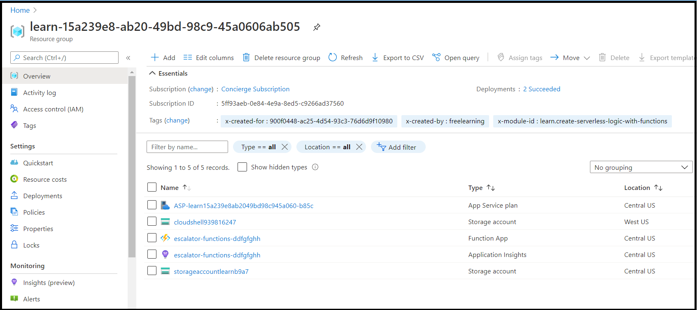
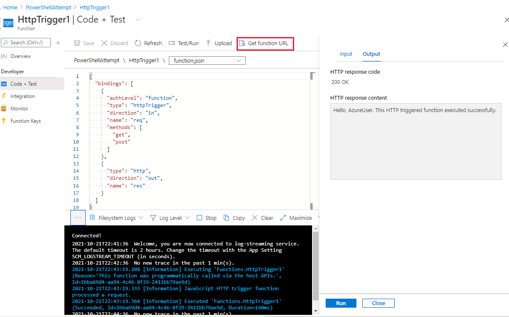
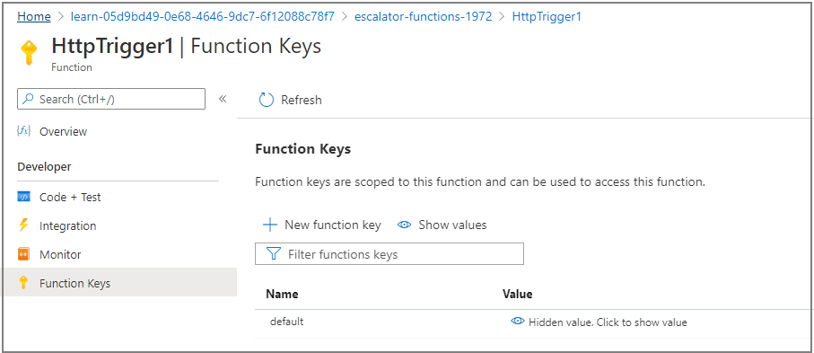
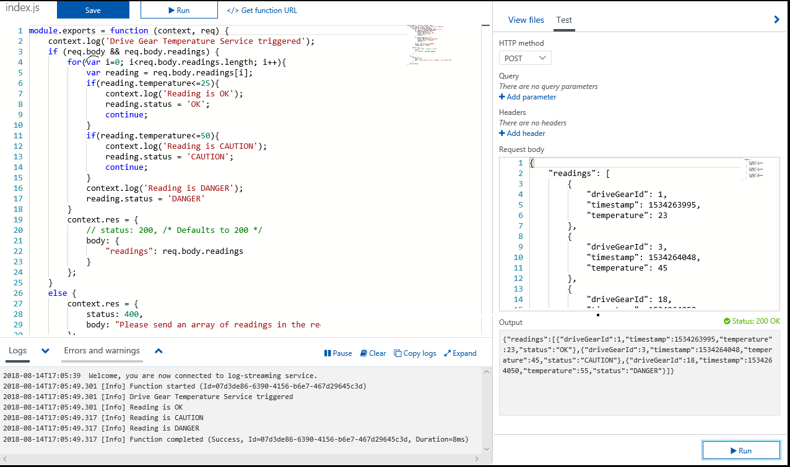

Let's continue with our gear drive example and add the logic for the temperature service. Specifically, we're going to receive data from an HTTP request.

## Function requirements

First, we need to define some requirements for our logic:

- Temperatures between 0-25 should be flagged as **OK**.
- Temperatures between 26-50 should be flagged as **CAUTION**.
- Temperatures above 50 should be flagged as **DANGER**.

## Add a function to our function app

As we discussed in the preceding unit, Azure provides templates that help you get started building functions. In this unit, we'll use the `HttpTrigger` template to implement the temperature service.

1. Sign in to the [Azure portal](https://portal.azure.com/learn.docs.microsoft.com?azure-portal=true).

1. Select the resource group from the first exercise by choosing **All resources** in the left-hand menu, and then selecting "**<rgn>[sandbox resource group name]</rgn>**".

1. The resources for the group will then be displayed. Click the name of the function app that you created in the previous exercise by selecting the **escalator-functions-xxxxxxx** item (also indicated by the lightning bolt Function icon).

    

1. Select the Add (**+**) button next to **Functions**. This action starts the function creation process.

1. On the **Azure Functions for JavaScript - getting started** page, select **In-portal** and then select **continue**.

1. In **Create a function**, select **More templates...**.

1. In the list of all templates available to this function app, select **Http trigger** .

1. Enter **DriveGearTemperatureService** in the name field of the **New Function** dialog that appears. Leave the Authorization level as "Function" and press the **Create** button to create the function.

1. When your function creation completes, the code editor opens with the contents of the *index.js* code file. The default code that the template generated for us is listed in the following snippet.

    ```javascript
    module.exports = function (context, req) {
        context.log('JavaScript HTTP trigger function processed a request.');
    
        if (req.query.name || (req.body && req.body.name)) {
            context.res = {
                // status: 200, /* Defaults to 200 */
                body: "Hello " + (req.query.name || req.body.name)
            };
        }
        else {
            context.res = {
                status: 400,
                body: "Please pass a name on the query string or in the request body"
            };
        }
        context.done();
    };
    ```

    Our function expects a name to be passed in either through the HTTP request query string or as part of the request body. The function responds by returning the message  **Hello, {name}**, echoing back the name that was sent in the request.

    On the right-hand side of the source view, you'll find two tabs. The **View files** tab lists the code and config file for your function.  Select **function.json** to view the configuration of the function, which should look like the following:

    ```javascript
    {
        "disabled": false,
        "bindings": [
        {
            "authLevel": "function",
            "type": "httpTrigger",
            "direction": "in",
            "name": "req"
        },
        {
            "type": "http",
            "direction": "out",
            "name": "res"
        }
        ]
    }
    ```

    This configuration declares that the function runs when it receives an HTTP request. The output binding declares that the response will be sent as an HTTP response.    

## Test the function

> [!TIP]
> **cURL** is a command line tool that can be used to send or receive files. It's included with Linux, macOS, and Windows 10, and can be downloaded for most other operating systems. cURL supports numerous protocols like HTTP, HTTPS, FTP, FTPS, SFTP, LDAP, TELNET, SMTP, POP3, etc. For more information, refer to the links below:
>
>- <https://en.wikipedia.org/wiki/CURL>
>- <https://curl.haxx.se/docs/>

To test the function, you can send an HTTP request to the function URL using cURL on the command line. To find the endpoint URL of the function, return to your function code and select the **Get function URL** link, as shown in the following screenshot. Save this link temporarily.



### Securing HTTP triggers

HTTP triggers let you use API keys to block unknown callers by requiring the key to be present on each request. When you create a function, you select the _authorization level_. By default, it's set to "Function", which requires a function-specific API key, but it can also be set to "Admin" to use a global "master" key, or "Anonymous" to indicate that no key is required. You can also change the authorization level through the function properties after creation.

Since we specified "Function" when we created this function, we will need to supply the key when we send the HTTP request. You can send it as a query string parameter named `code`, or as an HTTP header (preferred) named `x-functions-key`.

The function and master keys are found in the **Manage** section when the function is expanded. By default, they are hidden, and you need to display them.

1. Expand your function and select the **Manage** section, show the default Function Key, and copy it to the clipboard.

    

1. Next, from the command line where you installed the **cURL** tool, format a cURL command with the URL for your function, and the Function key.

    - Use a `POST` request.
    - Add a `Content-Type` header value of type `application/json`.
    - Make sure to replace the URL below with your own.
    - Pass the Function Key as the header value `x-functions-key`.

    ```bash
    curl --header "Content-Type: application/json" --header "x-functions-key: <your-function-key>" --request POST --data "{\"name\": \"Azure Function\"}" https://<your-url-here>/api/DriveGearTemperatureService
    ```

The function will respond back with the text `"Hello Azure Function"`.

> [!CAUTION]
> If you are on Windows, please run  `cURL` from the command prompt. PowerShell has a *curl* command, but it's an alias for Invoke-WebRequest and is not the same as `cURL`.

> [!NOTE]
> You can also test from an individual function's section with the **Test** tab on the side of a selected function, though you won't be able to verify the function key system is working, as it is not required here. Add the appropriate header and parameter values in the Test interface and click the **Run** button to see the test output.

## Add business logic to the function

Next, let's add the logic to the function that checks temperature readings that it receives and sets a status for each.

Our function is expecting an array of temperature readings. The following JSON snippet is an example of the request body that we'll send to our function. Each `reading` entry has an ID, timestamp, and temperature.

```json
{
    "readings": [
        {
            "driveGearId": 1,
            "timestamp": 1534263995,
            "temperature": 23
        },
        {
            "driveGearId": 3,
            "timestamp": 1534264048,
            "temperature": 45
        },
        {
            "driveGearId": 18,
            "timestamp": 1534264050,
            "temperature": 55
        }
    ]
}
```

Next, we'll replace the default code in our function with the following code that implements our business logic.

1. Open the **index.js** file and replace it with the following code.

```javascript
module.exports = function (context, req) {
    context.log('Drive Gear Temperature Service triggered');
    if (req.body && req.body.readings) {
        req.body.readings.forEach(function(reading) {

            if(reading.temperature<=25) {
                reading.status = 'OK';
            } else if (reading.temperature<=50) {
                reading.status = 'CAUTION';
            } else {
                reading.status = 'DANGER'
            }
            context.log('Reading is ' + reading.status);
        });

        context.res = {
            // status: 200, /* Defaults to 200 */
            body: {
                "readings": req.body.readings
            }
        };
    }
    else {
        context.res = {
            status: 400,
            body: "Please send an array of readings in the request body"
        };
    }
    context.done();
};
```

The logic we added is straightforward. We iterate over the array of readings and check the temperature field. Depending on the value of that field, we set a status of **OK**, **CAUTION**, or **DANGER**. We then send back the array of readings with a status field added to each entry.

Notice the `log` statements. When the function runs, these statements will add messages in the log window.

## Test our business logic

In this case, we're going to use the **Test** pane in the portal to test our function.

1. Open the **Test** window from the right-hand side flyout menu.

1. Paste the sample request into the request body text box.

    ```json
    {
        "readings": [
            {
                "driveGearId": 1,
                "timestamp": 1534263995,
                "temperature": 23
            },
            {
                "driveGearId": 3,
                "timestamp": 1534264048,
                "temperature": 45
            },
            {
                "driveGearId": 18,
                "timestamp": 1534264050,
                "temperature": 55
            }
        ]
    }
    ```

1. Select **Run** and view the response in the output pane. To see log messages, open the **Logs** tab in the bottom flyout of the page. The following screenshot shows an example response in the output pane and messages in the  **Logs** pane.

    

    You can see in the output pane that our status field has been correctly added to each of the readings.

    If you navigate to the **Monitor** dashboard, you'll see that the request has been logged to Application Insights.

    
