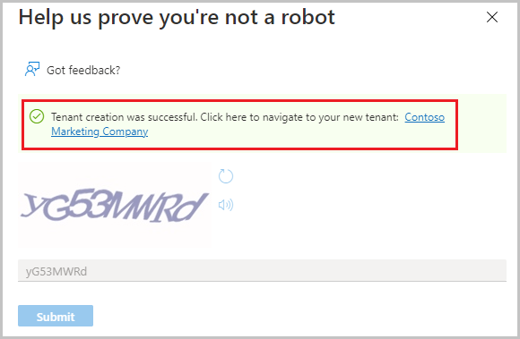
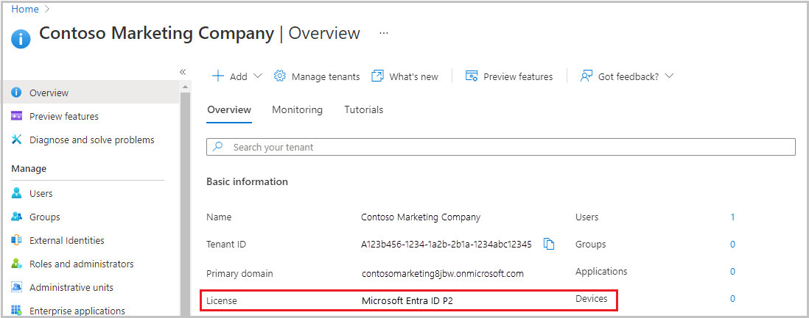

You need to add member user accounts for the new developer team in your organization.

In this exercise, you'll create a new Azure Active Directory (Azure AD) organization to hold all of your user accounts. You'll also create a user account, delete a user account, and learn how to recover a deleted user account.

## Create an Azure AD organization

Create a new organization to hold all of the users you create in this exercise.

1. Sign in to the [Azure portal](<https://portal.azure.com/learn.docs.microsoft.com?azure-portal=true>) with the same account you used to activate the sandbox.

1. In the left navigation pane, select **Create a resource  >  Identity  >  Azure Active Directory**.

   

1. On the **Create directory** pane, enter the following values:

   - **Organization name**:  _Contoso Marketing Company_
   - **Initial domain name**: _contosomarketingXXXX_ where you replace XXXX with numbers or letters to make your domain name unique

1. Select **Create**.

1. Wait for the creation of your organization to be completed. Note the full domain name including on.microsoft.com. When complete, switch to the new organization by selecting the link in the grey box under the **Country or region** field.  

    

    You've now created a new organization.

## Get free trial for Azure AD Premium

You'll need to activate a free trial for Azure AD Premium to complete all the exercises in this module.

1. In the organization you just created, select **Get started**.
1. Under **Getting started with Azure AD**, select **Get a free trial for Azure AD Premium**.

    
1. Under **Azure AD Premium 2**, select **Free trial** > **Activate**.
1. In the left-hand pane, click **Overview**. 
1. Refresh the browser until you see **Azure AD Premium P2** under the organization name.

    

## Add a new user

1. First, let's make sure you're logged in as an administrator for the organization you created earlier.

   In the Azure AD organization you created, under **Manage**, select **Roles and administrators**.  Your role should be set as Global Administrator.

      
   
   If it's not, on the top right of the Azure portal select your profile and **Switch directory**. Under **All directories**, select the organization you created. 

1. Now let's create a user account.

   In the Azure AD organization you created, under **Manage**, select **Users   >  New User**.
1. The **User** pane now  appears.   Provide the following values:

    - Name:  **Chris Green**
    - User Name:      chris\@contosomarketingXXXXXX.onmicrosoft.com (use the domain name you noted earlier)
1. Select **Show Password** and copy it somewhere you can refer to it later.

1. Select **Create**. The user is now created and registered to your organization.

A new user has been created.

## Delete a user

You can delete users after they've been created.

1. In your Azure AD organization, under **Manage**, select **Users**.
1. Select Chris Green from the list.
1. Select **Delete user**. If you don't see that option, select **More**.
1. You'll be asked to confirm your deletion. Select **Yes**.

This action removes the user.

## Recover deleted item

You can restore deleted users. View the list of the deleted users and then restore one.

1. In your Azure AD organization, under **Manage**, select **Users** > **Deleted users**.
1. You now see all of the users that were deleted within the last 30 days.
1. Select **Chris Green** and **Restore user**.
1. Select **Yes** to confirm.
1. Verify that Chris Green's account is recovered by clicking **All users** to see it in the list.

A deleted user has been recovered. 