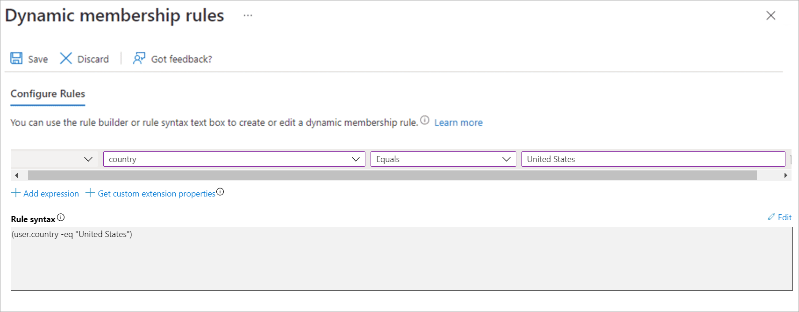

In this exercise, you'll create an Azure Active Directory (Azure AD) group to manage the developer team's access. You'll also add a rule for the group to manage the membership automatically.

> [!NOTE]
> This exercise depends on having completed prior exercises in this module. If you have not done so, please complete [exercise 3](../3-exercise-add-delete-users-azure-ad.yml) before you begin.

## Add a new group

1. Sign in to the [Azure portal](<https://portal.azure.com/learn.docs.microsoft.com?azure-portal=true>).

1. On the home page, under **Azure services**, select **Azure Active Directory**.

1. In the left menu pane, under **Manage**, select **Groups**. The **All groups** pane appears for your Azure AD.

1. On the top menu bar, select **New group**. The **New Group** pane appears.

1. Enter the following values for each setting.

    | **Setting** | **Value** |
    |-----------|---------|
    | Group type | Security |
    | Group name | Developer group |
    | Group description | Developer team |

1. Select **Create**. The new group now appears in the list of Groups.

## Use direct assignment to add a user to this group

You'll now assign members to the Developer group.

1. Select the **Developer group**.

1. In the left menu pane, under **Manage**, select **Members**. The **Members** pane appears.

1. On the top menu bar, select **Add members**.

   

1. Search for and select **Chris Green**.

1. Select **Select**. You'll see this user in the member list for the Developers group.

## Modify the group to use dynamic assignment

You can change the group to use dynamic assignment. Membership then depends on whether a user meets the rules you set for the group.

If you didn't activate the free trial for Azure AD Premium 2, you won't be able to complete this section. That's ok. You can still see how you change the group to use dynamic assignment.

1. In the **Developer group**, select **Properties**.

1. Change **Membership type** to **Dynamic User**. Select **Save**.

1. Select **Add dynamic query**.

   :::image type="content" source="../media/5-add-dynamic-query.png" alt-text="Screenshot that shows the Add dynamic query link.":::

1. Select the following values for the rule:

   

   | Field  |Value  |
   |---------|---------|
   | Property  | Country |
   | Operator  | Equals  |
   | Value     | United States  |

   The membership of this group now depends on whether the user is in the United States.

1. Select another field to enable **Save**.

1. Select **Save**.

1. Under **Manage**, select **Members**. You see that the **Add members** button is now disabled.

## Change group back to assigned

You'll need to assign a guest user to the Developer group in the next exercise, so let's change the membership type back to **Assigned**.

1. In the **Developer group**, select **Properties**.

1. Change **Membership type** to **Assigned**.

1. Select **Save**.
