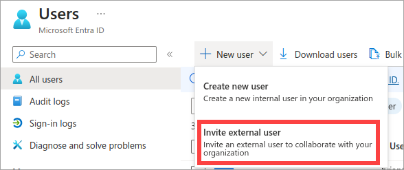
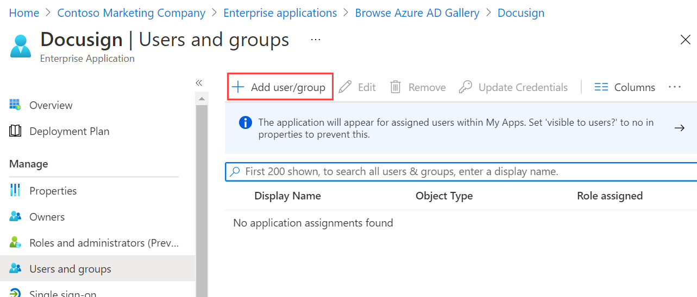
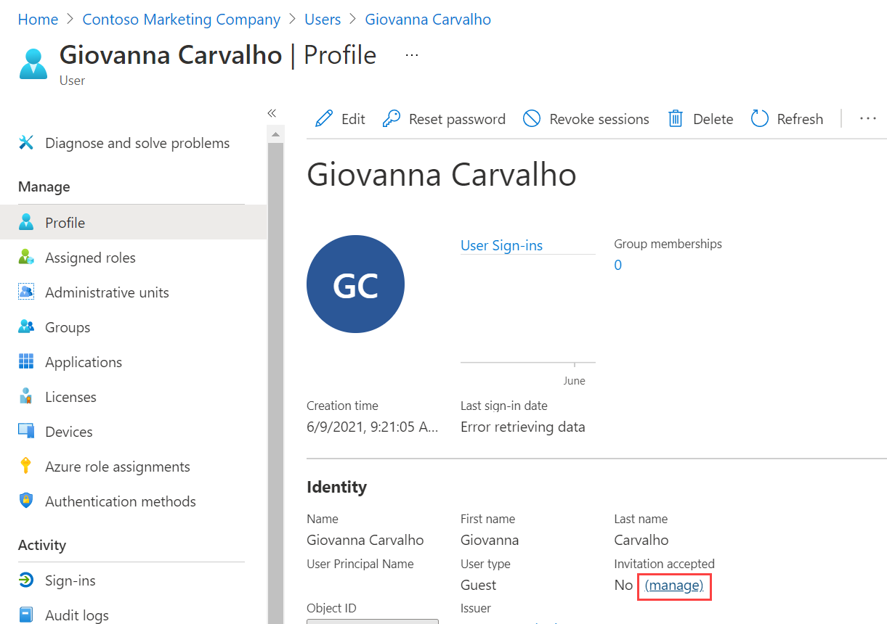

So the external and internal developer teams can work together, you decide to create guest user access for the external developer team. 

You'll use the Azure portal to invite B2B collaboration users. You can invite guest users to a directory, group, or application. After you invite a user, their account is added to Azure Active Directory (Azure AD), with a guest user type.

After adding a guest user to the directory, send them a direct link to a shared app. Have the guest user open the redemption URL in the invitation email.

## Add guest users to the directory

1. Sign in to the [Azure portal](<https://portal.azure.com/learn.docs.microsoft.com?azure-portal=true>).

1. Select **Azure Active Directory  > Users  > New guest user**.

   
1. Enter a name and an email address that you have access to.

1. Select **Invite**.  An invitation is sent to the email address you  provided for the guest user.

1. Notice that the user now appears in the list of users, and has Guest as user type.

You've added a guest user to the directory.

## Add guest users to a group

1. Select **Azure Active Directory  >  Groups**, then select the **Developers group** in the list of groups.
1. Select **Members >  Add members**.
1. Search for the guest account you added to the directory.
1. Select the account and click **Select**.  
1. You'll now see the user in the list of members for this group.

You've added a guest user to a group.

## Add guest users to an application

1. Select **Azure Active Directory**  > **Enterprise Applications** > **All Applications**.  
1. Select **New Application**.

   

1. Under **Add from the gallery**, type **Twitter** and add it.
1. Select **Users and groups** > **Add users**.

   

1. In **Add Assignment**, select **Users**.
1. Select the guest user you added in the previous exercise and click **Select**.
1. Select **Assign**. You'll now see the user in the list for this application.

1. To check that the correct access level is set, select the user in the list. 

    

1. Select **Edit**.
1. Click **Select Role** > **Default Access** and **Assign** so to make sure they have the correct access.

1. When the invitation arrives, the user accepts it and can then access the application.

    

You've added a guest user to an application.

## Resend invitations to guest users

 If the guest user didn't receive the first email invitation, you can resend an invitation email.

1. Select **Azure Active Directory  > Users**.
1. Select the user.
1. Select **Resend invitation**.

   

You've resent an invitation to a guest user.
