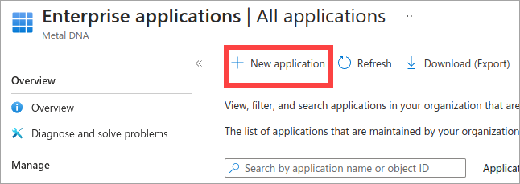

The external and internal developer teams want to work together, so you decide to create guest user access for the external developer team. 

You'll use the Azure portal to invite business-to-business (B2B) collaboration users. You can invite guest users to an Azure Active Directory (Azure AD) organization, group, or application. After you invite a user, their account is added to Azure AD, with a guest user type.

After you add a guest user to the organization, send them a direct link to a shared app. Have the guest user open the redemption URL in the invitation email.

## Add guest users to the organization

1. Sign in to the [Azure portal](<https://portal.azure.com/learn.docs.microsoft.com?azure-portal=true>), and select **Azure Active Directory**. The **Overview** pane for your Azure AD appears.

1. In the left menu pane, under **Manage**, select **Users**. The **All users** pane appears.

1. In the top menu bar, select **New guest user**.

   

   The **New user** pane appears.

1. Confirm **Invite user** is selected.

1. Enter a name and an email address that you have access to.

1. Select **Invite**. An invitation is sent to the email address you provided for the guest user.

1. In the **All users** pane, notice that the user now appears in the list of users and has Guest as user type.

## Add guest users to a group

1. In your Azure AD organization overview page, in the left menu pane, under **Manage**, select **Groups**. The **All groups** pane appears.

1. Search for and select **Developer group** in the list of groups. The **Developer Group** pane appears.

1. In the left menu pane, under **Manage**, select **Members**. The **Members** pane appears.

1. In the top menu bar, select **Add members**.

1. Search for the guest account you added to the organization.

1. Select the account, and select **Select**.

1. You now see the user in the list of members for this group.

## Add guest users to an application

1. In your Azure AD organization, select **Enterprise applications** > **All applications**.

1. Select **New application**.

   

1. Search for **DocuSign** and select **Create**.

1. Select **Users and groups** > **Add user/group**.

    :::image type="content" source="../media/7-application-users-groups.png" alt-text="Screenshot that shows the Docusign application user and groups page.":::

1. In **Add Assignment**, select **Users and groups**.

1. Select the guest user you added in the previous exercise, and **Select**.

1. Select **Assign**. You now see the user in the list for this application.

1. To check that the correct access level is set, select the user in the list.

    :::image type="content" source="../media/7-select-user.png" alt-text="Screenshot that shows the user selected on the users and groups page.":::

1. Select **Edit**.

1. Select **Select Role** > **DocuSign Sender** > **Select** to make sure they have the correct access.

    :::image type="content" source="../media/7-select-role.png" alt-text="Screenshot that shows role selected for user.":::

1. Select **Select Role** > **Default Access** and **Select** to make sure they have the correct access.

1. When the invitation arrives, the user accepts it, and can then access the application.

    :::image type="content" source="../media/7-application-visible-invitation-accepted.png" alt-text="Screenshot that shows the DocuSign app in the browser for the guest user after they've accepted the invitation.":::

You've now added a guest user to an application.

## Resend invitations to guest users

If the guest user didn't receive the first email invitation, you can resend an invitation email.

1. In your Azure AD organization, in the left menu pane, under **Manage**, select **Users**. The **All users** pane appears.

1. Select the user. The user's **Profile** pane appears.

1. In the left menu pane, under **Manage**, select **Profile**.

1. Under the **Identity** section, select the **(manage)** link. The **Manage invitations** pane appears.

1. Under *Email invitations* **Resend invite**, select **Yes**, and then confirm your resending the invitation. The **Manage invitations** pane reappears.

1. Select **Done**.

