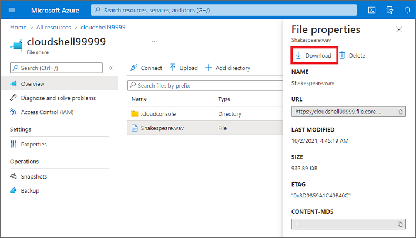

In order to listen to the WAVE file that your application created, you'll first need to download it. To do so, use the following steps.

1. In the Cloud Shell on the right, use the following command to copy the WAVE file to your temporary cloud drive.

    ```bash
    cp Shakespeare.wav ~/clouddrive
    ```

1. Sign in to the [Azure portal](https://portal.azure.com/learn.docs.microsoft.com?azure-portal=true) with the same account you used to activate the sandbox.

1. Select **All resources** on the Azure portal home page.

1. When the **All resources** page is displayed, select on your **cloudshellNNNNN** storage account, then select on **File shares**, and then select your **cloudshellfilesNNNNN** file share.

    [](../media/5-cloud-shell-file-shares.png#lightbox)

1. When your **cloudshellfilesNNNNN** file shares page is displayed, select on the **Shakespeare.wav** file, and then select the **Download** icon.

    [](../media/5-cloud-shell-file-download.png#lightbox)

1. Download the **Shakespeare.wav** file to your computer, where you can listen to it with your operating system's audio player.
