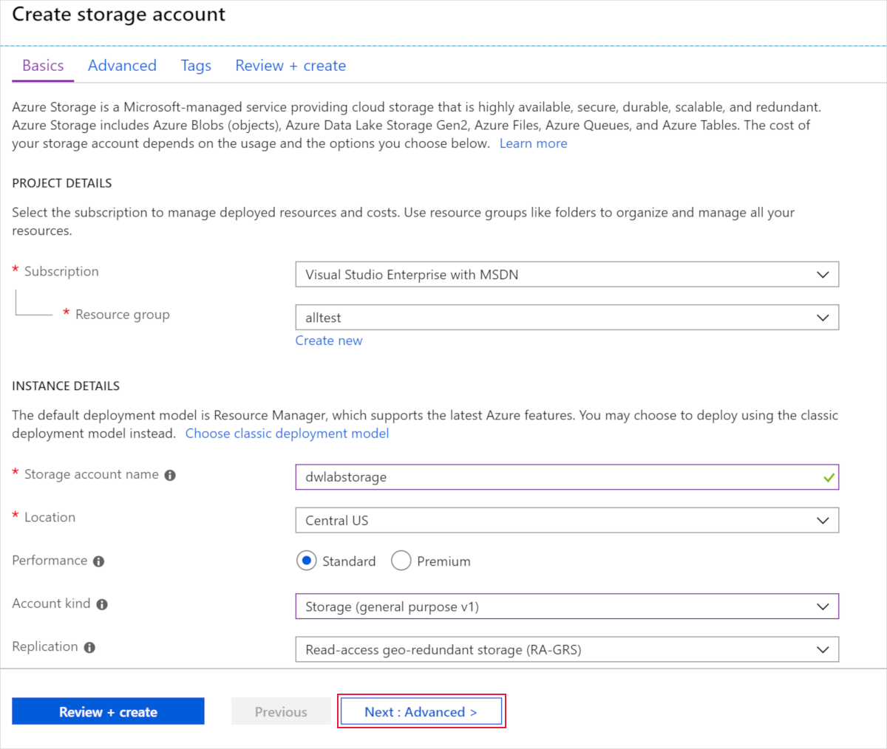
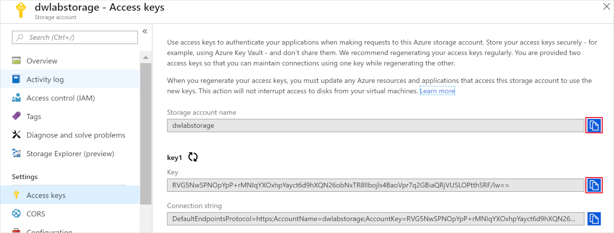
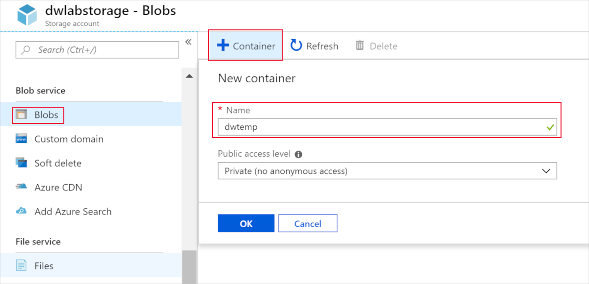
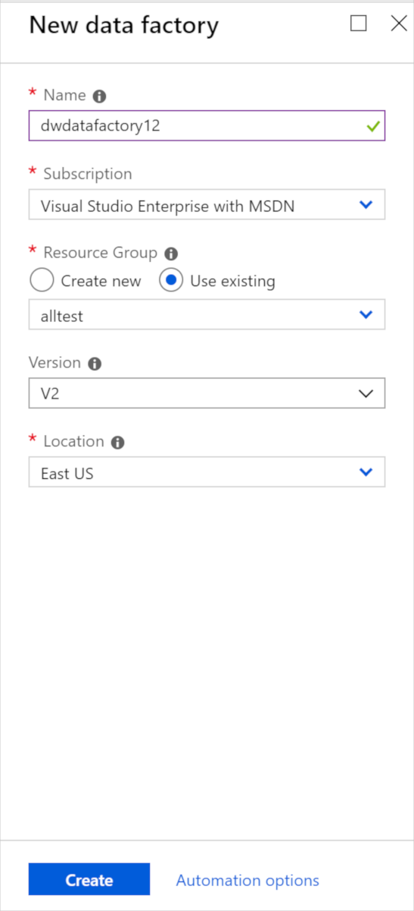

Let's start by creating an Azure storage account and an Azure Data Factory.

## Create Azure Storage account

1. In the Azure portal, select + Create a resource, enter "storage account" into the Search the Marketplace box select Storage account - blob, file, table, queue from the results, and select Create.

1. In the Create storage account blade, enter the following:

   - Subscription: Select the subscription you are using for this module.
   - _Resource group_: Choose your module resource group.
   - _Storage account name_: Enter a unique name (make sure you see a green checkbox).
   - _Location_: Select the location you are using for resources in this module.
   - _Performance_: Select Standard.
   - _Account kind_: Select Storage (general purpose v1).
   - _Replication_: Select Locally-redundant storage (LRS).

1. Select Next: **Advanced >**.
1. In the Advanced tab, select the following:

    - _Secure transfer required_: Select Disabled
    - _Virtual network_: Select None

1. Select **Review + create**.
1. In the Review tab, select **Create**.

## Acquire account name and key

1. Once provisioned, navigate to your storage account.
1. Select **Access keys** from the left-hand menu, and copy the Storage account name and key1 Key value into a text editor, such as Notepad, for later use.

## Create the dwtemp container

1. Select Blobs from the left-hand menu, then select **+ container** to create a new container.
1. Enter _dwtemp_ for the container name.
1. Leave the public access level selected as _Private_
1. Select **OK**.

## Create Azure Data Factory

1. Navigate to [Azure Portal](https://portal.azure.com).
1. Select + **Create a resource**, type "data factory" into the search bar, select Data Factory in the results, and then select **Create**.

1. Set the following configuration on the Data Factory creation form:

    - _Name_: Enter a globally unique name, as indicated by a green checkmark.
    - _Subscription_: Select the subscription you are using for this workshop.
    - _Resource Group_: Choose Use existing, and select the resource group for this workshop.
    - _Version_: V2
    - _Location_: Select a region.

1. Select **Create** to provision ADF v2.