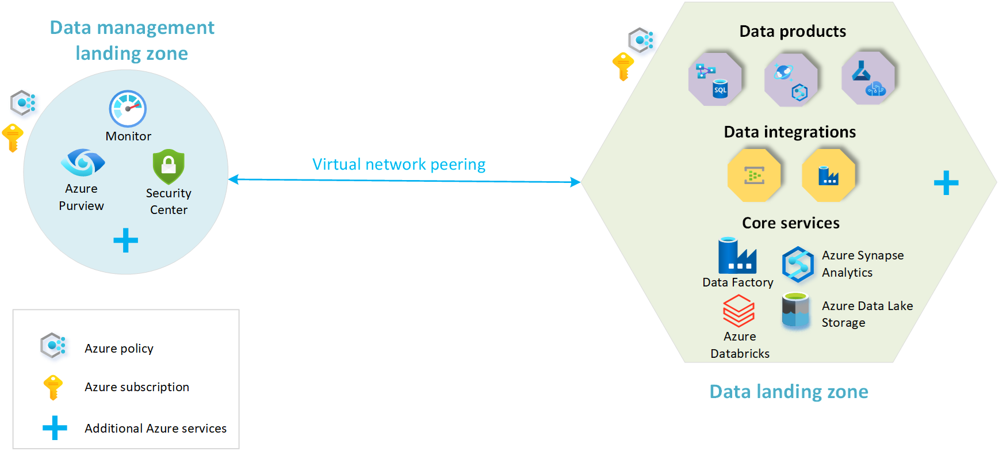

##

It is very important to define a long term data strategy that when executed results in incremental value returns for the business. Business outcomes are the direct measure of how well the strategy is executed based on the priority.

### Integration of Data Management and Analytics into the Cloud Adoption Strategy

 Most common business outcomes are

- Empower your employees
- Engage with customers
- Optimize operations
- Transform products

### Data management and analytics motivations

Common drivers for Data management and analytics are aligned to innovation

- A scalable analytics framework designed to enable building an enterprise data platform
- Self-service to empower the user in data exploration, data asset creation, and product development
- Foster a data led culture with reusable data assets, data communities, secure third-party exchange, and in-place sharing
- Share data with confidence secured by policies, common identity, confidentiality, and encryption
- Improved customer experiences and engagements
- Transformation of products or services
- Market disruption with new products or services
- Democratization and self-service environments

The following key themes outline how you can realize these motivations in your strategy. Carefully analyze them and think about how they relate to a coherent data strategy.

### Develop a data-driven culture

Here focus is on how an organization can become matured overtime by applying systematic principled approach. Below is an example

### A principled approach to your data strategy

### Data Ingestion

Key principles in getting data from various systems and sources is creating structured steps through orchestration. In addition, the orchestration should support easier updates to code and logic that performs the ingestion through continuous integration using tools like DevOps

### Storage

Choose right storage technologies based on workloads.  For advanced analytics support, the storage solution should provide support various file formats and ability to move from one tier to the other in an automated way. It should also support capabilities for batch and stream processing. Finally, always tag data

### Data Processing

Once data is persisted in the storage, data processing deals with transforming it to a usable format. When defining data processing, it's important to consider real-time versus batch, compute scaling, GPU support, memory limits etc.

### Analytics

Finally, the value delivered to the business is in the form of analytics solution to allow it to make intelligent decisions.

## A prescriptive plan

Data management and analytics scenario helps collate all four layers together with people, process, security, and compliance. We also suggest using the recommended architectures from Azure landing zones to get started. They use the Microsoft Cloud Adoption Framework and culminate our experience working through thousands of large-scale enterprise deployments.

The Data Management & Analytics architecture consists of two core building blocks:

- Data Management Landing Zone
- Data Landing Zone

The following diagram is an overview of a data platform with a central data management landing zone and multiple data landing zones:

In this module, we'll work on provisioning these major components

- Data Management Landing Zone
- Data Landing Zone
- Data Product Landing Zone
