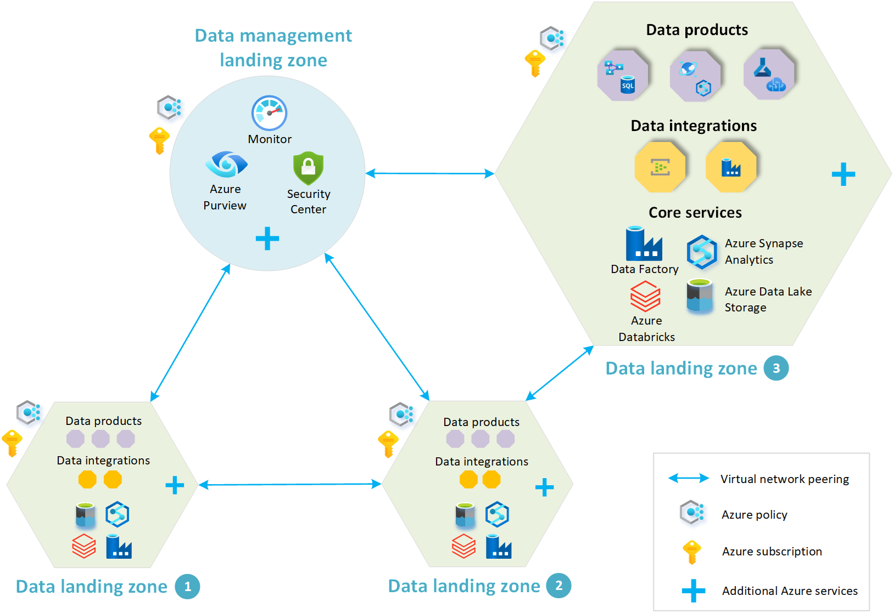
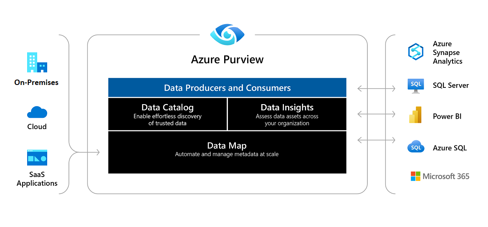

The data management landing zone is classified as a management function and is central to the data management and analytics scenario. It's responsible for the governance of the platform and enables communication to ingest data sources from Azure, third-party clouds, and on-premises data sources. It's the heart of the data governance flow.

## Significance

The data management zone allows for centralized data governance and control space for any centralized data estates. It provides placeholders for implementing several common components of enterprise data centric architecture that includes Data Catalog, Data Discovery, Data Classification, Data Lineage, Data Quality Management, Data Models Repositories, Master Data Management, API Catalog, Data Sharing contracts, Container Registry and several more. Lets study a few of them below

### Data Catalog and discovery

Data Catalog is an organized service that allows users to centralize Metadata and learn more about their data sources that help organizations achieve more values from their assets.

Following are some advantages to centralizing Metadata:

- Consistency and accuracy across the department/government
- Better data congruency, quality and structure
- Makes data easily accessible
- Allow users to self-serve

In an enterprise vision, we would like to minimize the number of data silos, get a faster access to what matters most, and function as a single source (during the Data Life Cycle) for better doing.

Data-driven culture empowers users with getting access to their data source. With this, the growing numbers of cloud applications, privacy regulations and security rules are making it more difficult to effectively secure and govern data. Therefore, a Data Catalog is needed to:

- Spend less time searching for data and more time using it to gain insight
- Have a better/safer access to data through governance. Departments have a  hard time finding data and controlling who has access to it.
- Reduce the cost of data redundancy and hoarding.
- Better linkage between the technical value of Metadata and the business value.

### Data Discovery

Data discovery describes processes in understanding data sets on hand for data integration and/or data analysis. This step occurs in design and should combine technical search from tools with subject matter expertise, from people. During data discovery, a high-level view is taken in assessing data preparation, or data quality needs.

### Data Classification

In the field of data management, data classification as a part of the Information Lifecycle Management (ILM) process can be defined as a tool for categorization of data to enable/help organizations to effectively answer the following questions:

- What data types are available?
- Where are certain data located?
- What access levels are implemented?
- What protection level is implemented and does it adhere to compliance regulations?

When implemented it provides a bridge between IT professionals and process or application owners. IT staff's are informed about the data value and management (usually application owners) understands better which part of the data center needs to be invested in to keep operations running effectively. This can be of particular importance in risk management, legal discovery, and compliance with government regulations. Data classification is typically a manual process; however, there are many tools from different vendors that can help gather information about the data.

Data classification needs to take into account the following:

Regulatory requirements
Strategic or proprietary worth
Organization specific policies
Ethical and privacy considerations
Contractual agreements

### Data Lineage

Data lineage includes the data origin, what happens to it and where it moves over time. It also enables replaying specific portions or inputs of the data flow for step-wise debugging or regenerating lost output. 

Data lineage can be represented visually to discover the data flow/movement from its source to destination via various changes and hops on its way in the enterprise environment, how the data gets transformed along the way, how the representation and parameters change, and how the data splits or converges after each hop. Representation broadly depends on scope of the metadata management and reference point of interest. Data lineage provides sources of the data and intermediate data flow hops from the reference point with backward data lineage, leads to the final destination's data points and its intermediate data flows with forward data lineage. 

Data lineage provides the audit trail of the data points at the highest granular level, but presentation of the lineage may be done at various zoom levels to simplify the vast information, similar to analytic web maps. Data Lineage can be visualized at various levels based on the granularity of the view. At a high level data lineage provides what systems the data interacts before it reaches destination. As the granularity increases it goes up to the data point level where it can provide the details of the data point and its historical behavior, attribute properties, and trends and data quality of the data passed through that specific data point in the data lineage.

### Data Quality Management

Defining data quality in a sentence is difficult due to the many contexts data are used in, and the varying perspectives among end users, producers, and custodians of data.
From a consumer perspective, data quality is:
• "data that are fit for use by data consumers"
• data "meeting or exceeding consumer expectations"

#### Below is a typical data management landing zone architecture. 

### Azure Purview Context

Azure Purview is a unified data governance service that helps you manage and govern your on-premises, multi-cloud, and software-as-a-service (SaaS) data. Create a holistic, up-to-date map of your data landscape with automated data discovery, sensitive data classification, and end-to-end data lineage. Enable data curators to manage and secure your data estate. Empower data consumers to find valuable, trustworthy data.

High-level architecture of Azure Purview, showing multi-cloud and on premises sources flowing into Azure Purview, and Azure Purview's apps (Data Catalog, Map, and Insights) allowing data consumers and data curators to view and manage metadata. This metadata is also being ported to external analytics services from Azure Purview for more processing.

Azure Purview automates data discovery by providing data scanning and classification as a service for assets across your data estate. Metadata and descriptions of discovered data assets are integrated into a holistic map of your data estate. Atop this map, there are purpose-built apps that create environments for data discovery, access management, and insights about your data landscape.

## Other references

<a href="/azure/cloud-adoption-framework/scenarios/data-management">Data Management and Analytics</a>
