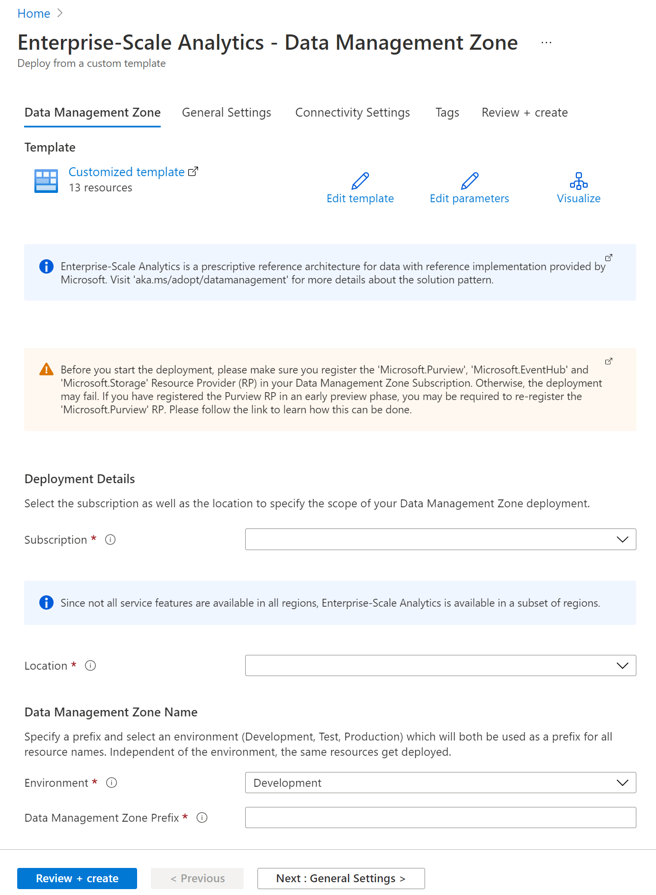
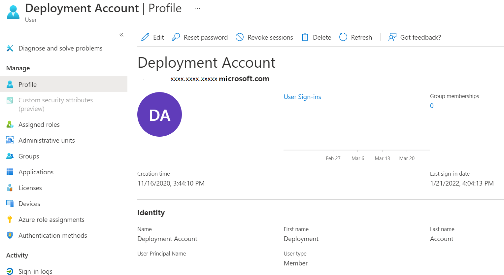
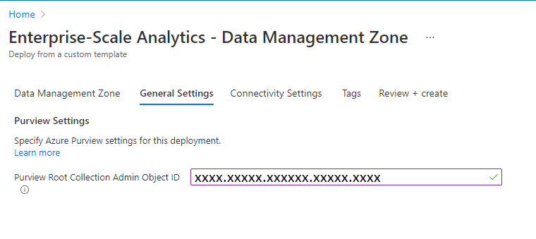
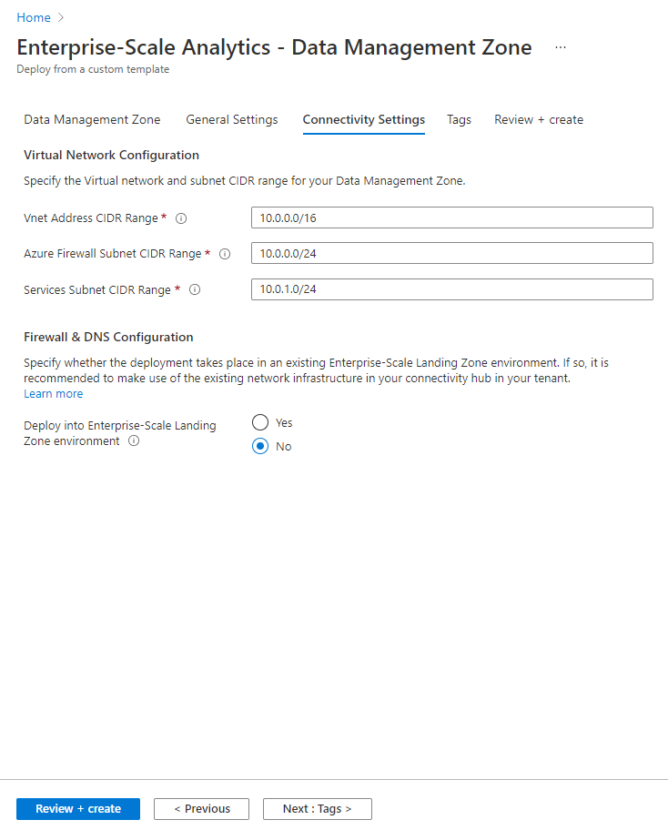
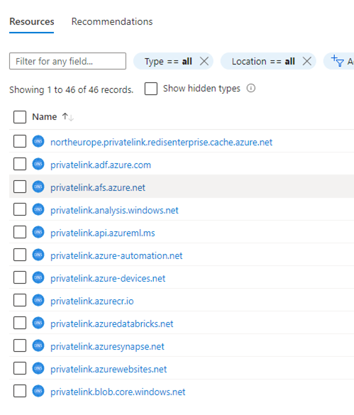
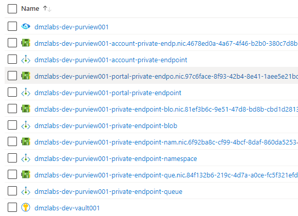

##

This module walks you through the process of provisioning the "Data Management landing zone" into your own Azure subscription

### Step 1 - Complete Pre-requisites

Register "Microsoft. Purview","Microsoft.EventHub" and "Microsoft. Storage" resource provider in your subscription

Follow the link below to register if not registered already

<a href="/azure/azure-resource-manager/management/resource-providers-and-types#azure-portal">Register Resources</a>

### Step 2 - Initiate the workflow to complete the data management landing zone using the portal wizard UI

In this page, provide the following information

Subscription: Select the subscription to deploy the Data Management Landing Zone to. If you have access to multiple subscriptions, choose the correct one.

Location: Select from the dropdown. If there are no organizational policies influencing the location, it's a good idea to pick a region that is physically close to you. Verify that this region is supported for Enterprise Scale Analytics. A list of supported region's available here and navigate to “Supported Regions”

Environment: We recommend you choose Development. You could use the same process to deploy a Test or Production environment as well.

Data management zone prefix: A prefix added to all the deployed resource groups and resources to make them unique within the subscription. Ensure the length is a max of 10 alphanumeric characters.

### Step 3 - Obtain ObjectId of Azure Purview Root collection admin ID

This step is required only if a user other than yourself has to be added as a collection admin in the Purview instance. To add a user, navigate to Azure Active Directory and in the list of users, select the relevant user to find the Object ID. Select on the Copy to Clipboard icon.

### Step 4 - select  General Settings

In this step enter the root collection admin object ID in the previous step

### Step 5 - select Connection Settings

In this step select whether you would like to deploy this management into existing enterprise scale landing zone

### Step 6a - click "Review + Create"

This will trigger the deployment validation to check for any errors.

### Step 6b - click " Create"

This will trigger the deployment. The deployment will take around 20 minutes to complete.

### Step 7 - Validation after deployment

#### You can use the details here to validate the deployment.

##### Resource Group Name - XXXX-dev-automation

This resource group is a placeholder for hosting any automation account

##### Resource Group Name - XXXX-dev-consumption

Azure Synapse Analytics private link hubs are Azure resources, which act as connectors between your secured network and the Synapse Studio web experience

##### Resource Group Name - XXXX-dev-container

To allow the Data Platform Ops to deploy standard containers for use in data science projects, the Data Management Landing Zone hosts an Azure Container Registry.

##### Resource Group Name - XXXX-dev-global-dns

The Enterprise Scale Analytics and AI solution pattern makes us of Private Links, which relies on having a private DNS zone. You should see 46 private link resources within this resource group.

##### Resource Group Name - XXXX-dev-governance

The Purview instance and private endpoints for communication between Purview and other services within the same private network.

##### Resource Group Name - XXXX-dev-network

The Enterprise Scale Analytics and AI solution pattern makes use of Private Links, which relies on having a private DNS zone.

##### Resource Group Name - XXXX-dev-mgmt

This resource group is a placeholder for management function like centralized monitoring and logging

### Other references

<a href="/azure/cloud-adoption-framework/scenarios/data-management">Data Management and Analytics</a>
