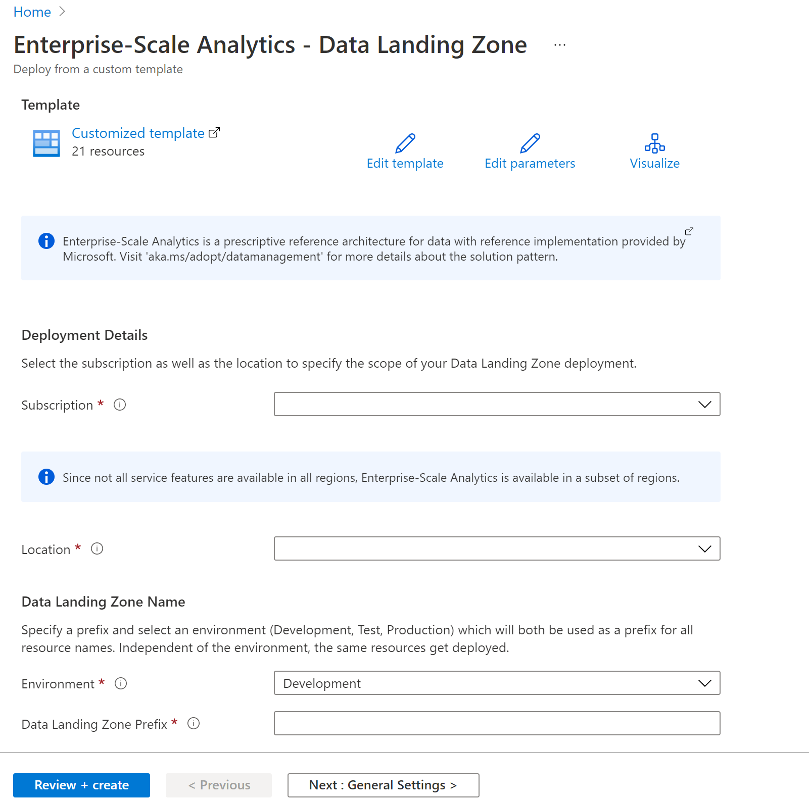
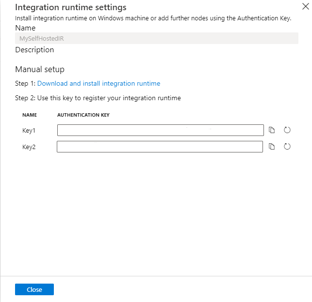
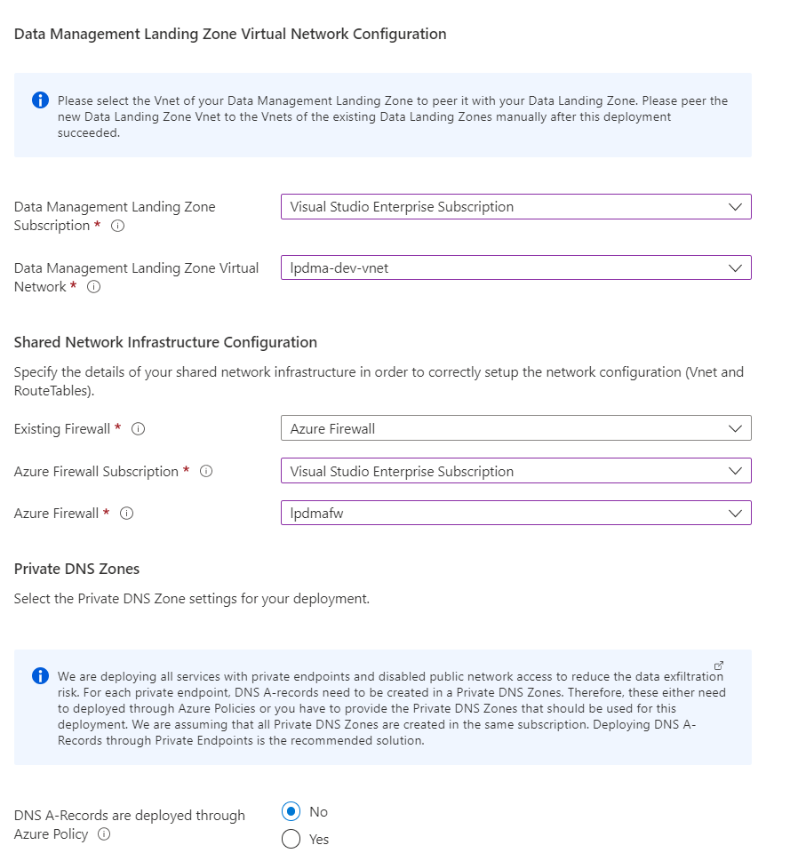
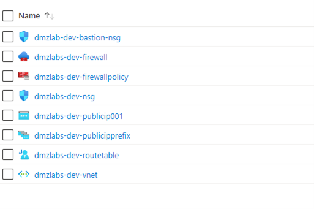
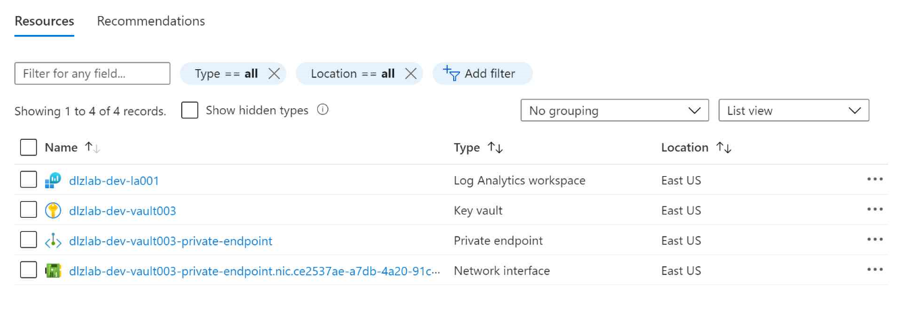
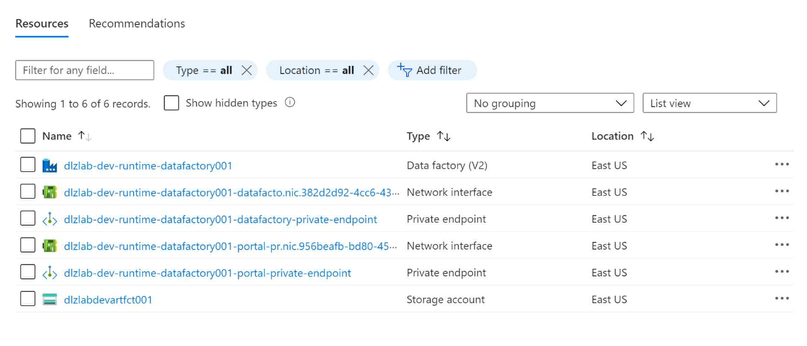
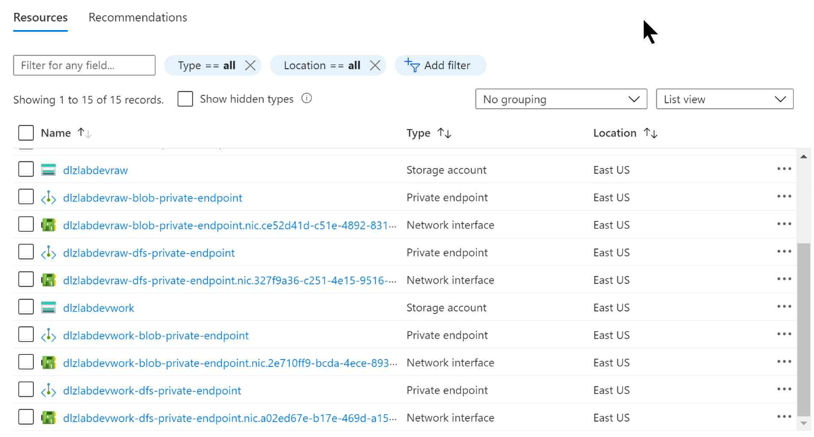
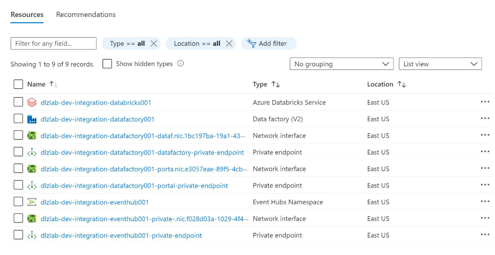
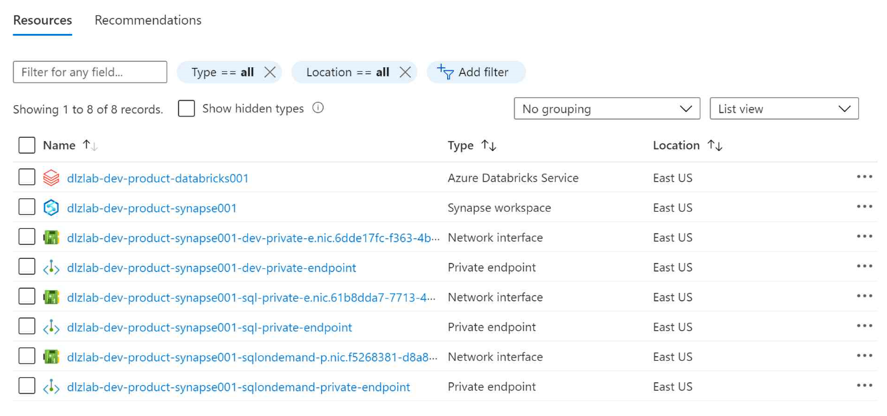
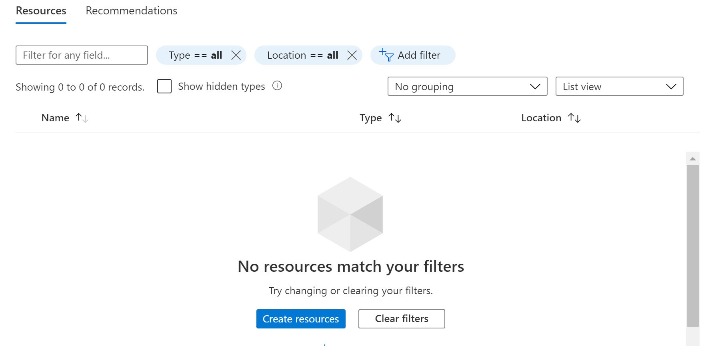

##

This module walks you through the process of provisioning the "Data landing zone" into your own Azure subscription

### Step 1 - Complete Prerequisites

A Data Management Zone deployed. Refer to Exercise 1 for details.

### Step 2 - Initiate the workflow to complete the data management landing zone using the portal wizard UI

In this Step 2, provide the following information

- Subscription: Select the subscription to deploy the Data Landing Zone to.

- Location: Select from the dropdown. If there are no organizational policies influencing the location, it's a good idea to pick a region that is physically close to you. Verify that this region is supported for Enterprise Scale Analytics. A list of supported region 's available here

- Environment: We recommend you choose Development

- Data Landing zone prefix: A prefix added to all the deployed resource groups and resources to make them unique within the subscription. The length can be a max of 10 alphanumeric characters.

### Step 3 - Obtain Azure Purview Self-hosted Integration Runtime Authentication Key

### Step 4 - select next for General Settings

In this step 4, provide the following information

- Service Settings: This step is required to set an administrator password for the Synapse workspaces, SQL Servers and potentially Self-hosted integration runtimes hosted on virtual machine scale set.

- Data Governance Settings: Select the Purview account from the dropdown to which you want to connect Synapse and Data Factory.

- Self-hosted Integration Runtime Settings: Specify whether you would like to deploy Self-hosted Integration Runtimes into your Data Landing Zone.

- Purview Self-hosted Integration Runtime Authentication Key: Paste the previously captured SHIR authentication key. If you don’t have the key,  follow the steps on Create Purview SHIR to generate and copy it.

### Step 5 - select next for Connectivity Settings

In this Step 5, provide the following information

- Virtual Network Configuration: This one is an optional step required only if the default VNET configuration has to be altered. We don’t recommend making any changes to these settings.

- Data Management Zone Virtual Network Configuration: Select the VNET of your Data Management Zone to peer it with your Data Landing Zone.

- Shared Network Infrastructure Configuration: In, “Existing Firewall” select “Azure Firewall”. Then, select the Azure Firewall Subscription, and finally under “Azure Firewall” select the [XXXX]-dev-firewall.

- Private DNS Zones: On the “DNS A-Records are deployed through Azure Policy” radio button, choose “No” and select from the multiple dropdowns the corresponding private DNS zones.

### Step 6a - select "Review + Create" for final review and create

This will trigger the deployment validation to check for any errors.

### Step 6b - click " Create"

This will trigger the deployment. The deployment will take around 20 minutes to complete.

### Step 7 - Validation after deployment

#### You can use the details here to validate the deployment.

##### Resource Group Name - XXXX-dev-network

This resource group is a placeholder for hosting any automation account

##### Resource Group Name - XXXX-dev-mgmt

This resource group is a placeholder for hosting any management function

##### Resource Group Name - XXXX-dev-logging

This resource group is a placeholder for hosting data product specific logging

##### Resource Group Name - XXXX-dev-runtimes

This resource group is a placeholder for hosting data product specific CI/CD runtimes

##### Resource Group Name - XXXX-dev-storage

This resource group is a placeholder for hosting data product specific storage

##### Resource Group Name - XXXX-dev-external-storage

This resource group is a placeholder for hosting data product specific external storage

##### Resource Group Name - XXXX-dev-metadata

This resource group is a placeholder for hosting data product specific metadata

##### Resource Group Name - XXXX-dev-shared-integration

This resource group is a placeholder for hosting centralized shared integration services

##### Resource Group Name - XXXX-dev-shared-product

This resource group is a placeholder for hosting shared product services

##### Resource Group Name - XXXX-dev-di001

This resource group is a placeholder for hosting data product specific integration

##### Resource Group Name - XXXX-dev-dp001

This resource group is a placeholder for hosting a specific data product

### Other references

<a href="/azure/cloud-adoption-framework/scenarios/data-management">Data Management and Analytics</a>
