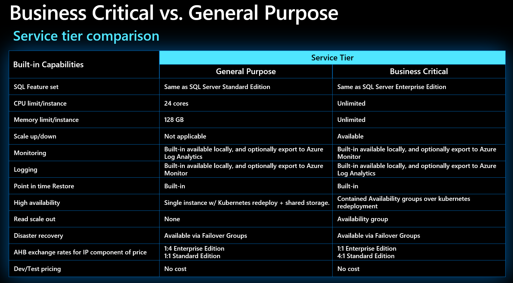

**[Azure SQL Managed Instance](/azure/azure-sql/managed-instance/sql-managed-instance-paas-overview?view=azuresql&preserve-view=true)** is an intelligent, scalable cloud database service that combines the broadest SQL Server database engine compatibility with all the benefits of a fully managed and evergreen platform as a service.

Azure Arc-enabled SQL Managed Instance (MI) provides nearly the same features, functionality, and user experience as Azure SQL MI, except it runs on your chosen hardware, on your version-supported kubernetes cluster inside your data center or multicloud environment.

Arc-enabled SQL MI has the following Features and Capabilities:
-	**[Supported Features and Services]((/azure/azure-arc/data/managed-instance-features)**
    - **[RDBMS High Availability]((/azure/azure-arc/data/managed-instance-features#RDBMSHA)**
    - **[RDBMS Scalability and Performance]((/azure/azure-arc/data/managed-instance-features#RDBMSSP)**
    - **[RDBMS Security]((/azure/azure-arc/data/managed-instance-features#RDBMSS)**
    - **[RDBMS Manageability]((/azure/azure-arc/data/managed-instance-features#RDBMSM)**
    - **[Programmability]((/azure/azure-arc/data/managed-instance-features#Programmability)**
    - **[Tools]((/azure/azure-arc/data/managed-instance-features#tools)**
-	**[Unsupported Features and Services](/azure/azure-arc/data/managed-instance-features#Unsupported)**

## Service Tiers

Arc-enabled SQL MI is available in two (2) vCore Service tiers:

- **General Purpose** is a budget-friendly tier designed for most workloads with common performance and availability features.
- **Business Critical** is designed for performance-sensitive workloads with higher availability features.

<!-- As Azure Arc-enabled SQL Managed Instance runs on your hardware inside your chosen data center, no guaranteed SLAs are provided for storage or compute. You get the flexibility to bring your own performant hardware to meet your SLAs. -->

## Feature comparison

Arc-enabled SQL MI provides all the same built-in capabilities as Azure SQL MI and SQL Server. You can take advantage of the most important features that Azure SQL MI and SQL Server have to offer, thanks to Arc-enabled SQL MI sharing a common code base with the latest version of SQL Server. The tables below compare the latest SQL Server features to what Arc-enabled SQL MI provides today:

##  RDBMS High Availability  
  
|Feature|Azure Arc-enabled SQL Managed Instance|
|-------------|----------------|
|Always On failover cluster instance| Not Applicable. Similar capabilities available.|
|Always On availability groups|Business Critical service tier.|
|Basic availability groups|Not Applicable. Similar capabilities available.|
|Minimum replica commit availability group|Business Critical service tier. 
|Clusterless availability group|Yes|
|Back up database | Yes - `COPY_ONLY`|
|Back up compression|Yes|
|Back up mirror |Yes|
|Back up encryption|Yes|
|Back up to Azure to (backup to URL)|Yes|
|Database snapshot|Yes|
|Fast recovery|Yes|
|Hot add memory and CPU|Yes|
|Log shipping|Not currently available.|
|Online page and file restore|Yes|
|Online indexing|Yes|
|Online schema change|Yes|
|Resumable online index rebuilds|Yes|

##  RDBMS Scalability and Performance  

| Feature | Azure Arc-enabled SQL Managed Instance |
|--|--|
| Columnstore | Yes |
| Large object binaries in clustered columnstore indexes | Yes |
| Online nonclustered columnstore index rebuild | Yes |
| In-Memory OLTP | Yes |
| Persistent Main Memory | Yes |
| Table and index partitioning | Yes |
| Data compression | Yes |
| Resource Governor | Yes |
| Partitioned Table Parallelism | Yes |
| NUMA Aware and Large Page Memory and Buffer Array Allocation | Yes |
| IO Resource Governance | Yes |
| Delayed Durability | Yes |
| Automatic Tuning | Yes |
| Batch Mode Adaptive Joins | Yes |
| Batch Mode Memory Grant Feedback | Yes |
| Interleaved Execution for Multi-Statement Table Valued Functions | Yes |
| Bulk insert improvements | Yes |

##  RDBMS Security

| Feature | Azure Arc-enabled SQL Managed Instance |
|--|--|
| Row-level security | Yes |
| Always Encrypted | Yes |
| Always Encrypted with Secure Enclaves | No |
| Dynamic data masking | Yes |
| Basic auditing | Yes |
| Fine grained auditing | Yes |
| Transparent database encryption | Yes |
| User-defined roles | Yes |
| Contained databases | Yes |
| Encryption for backups | Yes |
| SQL Server Authentication | Yes |
| Azure Active Directory Authentication | No |
| Windows Authentication | Yes |

##  RDBMS Manageability  

| Feature | Azure Arc-enabled SQL Managed Instance |
|--|--|
| Dedicated admin connection | Yes |
| PowerShell scripting support | Yes |
| Support for data-tier application component operations - extract, deploy, upgrade, delete | Yes |
| Policy automation (check on schedule and change) | Yes |
| Performance data collector | Yes |
| Standard performance reports | Yes |
| Plan guides and plan freezing for plan guides | Yes |
| Direct query of indexed views (using NOEXPAND hint) | Yes |
| Automatic indexed views maintenance | Yes |
| Distributed partitioned views | Yes |
| Parallel indexed operations | Yes |
| Automatic use of indexed view by query optimizer | Yes |
| Parallel consistency check | Yes |

##  Programmability  

| Feature | Azure Arc-enabled SQL Managed Instance |
|--|--|
| JSON | Yes |
| Query Store | Yes | 
| Temporal | Yes | 
| Native XML support | Yes | 
| XML indexing | Yes | 
| MERGE & UPSERT capabilities | Yes | 
| Date and Time datatypes | Yes | 
| Internationalization support | Yes | 
| Full-text and semantic search | No |
| Specification of language in query | Yes | 
| Service Broker (messaging) | Yes | 
| Transact-SQL endpoints | Yes | 
| Graph | Yes | 
| Machine Learning Services | No |
| PolyBase | No |

At this time, there is a small subset of unsupported features when using Arc-enabled SQL MI. Microsoft is constantly working to improve feature parity, so these limitations may be resolved over time:

- **[Back up and Restore](/azure/azure-arc/data/limitations-managed-instance#backup-and-restore)** 
<!--    - **Automated backups**
        - User databases in Simple Recovery model are not backed up.
        - Model database is not backed up.
    - **Point-in-time restore**
        - Does not support database restores across Azure Arc-enabled SQL Managed Instances. Can only restore to the same Azure Arc-enabled SQL Managed Instance where the backup was created.
        - Restoring TDE-enabled databases is not supported.
        - Restoring a deleted database is not supported. -->
- **[Data transfer technologies](/azure/azure-arc/data/limitations-managed-instance#other-limitations)**
<!--    - Transactional replication is not supported.
    - Log shipping is currently blocked. -->
