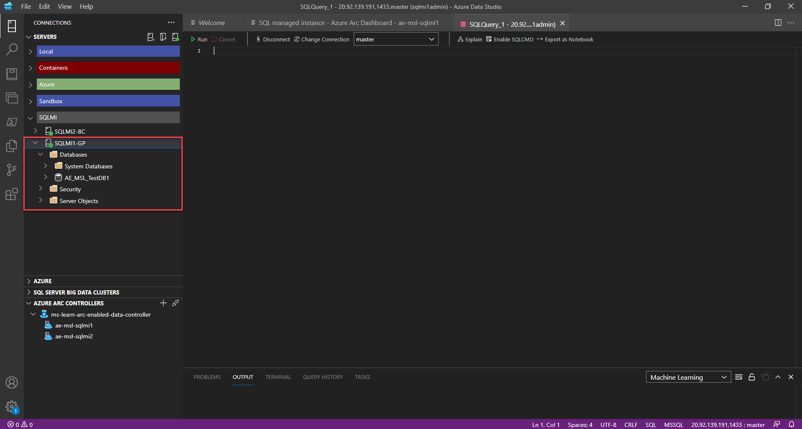
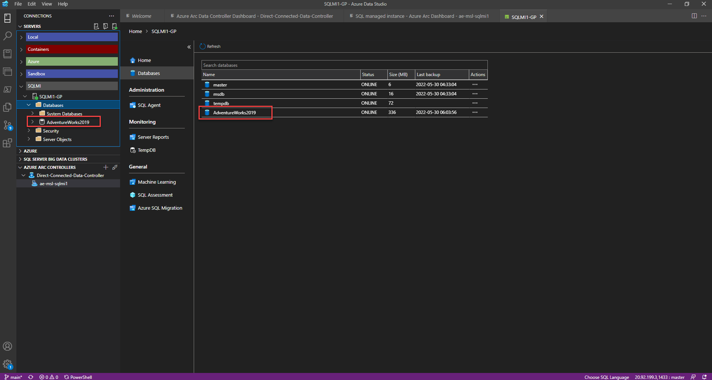

In this exercise, we will be using the AdventureWorks2019 sample database to familiarize yourself with your newly deployed Azure Arc-enabled SQL Managed Instance (MI).

## Exercise 1: Restore AdventureWorks2019

1. Download AdventureWorks2019 sample database backup [AdventureWorks2019](/sql/samples/adventureworks-install-configure?view=sql-server-ver16&tabs=ssms#download-backup-files).

2. [Copy](/azure/azure-arc/data/migrate-to-managed-instance#step-2-copy-the-backup-file-into-the-pods-file-system) the downloaded backup file to your backup drive attached to your Arc-enabled SQL MI using the `kubectl cp` command.
3. Open Azure Data Studio.
4. Expand the Connections Tab.
5. Expand Azure Arc Controllers.
6. Expand your Arc data controller.
7. Right Click on your Arc-enabled SQL MI and select Manage.

    

8. The external Endpoint is what you need to connect to your Arc-enabled SQL MI. Copy this and open either SQL Server Manage Studio or Azure Data Studio. The primary external endpoint is available from ADS as can be seen above or via the [`az sql mi-arc list`](/azure/azure-arc/data/connect-managed-instance#view-azure-arc-enabled-sql-managed-instances) command.
9. Connect to your external endpoint and name accordingly.
10. Open a new Query window to perform your database restore.

    

11. Execute the [Restore Filelistonly](/sql/t-sql/statements/restore-statements-filelistonly-transact-sql) command to confirm you have access to the AdventureWorks2019 backup file. In this example, we are restoring from locally attached storage.
12. Execute the [Restore Database](/sql/t-sql/statements/restore-statements-transact-sql) Command to restore to your Arc-enabled SQL MI.

    

13. Refresh your database list in the connections tab for your Arc-enabled SQL MI connection. 

    

## Explore AdventureWorks2019  

Whether you deploy your Arc-enabled SQL MI to Azure, on-premises, or any public cloud, you can access it the same as any other instance of SQL Server. Using your preferred tools like SQL Server Management Studio or Azure Data Studio, we will explore the AdventureWorks2019 database we restored in the exercise above.

1. Right-click on AdventureWorks2019 in your database listing and select New Query.
2. Execute the following statement to list all Schemas and Tables in the AdventureWorks2019 database:

    ```sql
    Select S.Name as 'SchemaName',
            T.Name as 'TableName'
    From sys.schemas as S
        Inner Join sys.tables as T on T.schema_id = S.schema_id
    Order By S.Name, T.Name;
    ```

    

3. Execute the following statement to retrieve all order details in the AdventureWorks2019 database:

    ```sql
    Select SUM(OrderQty) SumOfOrderQty, P.Name, SOH.OrderDate
    From Sales.SalesOrderHeader as SOH
        Inner Join Sales.SalesOrderDetail As SOD ON SOH.SalesOrderID = SOD.SalesOrderID
        Inner Join Production.Product as P on SOD.ProductID = P.ProductID
    Group By P.Name, SOH.OrderDate
    Order By SOH.OrderDate Desc;
    ```

    
