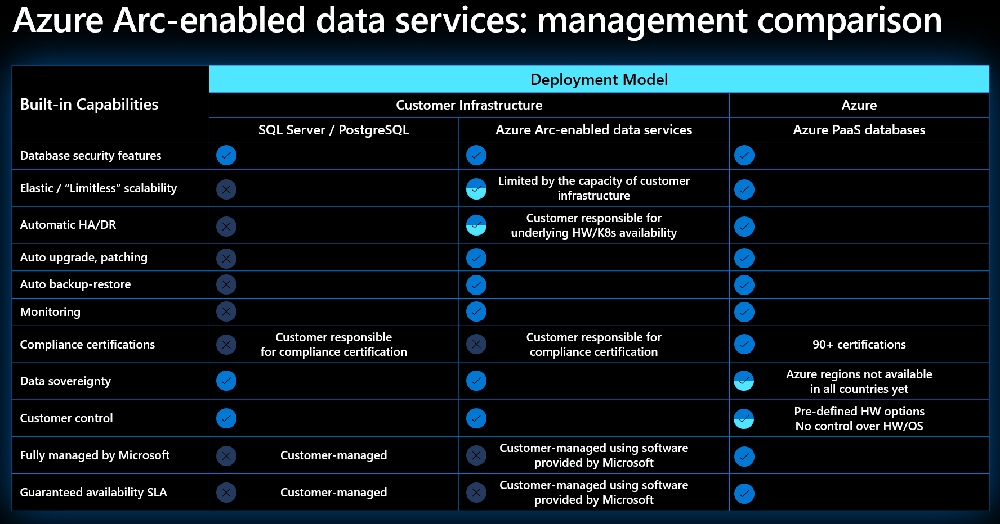
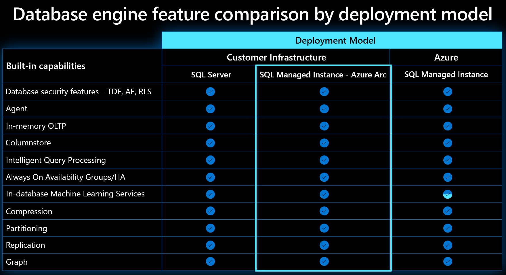

A variety of factors (such as design decisions, regulatory compliance, latency issues etc.) can impact where your data environments can be deployed or where they may currently reside. These factors may prevent you from utilizing public clouds such as Azure. Azure Arc-enabled data services allow you to deploy, manage, and run Azure data services on-premises, at the edge, or in any public cloud. Leveraging Kubernetes and the infrastructure of your choice Arc-enabled data services provides you with the built-in Azure capabilities for your data services.

## Management capabilities

Utilizing Azure Arc-enabled data services gives you the benefits of cloud computing in a hybrid environment allowing you to take advantage of Azure's built-in data services management capabilities. The benefits and reduced administrative efforts can be seen in this comparison table by deployment model.

The biggest differences between Arc-enabled SQL Managed Instance (MI) and Azure SQL Managed Instance (MI) are due to the fact that the data services environment is running on your hardware vs. in Azure. This means that:  

- **Elastic / Limitless scalability** is limited in your environment by the capability of the hardware infrastructure provisioned to host your Arc-enabled SQL MI. 
- **Automatic HA/DR** is your responsibility for the hardware / Kubernetes cluster availability. 
- **Compliance certification** is your responsibility for meeting any compliance certifications required.

Connectivity modes are essential to understand and dictate the deployment process one must follow. The following table outlines the differences in the management capabilities available under each connectivity mode. We will look at the two connectivity modes in the next section.

## Database engine feature comparison

Database engine feature set support plays a big part in determining the suitability of Azure Arc-enabled data services for your requirements. The following table shows the feature set comparisons between SQL Server, Arc-enabled SQL MI, and Azure SQL MI across all deployment model offerings.

## Supported regions

[Supported Region](https://azure.microsoft.com/global-infrastructure/services/?products=azure-arc) - Arc-enabled data services, supported in either connectivity mode, is a requirement to be included into your design and implementation in your environment.  

## Azure Arc Jumpstart

[Azure Arc Jumpstart](https://azurearcjumpstart.io/azure_arc_jumpstart/azure_arc_data/) provides us with our starting point for learning and understanding the various deployment options available on multiple infrastructure platforms.

- **Azure Kubernetes Service** guides you through creating an AKS cluster with Azure Arc-enabled data services integration in an automated fashion using ARM templates.
- **Kubernetes Cluster API** guides you through deploying Azure Arc-enabled data services on Cluster API (CAPI) Kubernetes in an automated fashion using ARM templates.
- **Amazon Elastic Kubernetes Service** guides you through creating an Amazon Elastic Kubernetes Service (EKS) with Azure Arc-enabled data services integration in an automated fashion using Terraform.
- **Google Kubernetes Engine** guides you through creating a Google Kubernetes Engine (GKE) with Azure Arc-enabled data services integration in an automated fashion using Terraform.
- **MicroK8s** guides you through deploying Azure Arc-enabled data services on MicroK8s in an automated fashion using ARM templates.
- **Upstream Kubernetes (Kubeadm)** guides you on creating a Kubernetes cluster using kubeadm in an Azure VM with Azure Arc-enabled data services integration in an automated fashion using ARM templates.

## Deployment Steps

To deploy your Arc-enabled data service environment, you must complete the following tasks:

- **Plan your deployment** - This will require choosing the connectivity mode, reviewing and planning your compute requirements needed for your Arc data controller and the number of data services you will deploy. You must also plan your storage requirements for your Kubernetes cluster, understand your availability and business continuity requirements, and deploy your Kubernetes cluster.
- **Install client tools** - Before starting your journey of deploying Arc-enabled data services, you will need to install some [client tools](/azure/azure-arc/data/install-client-tools) required for creating and managing the Arc-enabled data services.
- **Access a Kubernetes cluster** - To create a cluster, follow the instructions at [Quickstart: Deploy an Azure Kubernetes Service (AKS) cluster using the Azure portal](/azure/aks/learn/quick-kubernetes-deploy-portal). You will have to ensure that you connect your Kubernetes cluster to Azure Arc. Follow the instructions at [Introduction to Azure Arc enabled Kubernetes](/learn/modules/intro-to-arc-enabled-kubernetes/)
- **Create an Azure Arc data controller** - Depending on your chosen connected mode, there are different deployment options available that we will cover later in this module.
- **Deploy Azure Arc-enabled data service** - We will cover this in module 2.
- **Connect and manage your Azure Arc-enabled data service** - Using Azure Data Studio with the Azure Arc extension installed, you are now ready to connect and manage your newly provisioned Arc-enabled data services environment.
