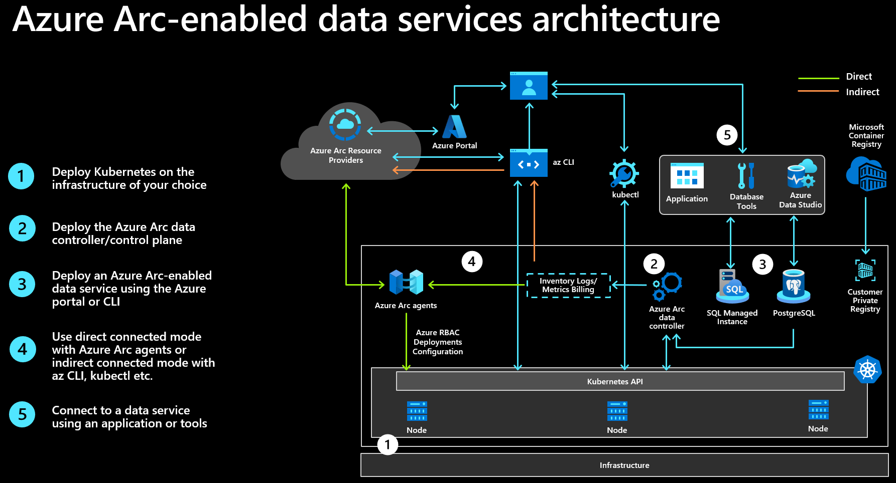

The Azure Arc data controller is a Kubernetes operator that performs all orchestration to ensure you achieve your desired state. it's the main component in the Azure Arc infrastructure that links the data services with the Arc-enabled hardware located either on-premises, in Azure, or in any public cloud data center and your Azure subscription. The Arc data controller allows you to deploy, manage, secure, and monitor your data services estate using familiar tools while having the same experience from the Azure portal.

In units 2 (Prepare for Azure Arc-enabled Data Services) and 3 (Evaluate Azure Arc-enabled data services connectivity modes) of this module, you looked at the capabilities and connectivity modes to prepare us to decide what type of deployment you need to implement for the Azure Arc data controller.

Point 1 - **Deploy Kubernetes on the infrastructure of your choice** provides the foundations of your Arc-enabled data services hosted in your required data center.

In preparation for Point 2 - **Deploy the Arc-enabled data controller/control plane**, your Kubernetes infrastructure needs to be Arc-enabled. In the next unit, you'll look at the steps required to achieve this as part of the deployment pre-requisites.

Point 2 provides multiple approaches for the deployment of the Arc data controller based on the connectivity mode and your preference of tools to use:

    - CLI commands utilizing both az arcdata and kubectl commands.
    - GUI options in either the Azure portal or Azure Data Studio.

Point 3 - **Deploy an Azure Arc-enabled SQL MI** will be discussed in the next module.

Point 4 - **Connectivity mode** will dictate the deployment option tools used and some of the options and experiences you can achieve. As outlined in the previous unit, you can't change your chosen connectivity mode after completing the deployment.

Point 5 - **Connect to your data services** allows you to use your data tools of choice (SQL Server Management Studio, Azure Data Studio, Visual Studio, etc.) and any existing applications with no additional changes, since it's just a deployment of the Azure SQL Managed Instance or PostgreSQL database.
