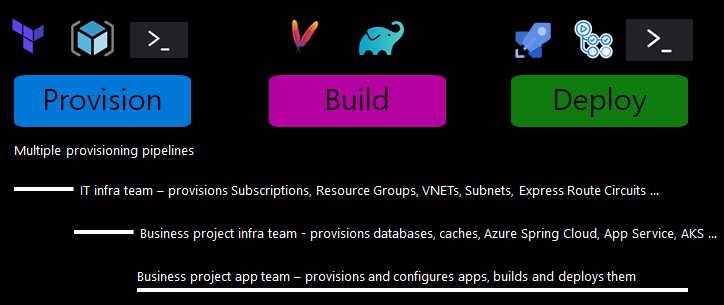

Imagine that you're an infrastructure manager and you've been asked to provision your Azure resources by using Terraform. After you've created your project, you plan to build and deploy your application with GitHub Actions.

## Provision, build, and deploy tracks

Automation ordinarily uses three tracks: *Provision*, *Build*, and *Deploy*. Each track can have one or more *pipelines*. 

The following image displays multiple pipelines in the **Provision** track, with each pipeline focusing on the infrastructure for a team.

In this module's scenario, you'll use all three tracks by implementing multiple pipelines.

Several tools are available to help you work with these pipelines. Because you're already using GitHub for your code repository, you can use GitHub Actions with Terraform to provide the automation you need.

## Learning objectives

In this module, you will:
- Create a Terraform configuration for your Azure resources.
- Provision your infrastructure and deploy it to Azure.
- Set up your project for continuous integration and continuous delivery (CI/CD) by using GitHub Actions.

## Prerequisites

- An Azure subscription
- A GitHub account
- Basic knowledge of software development
- Basic knowledge of managing and provisioning Azure resources
