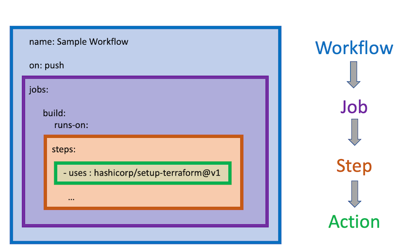

In this unit, you'll learn about GitHub actions and how they integrate with Terraform and Azure.

## GitHub actions

As an infrastructure Manager, you need your build and deployment workflows part of your GitHub repository, and use the same version control as your project.

GitHub actions allow you to run Continuous Integration and Deployments (CI/CD) linked to your GitHub repositories.

Github Actions let you build, test, and deploy your code right from GitHub. You can also assign code reviews, manage branches, and triage issues the way you want with actions.

## GitHub Actions Components

Let's look at the different GitHub Actions components:

- Workflows: Automated processes added to your repository.
- Events: An activity that triggers a workflow.
- Jobs: A set of steps that execute on a runner.
- Steps: A task that can run one or more commands (actions).
- Actions: Standalone commands that can be combined into steps. Multiple steps can be combined to create a job.

A Workflow is a collection of jobs and steps to automate software development life-cycle tasks.

Each step is made up of individual actions that run after a specific event (like a pull request) occurs. The individual actions are packaged scripts that automate software development tasks.

To create a workflow, you add actions to a .yml file in the .github/workflows directory in your GitHub repository.

## Terraform GitHub Action

The `hashicorp/setup-terraform` action sets up Terraform CLI in your GitHub Actions workflow by:

- Downloading a specific version of Terraform CLI and adding it to the `PATH`.
- Configuring the Terraform CLI configuration file with a Terraform Cloud/Enterprise hostname and API token.
- Installing a wrapper script to wrap later calls of the `terraform` binary and expose its STDOUT, STDERR, and exit code as outputs named `stdout`, `stderr`, and `exitcode` respectively.

## Authenticating GitHub Actions with Azure

Terraform supports several options for authenticating with Azure:

- When using Terraform interactively, authenticating via Microsoft account is recommended.
- When using Terraform from code or automation, authenticating via Azure service principal is the recommended way.

An Azure service principal is an identity created for use with applications, hosted services, and automated tools to access Azure resources.

## Next steps

In the next unit, we'll set up a sample project and use GitHub Actions with Terraform to deploy to Azure.
