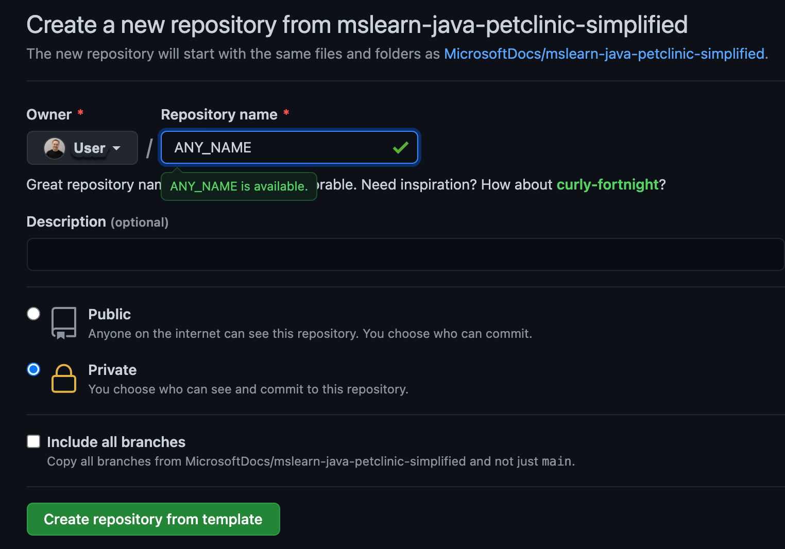
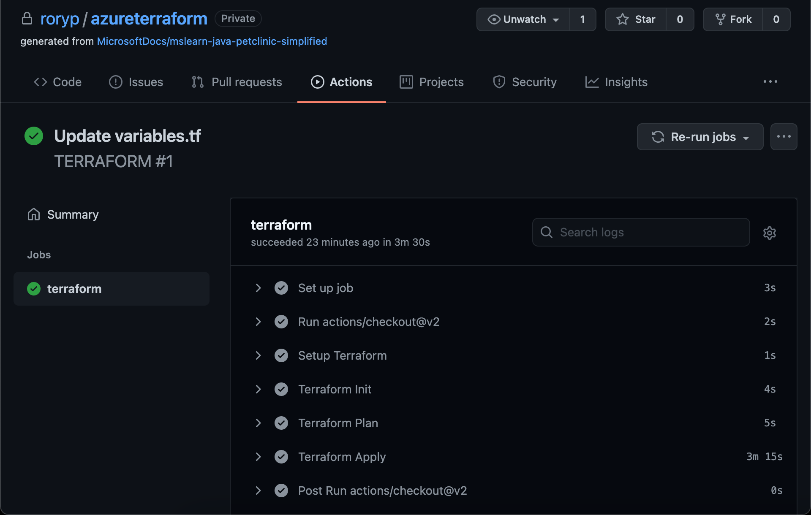

In this exercise, you'll configure GitHub actions to provision your Terraform resources.

## Access the sample application

In this exercise, we'll be creating a GitHub repository from a template that contains all the code for our Terraform provisioning.

Create a GitHub repository from the following GitHub template:

```html
https://github.com/MicrosoftDocs/mslearn-java-petclinic-simplified
```

- On GitHub, navigate to the main page of the repository.

- Above the file list, select "Use this template".


- select to "Create Repository from template" under your GitHub Account as a private repository.



## Workflow

Inside the project directory, you'll see a directory called `terraform` and a file called `main.tf` in it.

Lets look at some sections that define your module's configuration:

- Provider: A Terraform configuration file starts off with the specification of the provider. When using Azure, you'll specify the Azure provider (azurerm) in the provider block
- Terraform: Terraform version
- Data: Get data from already existing services
- Locals: Generates new variables using functions and expressions
- Resource: Describes resources & dependencies
- Module: Reusability & complexity abstraction

Lets look at which sections we need in our **main.tf** file:
(The comments in green explain the different sections and their roles in our module)

```yml
provider "azurerm" {
  version = "=2.20.0"
  features {}
}

# This creates a resource group
resource "azurerm_resource_group" "main" {
  name     = var.resource_group
  location = var.location

  tags = {
    "Terraform" = "true"
  }
}

resource "random_password" "password" {
  length = 32
  special = true
  override_special = "_%@"
}

# This creates a MySQL server
resource "azurerm_mysql_server" "main" {
  name                              = "${azurerm_resource_group.main.name}-mysql-server"
  location                          = azurerm_resource_group.main.location
  resource_group_name               = azurerm_resource_group.main.name

  administrator_login               = "petclinic"
  administrator_login_password      = random_password.password.result

  sku_name   = "B_Gen5_1"
  storage_mb = 5120
  version    = "5.7"
  auto_grow_enabled                 = true
  backup_retention_days             = 7
  geo_redundant_backup_enabled      = false
  infrastructure_encryption_enabled = false
  public_network_access_enabled     = true
  ssl_enforcement_enabled           = true
  ssl_minimal_tls_version_enforced  = "TLS1_2"
}

# This is the database that our application will use
resource "azurerm_mysql_database" "main" {
  name                = "${azurerm_resource_group.main.name}_mysql_db"
  resource_group_name = azurerm_resource_group.main.name
  server_name         = azurerm_mysql_server.main.name
  charset             = "utf8"
  collation           = "utf8_unicode_ci"
}

# This rule is to enable the 'Allow access to Azure services' checkbox
resource "azurerm_mysql_firewall_rule" "main" {
  name                = "${azurerm_resource_group.main.name}-mysql-firewall"
  resource_group_name = azurerm_resource_group.main.name
  server_name         = azurerm_mysql_server.main.name
  start_ip_address    = "0.0.0.0"
  end_ip_address      = "0.0.0.0"
}

# This creates the plan that the service use
resource "azurerm_app_service_plan" "main" {
  name                = "${var.application_name}-plan"
  location            = azurerm_resource_group.main.location
  resource_group_name = azurerm_resource_group.main.name
  kind                = "Linux"
  reserved            = true

  sku {
    tier = "PremiumV2"
    size = "P1v2"
  }
}

# This creates the service definition
resource "azurerm_app_service" "main" {
  name                = var.application_name
  location            = azurerm_resource_group.main.location
  resource_group_name = azurerm_resource_group.main.name
  app_service_plan_id = azurerm_app_service_plan.main.id
  https_only          = true

  site_config {
    always_on        = true
    linux_fx_version = "JAVA|8-jre8"
  }

  # Application specific environment variables
  app_settings = {
    "WEBSITES_ENABLE_APP_SERVICE_STORAGE" = "false"

    "SPRING_PROFILES_ACTIVE"     = "mysql"
    "SPRING_DATASOURCE_URL"      = "jdbc:mysql://${azurerm_mysql_server.main.fqdn}:3306/${azurerm_mysql_database.main.name}?useUnicode=true&characterEncoding=utf8&useSSL=true&useLegacyDatetimeCode=false&serverTimezone=UTC"
    "SPRING_DATASOURCE_USERNAME" = "${azurerm_mysql_server.main.administrator_login}@${azurerm_mysql_server.main.name}"
    "SPRING_DATASOURCE_PASSWORD" = azurerm_mysql_server.main.administrator_login_password
  }
}
```

## Set Up up your workflow

Let's now allow your GitHub workflow, access to your Azure account.
Create a service principal with the Azure CLI:

> [!IMPORTANT]
> Replace `yourServicePrincipalName` with a name of your service principal you choose.

```azurecli
az ad sp create-for-rbac --name "yourServicePrincipalName" --role contributor --sdk-auth
```

This command will return JSON - copy it and keep it safe as we'll use it in the next step:

```bash
{
  "clientId": "XXXXXXX-XXXX-XXXX-XXXX-XXXXXXXXXXXXX",
  "clientSecret": "XXXXXXXXXXXXXXXXXXXXXXXXXXXXX",
  "subscriptionId": "XXXXXXXXX-XXXXX-XXXX-XXXX-XXXXXXXXXXXXX",
  "tenantId": "XXXXXXXX-XXXXX-XXXX-XXXX-XXXXXXXXXXX",
  ...
}
```

## GitHub Secrets

Once you have the required ID and Secrets, the next step is to add them the Secret store in your GitHub project.

GitHub repositories have a feature known as Secrets that allow you to store sensitive information used by Terraform to authenticate to Azure.

For this exercise, we need to store the secrets – `AZURE_CLIENT_ID`, `AZURE_CLIENT_SECRET`, `AZURE_SUBSCRIPTION_ID`, and `AZURE_TENANT_ID`.
To create the secrets, navigate to your forked GitHub repository, select the `Settings` menu and then on `Secrets`.
Create a GitHub secret for each of four secrets using the values returned the Azure service principal.

 > [!IMPORTANT]
> Create each Secret without the "" (quotes) - XXXXXXX-XXXX-XXXX-XXXX-XXXXXXXXXXXXX and NOT "XXXXXXX-XXXX-XXXX-XXXX-XXXXXXXXXXXXX"

The result will be something like this:


## Workflow file

Inside the project directory, you'll see a directory called `.github/workflows` and a file called `main.yml` in it.
This file is a GitHub workflow and will use the secret we configured above to deploy the application to your Azure subscription.

In that file, you'll see the following content:

```yml
name: TERRAFORM

on:
  push:
    branches: [ main ]
    paths:
    - 'terraform/**'
  pull_request:
    branches: [ main ]
    paths:
    - 'terraform/**'

  workflow_dispatch:
jobs:
  terraform:
    runs-on: ubuntu-latest

    env:
      ARM_CLIENT_ID: ${{ secrets.AZURE_CLIENT_ID }}
      ARM_CLIENT_SECRET: ${{secrets.AZURE_CLIENT_SECRET}}
      ARM_SUBSCRIPTION_ID: ${{ secrets.AZURE_SUBSCRIPTION_ID }}
      ARM_TENANT_ID: ${{ secrets.AZURE_TENANT_ID }}

    defaults:
      run:
        working-directory: ./terraform
    steps:
      - uses: actions/checkout@v2

      - name: Setup Terraform
        uses: hashicorp/setup-terraform@v1

      - name: Terraform Init
        run: terraform init

      - name: Terraform Plan
        run: terraform plan

      - name: Terraform Apply
        run: terraform apply -auto-approve
```

This workflow does the following actions:

- Check whether the configuration is formatted properly
- generate a plan for every pull requests
- trigger the configuration when you update files in the "terraform" directory

> [!NOTE]
> You also trigger the GitHub Actions workflow by going to "Actions", then select the terraform workflow and "Re-run existing Jobs".

## Trigger the workflow

Next, in your repository, let's trigger your GitHub Action.

Using the built-in GitHub Text editor, or an editor of choice, edit `terraform/variables.tf`

```yaml
variable "resource_group" {
  description = "The resource group"
  default = "CHANGE_ME_RESOURCE_GROUP"
}

variable "application_name" {
  description = "The Spring Boot application name"
  default     = "CHANGE_ME_APP_NAME"
}

variable "location" {
  description = "The Azure location where all resources in this example should be created"
  default     = "westeurope"
}
```

Change "**CHANGE_ME_RESOURCE_GROUP**" to your intended resource group name and "**CHANGE_ME_APP_NAME**" to your intended application name.

Commit your changes.

> [!IMPORTANT]
> Make sure the name of your application name is unique.

## Confirm the GitHub Action build

- Go to the "Actions" tab on your repository, then select the "TERRAFORM" workflow.
  - Verify the "Terraform Init", "Terraform Plan" and "Terraform Validate" steps have been triggered:



- Expand the "Terraform Apply" step.
  - Terraform has created the resources and displayed the Azure Instance URL.
- Verify your Azure App Instance is publicly available.


## Next Steps

In the next exercise, you'll use GitHub Actions to deploy a Spring Boot sample application.
