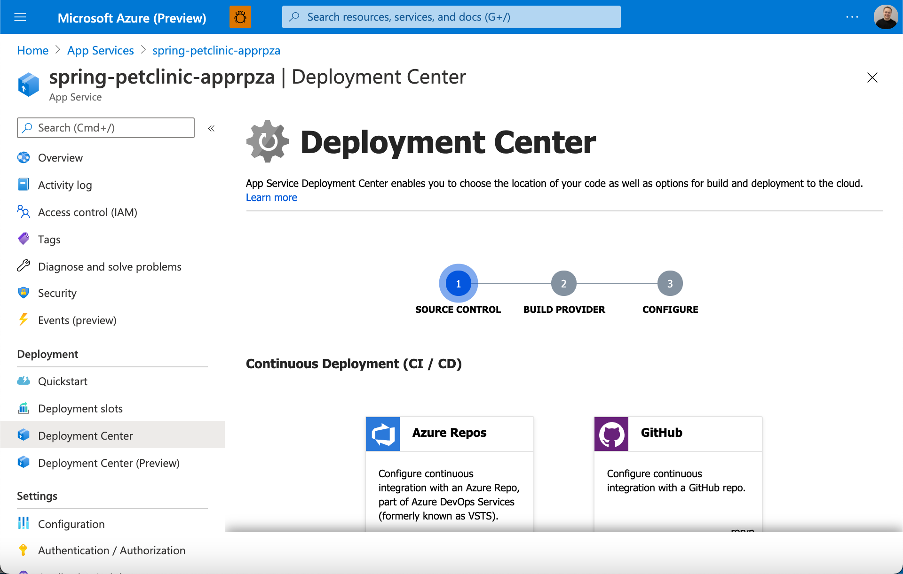

In this exercise, you'll use GitHub Actions to deploy a Spring Boot sample application.

## Set up your Maven Build/Deploy GitHub Action

Now that we've provisioned our Azure resources we can deploy your sample Spring Boot application.
To create our Maven GitHub workflow, we'll use the built-in CI/CD wizard tool that is available in the Azure App Service portal - The **Deployment Center**.



The Azure App Service Deployment Center will automatically generate a GitHub Actions workflow file based on your application stack and commit it to your GitHub repository in the correct directory. It will also link your GitHub Action to an Azure App Service publishing profile.

- Navigate to your Azure App Service webapp in the Azure portal
- On the left side, select **Deployment Center**
- Under **Continuous Deployment (CI / CD)**, select **GitHub**
- Next, select **GitHub Actions**
- On the right, under **Settings**, use the dropdowns to select your GitHub repository, **main** branch, and **JAVA 8** as the application stack
- On the final screen, you can review your selections and preview the workflow file that will be committed to the repository. Your Workflow file will be created similar to the below. You'll have a different application name (APP_NAME) and publishing profile:

```yml
name: Build and deploy JAR app to Azure Web App - APP_NAME

on:
  push:
    branches:
      - main
  workflow_dispatch:

jobs:
  build-and-deploy:
    runs-on: ubuntu-latest

    steps:
    - uses: actions/checkout@master

    - name: Set up Java version
      uses: actions/setup-java@v1
      with:
        java-version: '8'

    - name: Build with Maven
      run: mvn clean install

    - name: Deploy to Azure Web App
      uses: azure/webapps-deploy@v2
      with:
        app-name: 'APP_NAME'
        slot-name: 'production'
        publish-profile: ${{ secrets.AzureAppService_PublishProfile_c1ee8d191003493b9c9e13a9b78ad2c3 }}
        package: '${{ github.workspace }}/target/*.jar'
```

- If the Workflow is correct, select **Finish**
- This configuration will commit the workflow file to the repository, and immediately start to build and deploy your app.

> [!NOTE]
> You also trigger the GitHub Actions workflow by going to "Actions", then select the "build-and-deploy" workflow and "Re-run Jobs".

## Confirm the GitHub Action build

- Go to the "Actions" tab on your repository, then select the "build-and-deploy" workflow.
- Expand the "Deploy to Azure Web App" step.
  - Terraform has deployed the Java Web App and displayed the Azure Instance URL.
- Verify your Java application is deployed, connection to your MySQL database, and returning data.


## Next steps

Congratulations! You now have two GitHub actions workflows - a provisioning action and a build/deploy action.
Each time you `git push` your code, your build/deploy action is triggered and your application is deployed.

> [!IMPORTANT]

> Re-running your provision GitHub action will not recreate your resources if they already exist. You will need to delete your resource group or resources manually and then re-run the GitHub action.

> Re-running your build/deploy GitHub action will replace your application.

> If you re-create your App Service Instance you will need to also change to the new publishing profile  - the following is the only line that needs to be changed to your new Publish Profile:

```yml
publish-profile: ${{ secrets.AzureAppService_PublishProfile_c1ee8d191003493b9c9e13a9b78ad2c3 }}
```

In the next unit, we'll do a knowledge check and then summarize what we learnt.
