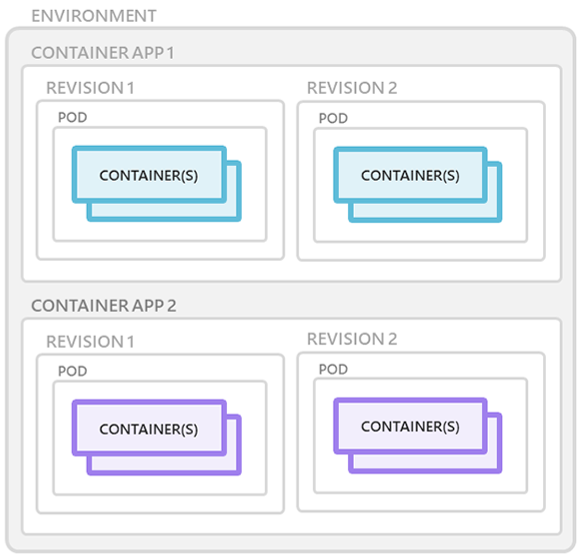

In this unit, you learn how to create an Azure Container Apps environment and an Azure for PostgreSQL database by using Azure CLI. You then configure your Quarkus application so that it connects to the remote database instead of the local one.

Several targets are available for deploying a Quarkus application on Azure, from IaaS to FaaS. [Azure Container Apps](https://azure.microsoft.com/products/container-apps/) is between PaaS and FaaS. It's more like a PaaS because it doesn't force you into a specific programming model, and you can control the rules by which to scale out and in. On the other hand, it has some serverless characteristics, like scaling to zero, event-driven scaling, and a per-second pricing model.

Container Apps is built on [Azure Kubernetes Service](https://azure.microsoft.com/products/kubernetes-service/) (AKS). It includes deep integration with [KEDA](https://keda.sh) (event-driven autoscaling for Kubernetes), [Dapr](https://dapr.io) (distributed application runtime) and [Envoy](https://www.cncf.io/projects/envoy) (a service proxy designed for cloud-native applications). The underlying complexity is abstracted, so you don't need to configure your Kubernetes service, deployment, ingress, or volume manifests. You get a simple API and user interface to configure the configuration for your containerized application. Because of this simplification, you have less control than you have with AKS.

In Container Apps, the applications need to be packaged into a Docker container. Container Apps supports Docker containers built with Dockerfiles or with Jib. The container needs to be available on a container registry. Container Apps supports Azure Container Registry, Docker Hub, and GitHub Container registry. After the application image is available in a registry, Container Apps supports deploying from the Azure portal, Azure CLI, GitHub Actions, and Azure DevOps.

Container Apps provides the following features.

* _Revisions_: Automatic versioning that helps you manage the application lifecycle of your container apps.
* _Traffic control_: The ability to split incoming HTTP traffic across multiple revisions for blue/green deployments and A/B testing.
* _Ingress_: Simple HTTPS ingress configuration. You don't need to worry about DNS or certificates.
* _Autoscaling_: KEDA-supported scale triggers to scale your app based on external metrics.
* _Secrets_: Secrets that are shared among containers, scale rules, and Dapr sidecars.
* _Monitoring_: Standard output and error streams that are automatically written to Log Analytics.
* _Dapr_: Dapr integration for your container apps. Enable this integration by using a simple flag.

In the next exercise, you'll be introduced to the following concepts.

* _Environment_: An enhanced-security boundary around a group of container apps. The apps are deployed in a singe virtual network, they can easily intercommunicate with each other, and they write logs to a single Log Analytics workspace. An environment can be compared with a Kubernetes namespace.
* _Container app_: A group of containers (a pod) that's deployed and scales together. They share a single disk space and network.
* _Revision_: An immutable snapshot of a container app. New revisions are created automatically and are valuable for HTTP traffic redirection strategies like A/B testing.

You'll now create a Container App environment to see how these elements work.
