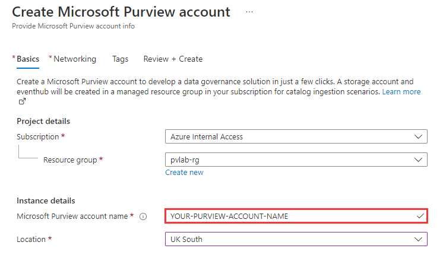

The first step in creating a holistic, up-to-date map of your data landscape, is to deploy a Microsoft Purview account. Here, we will discuss configuration settings, account concepts, and key considerations.

## Microsoft Purview account name
The name of the Microsoft Purview account. This name is used to programmatically access the Microsoft Purview account and cannot be changed. The Microsoft Purview account name must be:
* Globally unique
* Can contain only letters, numbers and hyphens
* The first and last characters must be a letter or number
* Spaces are not allowed

## Managed resources
Microsoft Purview provisions a storage account and an Azure Event Hubs account as managed resources within the subscription that the Microsoft Purview account is provisioned in. This is required to support enhanced security features during scanning.
* The name of the managed resource group will be auto-generated but can be changed during the Microsoft Purview account creation process.
* The names of the storage account and Azure Event Hubs namespace will be auto-generated during account creation and cannot be changed.

## Microsoft Purview Data Map
The Microsoft Purview Data Map is central to the Microsoft Purview service as it is responsible for storing and serving metadata, lineage, classifications, and other annotations associated with data assets. The size of the Data Map is measured in Capacity Units. There is no need to predetermine the number of Capacity Units required as Microsoft Purview will **auto-scale** up and down based on usage.

## Capacity Units
All Microsoft Purview accounts come with one Capacity Unit by default, and elastically grow based on usage. The Data Map is **always on** while the Microsoft Purview account exists, in which case, there will always be a minimum of 1 Capacity Unit consumed. 

Each Capacity Unit:
* Can support up to **25 data map operations per second**.
* Includes storage of up to **10 GB** of metadata about data assets.

## Scanning
The compute required to facilitate the automated population of the Data Map is serverless (**pay as you go**) and based on the duration of scans or ingestion jobs. Duration of these jobs can vary based on the number of systems scanned, data assets contained in the scanned systems, number of classifications selected, the shape of the data, and performance of the system scanned. Scanning is billed based on the number of vCore Hours consumed.

## Network connectivity
You can connect to your Microsoft Purview account either publically, via public IP addresses or service endpoints, or privately, using a private endpoint. [Learn more about private endpoints for your Microsoft Purview account](https://docs.microsoft.com/en-us/azure/purview/catalog-private-link).

