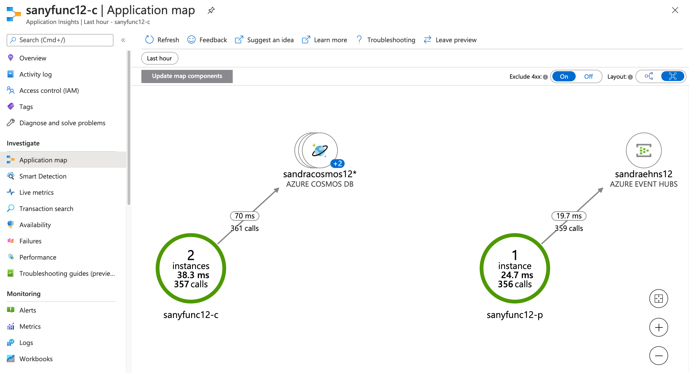

Let's have a look at the metrics in Application Insights to measure the performance and identify potential bottle necks.

## Let's check our metrics on the Azure portal

Your functions now run in Azure, and continue to accumulate data in your Azure Cosmos DB. You can view your deployed function apps in the Azure portal, and view app telemetry through the connected Application Insights resource, as shown in the following screenshots:

App map:

The Application map gives you an idea how dependent your services are with each other. As you can see, the consumer function is bound with the Cosmos DB but not with the other function. Also the consumer function is loosely coupled with the Azure Event Hub. Whereas, the producing function is bound with the event hub but not with the consuming function or the Cosmos DB.

Live Metrics Stream:

Performance:

To investigate the performance of the application stack, you can have a closer look at `Operations`, `Dependencies`, or `Roles`. Each of them allow you to dive even deeper.

## Set alerts

You always want to be sure, that your system is up and running correctly. If something goes wrong or the behavior indicates that something might go wrong closely, you want to be alarmed automatically. Alerts are the solution. Set and review alerts for your services. You find the `Alerts` tab under `Monitoring`.

Click on `New alert rule`, check the Scope, and choose the Condition.
You can either choose a specific log using `Custom log search` or you benefit from one of the smart predefined ones.

For the performance, the duration time is important. Think what's more important to you. Is the average duration enough or is it important that every request is in time and we need an alert for outliers as well? You can create as many alerts as needed. After the condition is chosen, specify the Action. For easier maintenance, you can organize them in action groups.
