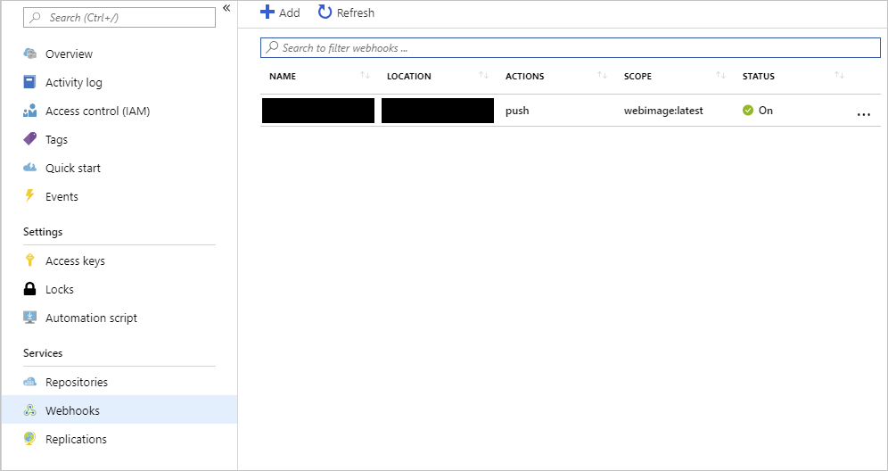

In this unit, you'll configure continuous deployment for the web app and create a webhook that links to the registry containing the Docker image. Then you'll make a change to the source code for a web app and rebuild the image. You'll visit the web site hosting the sample web app again, and verify the newest version is run.

> [!NOTE]
> This exercise does not create an Azure Container Registry task. Instead, you'll manually rebuild the Docker image for the sample app. The webhook will fire when the new Docker image is created.

## Configure continuous deployment and create a webhook

1. Return to the [Azure portal](https://portal.azure.com/learn.docs.microsoft.com?azure-portal=true) and navigate to the **Container settings** page of your App Service web app.

1. Set **Continuous Deployment** to **On**, and then click **Save**. This setting configures a webhook that Azure Container Registry can use to alert the web app that the Docker image has changed.

    

    If you were to navigate to the **Webhooks** page for your Azure Container Registry, you'd see the newly-configured webhook:

    
  
## Update the web app and test the webhook

1. In the Cloud Shell, move to the `SampleWeb/Pages` folder. This folder contains the source code for the HTML pages displayed by the web app:

    ```bash
    cd ~/mslearn-deploy-run-container-app-service/SampleWeb/Pages
    ```

1. Run the following commands to replace the default page in the web app (`Index.cshtml`) with a new version that has an additional item in the carousel control. This simulates continued development on the app, and adds a new page to the carousel.

    ```bash
    mv Index.cshtml Index.cshtml.old
    mv Index.cshtml.new Index.cshtml
    ```

1. Run this next set of commands to rebuild the image for the web app and push it to Azure Container Registry. Replace `<container_registry_name>` with the name of your registry. Don't forget the `.` at the end of the second command:

    ```bash
    cd ~/mslearn-deploy-run-container-app-service
    az acr build --registry <container_registry_name> --image webimage .
    ```

1. Navigate to the **Webhooks** page of your container registry in the Azure portal and click on the single webhook in the list.

1. At the bottom of the page, you'll see a record of the webhook that just fired in response to the build and push you ran.

    

## Test the web app again

1. Navigate back to your web app in the browser. If you closed the tab for it earlier, you can navigate to the Overview page of the app in the Azure portal and click **Browse**. There will be a cold start delay while the web app loads the new image from Azure Container Registry.

1. Click through the items in the carousel control. The control should now contain four pages. The new page looks like this:

    

 The webapp has been automatically updated and redeployed based on the new image. The webhook service in your registry notified your web app that the container image had been modified, triggering an update.