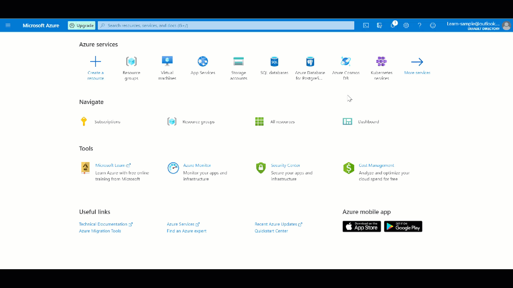
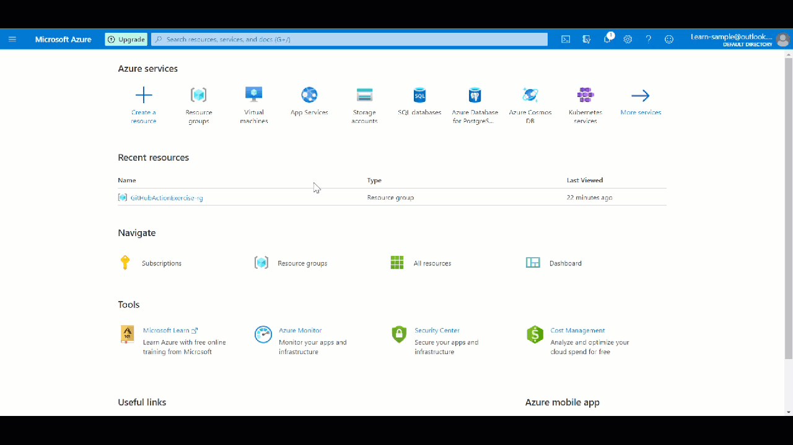

Here you'll deploy an Azure Resource Manager (ARM) template from a GitHub Actions workflow.

> [!IMPORTANT]
> You perform this exercise outside the Microsoft Learn environment. This exercise requires you to have your own Azure subscription, and you might incur charges. This is required because you'll need to create a service principal, which is *not* supported in the sandbox subscription. If you don't already have an Azure subscription, create a [free account](https://azure.microsoft.com/free/?azure-portal=true) before you begin.

## Create your GitHub account and repository

First, if you don't have a GitHub account, please create one now on the [GitHub account creation page](https://github.com/join?ref_cta=Sign+up&ref_loc=header+logged+out&ref_page=%2F&source=header-home). (It's free.) 

:::image type="content" source="../media/9-github-account-creation.png" alt-text="Screenshot that shows the GitHub account creation page.":::

After you have an account, sign in and create a new repository where you'll keep your templates as part of the infrastructure as code (IaC) model. To create the repository (or *repo* as it's called in the industry), follow these steps:

1. In the upper-right corner of any page on the GitHub site, use the **+** drop-down menu and select **New repository**. Or select the green **Create repository** button, if it's there.

    :::image type="content" source="../media/9-github-repo-creation.png" alt-text="Screenshot that shows selections for creating a GitHub repo.":::

1. Enter a short, memorable name for your repository. For example, use **Deploy-ARM-Template**. Optionally, add a description of your repository. For example, use **Deploying my first ARM template with GitHub Actions**.
1. Choose a repository visibility setting. Public repositories are accessible to everyone on the internet. Private repositories are accessible only to you and to people you explicitly share access with. (Either will work with this exercise.)
1. Select **Initialize this repository with a README**.
1. Select **Create repository**.

    :::image type="content" source="../media/9-github-repo-creation-2.png" alt-text="Screenshot that shows the creation of new repo details.":::

You've created your repository and initialized it with a README file. It's time to commit a template and a template parameter file to the repo.

> [!NOTE]
>README files are a great place to describe your project in more detail, or to add some documentation such as how to install or use your project. The contents of your README file automatically appear on the front page of your repository.

## Commit an ARM template file to the repo

1. On GitHub, go to the main page of the repository.
1. Above the list of files, in the **Add file** drop-down list, select **Create new file**.

    :::image type="content" source="../media/9-github-file-creation.png" alt-text="Screenshot that shows selections for adding a template to the repo.":::

1. In the file name field, enter the name and extension for the template. In our exercise, use the name **azuredeploy.json**. Copy and paste the following template into your new GitHub file:

    ```json
    {
        "$schema": "https://schema.management.azure.com/schemas/2019-04-01/deploymentTemplate.json#",
        "contentVersion": "1.0.0.0",
        "parameters": {
            "VnetName": {
                "type": "string",
                "defaultValue": "VNet-001",
                "metadata": {
                    "description": "Virtual Network Name"
                }
            },
            "CostCenterIO": {
                "type": "string",
                "defaultValue": "12345",
                "metadata": {
                    "description": "Cost Center IO number for cross billing"
                }
            },
            "OwnerName": {
                "type": "string",
                "defaultValue": "John Smith",
                "metadata": {
                    "description": "Name of the stakeholder responsible for this resource"
                }
            }
        },
        "variables": {},
        "resources": [
            {
                "apiVersion": "2018-10-01",
                "type": "Microsoft.Network/virtualNetworks",
                "name": "[parameters('VnetName')]",
                "location": "[resourceGroup().location]",
                "tags": {
                    "CostCenter": "[parameters('CostCenterIO')]",
                    "Owner": "[parameters('OwnerName')]"
                },
                "properties": {
                    "addressSpace": {
                        "addressPrefixes": [
                            "10.0.0.0/16"
                        ]
                    },
                    "enableVmProtection": false,
                    "enableDdosProtection": false,
                    "subnets": [
                        {
                            "name": "subnet001",
                            "properties": {
                                "addressPrefix": "10.0.0.0/24"
                            }
                        },
                        {
                            "name": "subnet002",
                            "properties": {
                                "addressPrefix": "10.0.1.0/24"
                            }
                        }
                    ]
                }
            }
        ]
    }
    ```

1. Add a description in the **Commit new file** section and select **Commit new file** to save it to your repo.

    :::image type="content" source="../media/9-github-file-creation-2.png" alt-text="Screenshot that shows saving a new template to the repo." lightbox="../media/9-github-file-creation-2.png":::

## Configure authentication between GitHub Actions and your Azure subscription

To deploy any resources to Azure by using GitHub Actions, you need to create an Azure service principal and give it permissions to create resources defined in your templates. You'll perform that step in the Azure Cloud Shell section of the Azure portal after you're signed in to your subscription.

### Create the service principal

For the principal of a GitHub Actions workflow to deploy Azure resources, it needs the right built-in contributor.

The following Azure CLI script shows how you can generate an Azure service principal with contributor permissions in an Azure resource group. This resource group is where the workflow will deploy the resources defined in your ARM template.

```azurecli
projectName="GitHubActionExercise"
location="eastus"
resourceGroupName="${projectName}-rg"
appName="http://${projectName}"

# Create the resource group
az group create --name $resourceGroupName --location $location

# Store the resource group ID in a variable
scope=$(az group list --query "[?contains(name, '$resourceGroupName')].id" -o tsv)

# Create the service principal with contributor rights to the resource group we just created
az ad sp create-for-rbac --name $appName --role Contributor --scopes $scope --sdk-auth
```

In the portal, while you're signed in your subscription, select the **Cloud Shell** icon to open the shell at the bottom of the page.



In the shell, use the preceding code to create the service principal.  You'll get the following results. Copy the JSON part of the results (the content in the red box in the following screenshot) because you'll need it when configuring the secret in GitHub.

:::image type="content" source="../media/9-github-spn-creation.png" alt-text="Screenshot that shows results for creating a service principal in Azure.":::

Copy the JSON output and store it as a GitHub secret within your GitHub repository. To do this, from your GitHub repository, select the **Settings** tab and then select **Secrets** from the left menu.

Enter the following values and then select **Add secret**:

* **Name**: Enter **AZURE_CREDENTIALS**.
* **Value**: Paste the JSON output that you copied earlier.


This is the information that you'll need to specify the authentication in the workflow.

## Create a workflow

The workflow file must be stored in the .github/workflows folder at the root of your repository. The workflow file extension can be either .yml or .yaml.

You can create a workflow file and then push/upload the file to the repository. Or you can use the following procedure to create it in the GitHub interface:

1. From your GitHub repository, select **Actions** from the top menu, and select **Set up a workflow yourself**.

    :::image type="content" source="../media/9-github-workflow-creation.png" alt-text="Screenshot that shows selections for setting up a workflow.":::

1. Rename the workflow file if you prefer a different name instead of main.yml. For example, use **deployARMTemplate.yml**.
1. Replace the content of the .yml file with the following code.
   
    > [!NOTE]
    > The [GitHub Marketplace](https://github.com/marketplace) has some custom-built actions that you can use to deploy ARM templates.  This module uses the [Deploy Azure Resource Manager (ARM) Template](https://github.com/marketplace/actions/deploy-azure-resource-manager-arm-template) marketplace provider.

    ```yaml
    name: Deploy ARM Template

    on:
      push:
        branches:
          - master
    env:
      AZURE_SUBSCRIPTION_ID: << Subscription Id >>   # set this to your Azure Subscription Id
      AZURE_RESOURCE_GROUP: GitHubActionExercise-rg   # set this to your target resource group

    jobs:
      deploy-virtual-network-template:
        runs-on: ubuntu-latest
        steps:
          - name: Checkout source code
            uses: actions/checkout@master

          - name: Login to Azure
            uses: azure/login@v1
            with:
              creds: ${{ secrets.AZURE_CREDENTIALS }}

          - name: Deploy ARM Template
            uses: azure/arm-deploy@v1
            with:
              scope: subscription
              subscriptionId: ${{ env.AZURE_SUBSCRIPTION_ID }}
              resourceGroupName: ${{ env.AZURE_RESOURCE_GROUP }}
              template: $GITHUB_WORKSPACE/azuredeploy.json
    ```

    The workflow file has three sections:

    - `name`: This is the name of the workflow.
    - `on`: This is the name of the GitHub event that triggers the workflow. The workflow is triggered when a push event is on the master branch and modifies at least one file on the master branch.
    - `jobs`: A workflow run consists of one or more jobs. Only one job is called `deploy-virtual-network-template`. This job has three steps:
      1. Check out source code.
      1. Sign in to Azure.
      1. Deploy the ARM template.

    > [!IMPORTANT]
    > Verify that the secret name in the expression `creds: ${{ secrets.AZURE_CREDENTIALS }}` matches the name of the secret that you saved to your repository's settings. Also verify that the ARM template name in the `Deploy ARM Template` step `template: $GITHUB_WORKSPACE/azuredeploy.json` matches the one that you saved in the repo earlier.

    > [!NOTE]
    > The resource group name should be `GitHubActionExercise-rg` if you used the preceding Azure CLI code when you configured deployment credentials. The generated resource group name is the project name with `rg` appended.
1. Select **Start commit**. Add a comment and description if needed.
1. Ensure that **Commit directly to the master branch** is selected, and then select **Commit new file** (or **Commit changes**).

    :::image type="content" source="../media/9-github-workflow-commit.png" alt-text="Screenshot that shows committing a workflow to the master branch.":::

    After the workflow file is created and committed to the master branch of the repo, the workflow will start automatically because the trigger in your workflow is a commit/push to the master branch.

    ```yaml
    on:
      push:
        branches:
          - master
    ```

1. Go to your repo and check the status of your workflow.

    :::image type="content" source="../media/9-github-workflow-status.png" alt-text="Screenshot that shows the workflow status.":::

## Check your deployment

When the workflow is completed, go to the Azure portal to check the deployment status.

In the left pane, select **Resource groups** > **GitHubActionExercise-rg**. On the **Deployments** pane, verify that your deployment succeeded.


