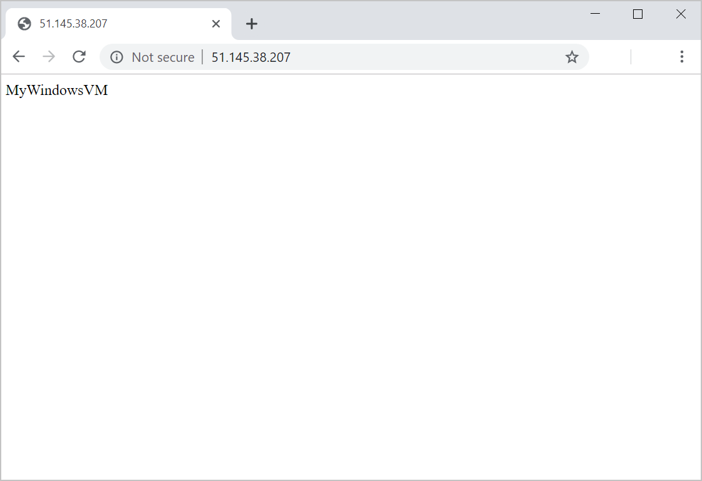
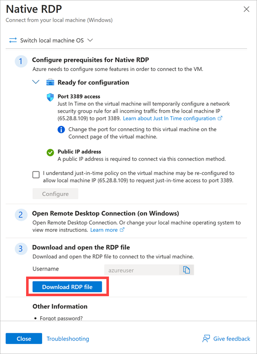
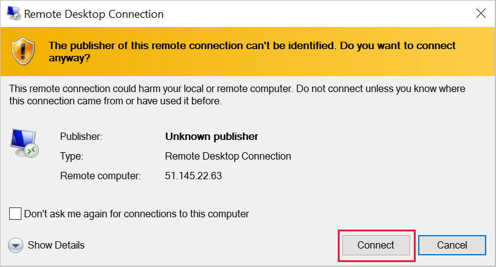
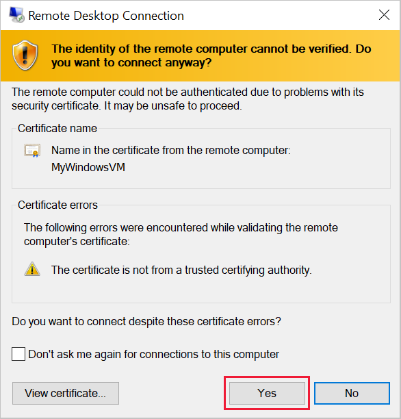
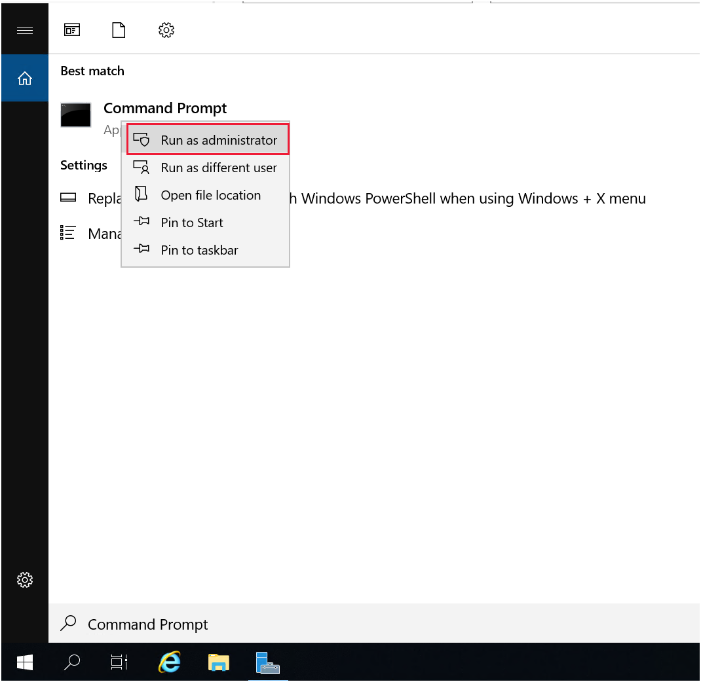
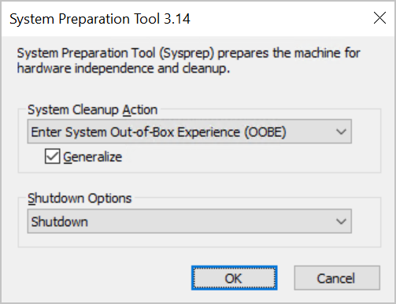

In this sample scenario, your organization is rolling out a new environment in Azure that uses virtual machines. You've already constructed a virtual machine that contains the software and tools required to support the organization's functions. You need to use this virtual machine to generate a custom image that you can then use to create new virtual machine instances.

In this exercise, you'll create a virtual machine and generalize it. You'll then create an image from the generalized virtual machine, and then use this image to create another virtual machine.

## Create a virtual machine

In this task, you'll quickly create a virtual machine that runs a simple web app. The web app displays the name of the host machine. You'll use this virtual machine as the basis for the rest of the exercise.

::: zone pivot="personal-subscription"

1. Browse to the [Azure Cloud Shell](https://shell.azure.com?azure-portal=true) and sign into your Azure subscription.

1. Create a new Azure Resource Group to hold your virtual machine. In the Cloud Shell window, run the following command.

    ```azurecli
    az group create --name "learn-vm"
    ```

1. Set the default resource group for the Azure CLI by typing the following command into the Cloud Shell window. This allows you to omit the resource group name from all the commands.

    ```azurecli
    az configure --defaults group=learn-vm
    ```

::: zone-end

::: zone pivot="sandbox-subscription"

1. Activate the Cloud Shell window on the right by signing into the Azure Sandbox.

1. Set the default resource group to work with by typing the following command into the Cloud Shell on the right. This allows you to omit the resource group name from all the commands.

    ```azurecli
    az configure --defaults group=<rgn>[Sandbox resource group name]</rgn>
    ```

::: zone-end

::: zone pivot="windows-cloud"

1. In the Azure Cloud Shell, run the following commands to create a Windows Server Datacenter virtual machine that's running IIS. When you're prompted for the *azureuser* password, enter a password of your choice.

    ```azurecli
    az vm create \
        --name MyWindowsVM \
        --image Win2019Datacenter \
        --admin-username azureuser
    ```

1. Run the following command to install IIS and set up a default webpage.

    ```azurecli
    az vm extension set \
        --name CustomScriptExtension \
        --vm-name MyWindowsVM \
        --publisher Microsoft.Compute \
        --settings '{"commandToExecute":"powershell Add-WindowsFeature Web-Server; Add-Content -Path \"C:\\inetpub\\wwwroot\\Default.htm\" -Value $(hostname)"}'
    ```

1. Run the following command to open port 80 to the web server.

    ```azurecli
    az vm open-port \
        --name MyWindowsVM \
        --port 80
    ```

1. Run the following command to find the public IP address of the new virtual machine.

    ```azurecli
    echo http://$(az vm list-ip-addresses \
                 --name MyWindowsVM \
                 --query "[].virtualMachine.network.publicIpAddresses[*].ipAddress" \
                 --output tsv)
    ```

1. In the web browser, go to the public IP address of the virtual machine. Verify that a webpage that displays the name of the virtual machine, *MyWindowsVM*, appears.

    

::: zone-end

::: zone pivot="linux-cloud"

1. In the Cloud Shell, run the following commands to create an Ubuntu Server virtual machine that's running Nginx. When you're prompted for the *azureuser* password, enter a password of your choice.

    ```azurecli
    az vm create \
        --name MyUbuntuVM \
        --image UbuntuLTS \
        --generate-ssh-keys

    az vm open-port \
        --name MyUbuntuVM \
        --port 80

    az vm extension set \
        --publisher Microsoft.Azure.Extensions \
        --name CustomScript \
        --vm-name MyUbuntuVM \
        --settings '{"commandToExecute":"apt-get -y update && apt-get -y install nginx && hostname > /var/www/html/index.html"}'
    ```

1. Run the following command to find the public IP address of the new virtual machine.

    ```azurecli
    echo http://$(az vm list-ip-addresses \
                 --name MyUbuntuVM \
                 --query "[].virtualMachine.network.publicIpAddresses[*].ipAddress" \
                 --output tsv)
    ```

1. In the web browser, go to the public IP address of the virtual machine. Verify that a webpage that displays the name of the virtual machine *MyUbuntuVM* appears.

    

::: zone-end

## Generalize the virtual machine

::: zone pivot="windows-cloud"

1. Sign in to the [Azure portal](https://portal.azure.com/learn.docs.microsoft.com?azure-portal=true).

::: zone-end

::: zone pivot="windows-cloud, sandbox-subscription"

1. On the Azure portal menu or from the **Home** page, select **Resource groups**, and then select the **<rgn>[Sandbox resource group name]</rgn>** resource group.

::: zone-end

::: zone pivot="windows-cloud, personal-subscription"

1. On the Azure portal menu or from the **Home** page, select **Resource groups**, and then select the **learn-vm** resource group.

::: zone-end

::: zone pivot="windows-cloud"

1. Select the **MyWindowsVM** virtual machine.

1. On the **MyWindowsVM** page, select **Connect**.

1. In the **Connect to virtual machine** window, select **Download RDP File**.

    

1. When the RDP file is downloaded, select it to open an RDP connection to the virtual machine.

1. In the **Remote Desktop Connection** dialog box, select **Connect**.

    

1. In the **Windows Security** dialog box, select **More choices**, and then select **Use a different account**.

1. Sign in with the username *azureuser*, and the admin password that you used when you created the original virtual machine.

1. In the **Remote Desktop Connection** dialog box, select **Yes** to proceed.

    

1. On the virtual machine, select the **Search** button in the lower-left corner of the screen.

    

1. In the **Type here to search** box, type **Command Prompt**, but *don't* select the Enter key.

1. In the **Best match** window, right-click the **Command Prompt** app, and then select **Run as administrator**.

    

1. In the Command Prompt window, use the following command to run the Sysprep tool.

    ```command
    C:\windows\system32\sysprep\sysprep
    ```

1. In the **System Preparation Tool** dialog box, select the following settings, and then select **OK**.

    | Property  | Value  |
    |---|---|
    | **System Cleanup Action** | **Enter System Out-of-Box Experience (OOBE)** |
    | **Generalize** | Select  |
    | **Shutdown Options** | **Shutdown** |

    

1. Wait for the Sysprep tool to finish and the connection to the virtual machine to end. Then, in the **Remote Desktop Connection** message box, select **OK**.

    

1. In the Cloud Shell window, run the following command to deallocate the virtual machine.

    ```azurecli
    az vm deallocate \
        --name MyWindowsVM
    ```

1. Run the following command to generalize the virtual machine.

    ```azurecli
    az vm generalize \
        --name MyWindowsVM
    ```

::: zone-end

::: zone pivot="linux-cloud"

1. In the Cloud Shell window, run the following command to connect to the Ubuntu virtual machine. Replace `<ip address>` with the public IP address of the virtual machine that you noted during the setup task.

    ```bash
    ssh -o StrictHostKeyChecking=no <ip address>
    ```

1. Run the following command to prepare the virtual machine for generalization.

    ```bash
    sudo waagent -deprovision+user
    ```

    At the **Do you want to proceed (y/n)** prompt, enter **y**.

1. When the operation has finished, run the following command to end the connection to the virtual machine.

    ```bash
    exit
    ```

1. In Cloud Shell, run the following command to deallocate the virtual machine.

    ```azurecli
    az vm deallocate \
        --name MyUbuntuVM
    ```

1. Run the following command to generalize the virtual machine.

    ```azurecli
    az vm generalize \
        --name MyUbuntuVM
    ```

::: zone-end

## Create a virtual machine image

::: zone pivot="windows-cloud"

Run the following command to create a virtual machine image named *MyVMImage* from the generalized virtual machine.

```azurecli
az image create \
    --name MyVMIMage \
    --source MyWindowsVM
```

::: zone-end

::: zone pivot="linux-cloud"

1. Run the following command to create a virtual machine image named *MyVMImage* from the generalized virtual machine.

    ```azurecli
    az image create \
        --name MyVMIMage \
        --source MyUbuntuVM
    ```

::: zone-end

## Create a virtual machine by using the new image

::: zone pivot="linux-cloud"

1. Run the following command to create a new virtual machine by using the *MyVMImage* image.

    ```azurecli
    az vm create \
      --name MyVMFromImage \
      --computer-name MyVMFromImage \
      --image MyVMImage \
      --admin-username azureuser \
      --generate-ssh-keys
    ```

1. Run the following command to update the default web page with the server name.

    ```azurecli
        az vm extension set \
        --publisher Microsoft.Azure.Extensions \
        --name CustomScript \
        --vm-name MyVMFromImage \
        --settings '{"commandToExecute":"hostname > /var/www/html/index.html"}'
    ```

1. Run the following command to open port 80 on the new virtual machine.

    ```azurecli
    az vm open-port \
        --name MyVMFromImage \
        --port 80
    ````

1. Run the following command to find the public IP address of the new virtual machine.

    ```azurecli
    echo http://$(az vm list-ip-addresses \
                    --name MyVMFromImage \
                    --query "[].virtualMachine.network.publicIpAddresses[*].ipAddress" \
                    --output tsv)
    ```

1. In the web browser, go to the public IP address of the new virtual machine. Verify that a webpage displays the name of the virtual machine from which the image was built, *MyVMFromImage*.

::: zone-end

::: zone pivot="windows-cloud"

1. Run the following command to create a new virtual machine by using the *MyVMImage* image. Enter the *azureuser* password that you used when you created the original virtual machine.

    ```azurecli
    az vm create \
      --name MyVMFromImage \
      --computer-name MyVMFromImage \
      --image MyVMImage \
      --admin-username azureuser
    ```

1. Run the following command update the default web page with the server name.

    ```azurecli
    az vm extension set \
        --name CustomScriptExtension \
        --vm-name MyVMFromImage \
        --publisher Microsoft.Compute \
        --settings '{"commandToExecute":"powershell Clear-Content -Path \"C:\\inetpub\\wwwroot\\Default.htm\"; Add-Content -Path \"C:\\inetpub\\wwwroot\\Default.htm\" -Value $(hostname)"}'
    ```

1. Run the following command to open port 80 on the new virtual machine.

    ```azurecli
    az vm open-port \
        --name MyVMFromImage \
        --port 80
    ````

1. Run the following command to find the public IP address of the new virtual machine.

    ```azurecli
    echo http://$(az vm list-ip-addresses \
                    --name MyVMFromImage \
                    --query "[].virtualMachine.network.publicIpAddresses[*].ipAddress" \
                    --output tsv)
    ```

1. In the web browser, go to the public IP address of the new virtual machine. Verify that a webpage displays the name of the virtual machine from which the image was built, *MyVMFromImage*.

::: zone-end
