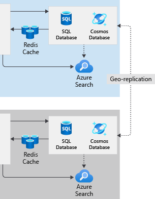

The final part of our application's architectural design to consider is the data storage tier. We want to make sure that data is both readable and writable with full functionality after a region-wide failure.

In the shipment tracking portal, we chose to use Azure Front Door to send all requests to App Services in East US. If East US fails, Front Door detects the failure, and sends requests to duplicate App Services components in West US. In our original, single-region architecture, we stored relational data in Azure SQL Database and semi-structured data in Cosmos DB. Now, we want to understand how we can ensure that both databases remain available if East US fails.

Here, we'll learn how to replicate data between regions, and how to ensure that failover can occur quickly, if necessary.

## Azure SQL Database

To create a multi-region implementation of Azure SQL Database to store relational data, we can use either:

- Active geo-replication
- Auto failover groups

### Active geo-replication

Azure SQL Database can automatically replicate a database and all its changes from one database to another with the active geo-replication feature. Only the primary logical server hosts a writable copy of the database. We can create up to four other logical servers that host read-only copies of the database.

For the shipment tracking portal, create a secondary database in West US and configure geo-replication from East US. When a regional failure occurs, Front Door redirects user requests to App Services in West US. App Services and Azure Functions can get access the relational data because a copy has already been replicated to West US.

This change is automatic, but remember that the secondary database in West US is read-only. If a user tries to modify data, for example, by creating a new shipment, errors may arise. We can manually initiate a failover to West US as soon as we notice the problem in that Azure portal. If we want to automate this process, our developers can write code that calls the `failover` method in the Azure SQL Database REST API.

> [!NOTE]
> Managed instances of Azure SQL Database do not support Active geo-replication. Managed instances are designed to make it simple to migrate data from an on-premises SQL Server while maintaining security. If we're using a managed instance, consider using failover groups instead.

### Auto failover groups

An auto failover group is a group of databases where data replicates automatically from a primary to one or more secondary servers. This design is like active geo-replication and uses the same data replication method. However, we can automate the response to a failure by defining a policy.

For the shipping portal, we'll create a secondary database in West US. We'll then add a policy that fails over the primary replica of the database to West US if a catastrophic failure occurs in East US. If that happens, the West US replica automatically becomes the writable primary database, and full functionality is maintained.  

Consider using an auto failover group if you want to automate the failover of the writeable database without writing custom code to trigger it. Also, use auto failover groups if our database runs in a managed instance of Azure SQL Database.

> [!IMPORTANT]
> The replication that underlies both active geo-replication and auto failover groups are asynchronous. An acknowledgment is sent to the client when a change is applied to the primary replica. At this point, the transaction is considered complete, and replication occurs. If a failure occurs, the latest changes made in the primary database may not have replicated to the secondary. Keep in mind that, after a disaster, the most recent database changes may have been lost.

## Azure Cosmos DB

Our configuration is less complex with Azure Cosmos DB.  Cosmos DB  is a multi-model database, able to store relational data, semi-structured data, and other forms of data. That's because Cosmos DB was designed as a multi-regional cloud database system. Even if we run Cosmos DB in a single region, data is replicated to multiple instances across different fault-domains for the best availability.

When we create a Cosmos DB account multi-region, we can choose from the following modes:

- **Multi-region accounts with multiple write regions.**

    In this mode, all copies of the database are writable at all times. If a region fails, no failover is necessary.

- **Multi-region accounts with a single write region.**

    In this mode, only the primary region contains writable databases. The data replicated to the secondary regions are read-only. Updates are disabled by default when the primary region fails. However, we can select **enable automatic failover** so that Cosmos DB automatically fails over the primary, writable copy of the database to another region.

> [!IMPORTANT]
> In Cosmos DB, data replication is synchronous. When a change is applied, the transaction is not considered complete until replicated to a quorum of replicas. Then an acknowledgment is sent to the client. When a failure occurs, no recent changes are lost because replication has already occurred.
