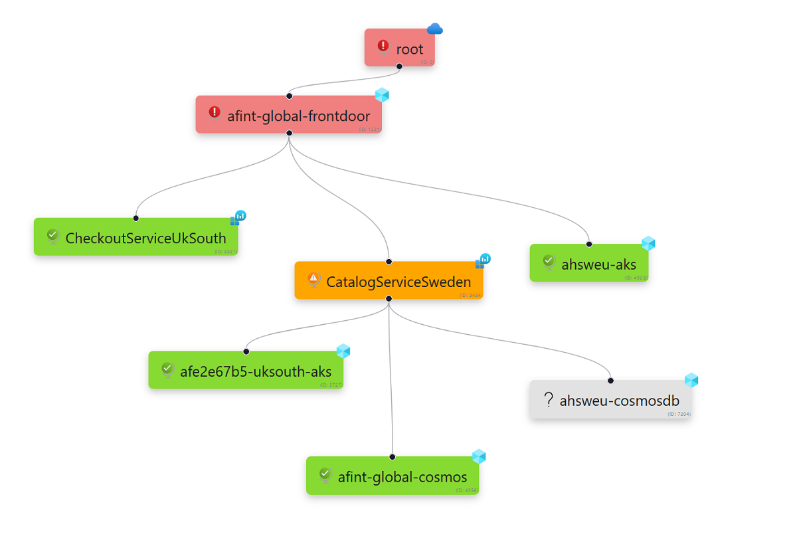

Health modeling allows you to maximize reliability for your application. It focuses on thorough instrumentation and monitoring, which provides critical insight into your application's health. With this insight, you can quickly identify and resolve issues.

## Problem context

Most mission-critical applications are significant in terms of both scale and complexity, and  generate high volumes of operational data. This setup can make it challenging to evaluate the state of an application and determine the optimal action to take to correct faults.

Health modeling maximizes observability by augmenting raw data logs and metrics with key business requirements to quantify an application's health and drive automated evaluation of its health states.

## Advantages of health monitoring

To help you determine whether your environment is working as expected, it's important to monitor your application's health and the key metrics of its Azure resources. To understand these metrics and evaluate the overall health of your workload, you need a holistic understanding of all of the data monitored. A health model can assist with the evaluation of the overall health status by displaying a clear indication of the health of the workload, as opposed to raw data metrics. Representation of a health model with set indicators makes it intuitive for an operator to understand the overall health of the workload and respond quickly to any issues that might arise. Health status is typically presented as *traffic light* indicators, such as red, green, or yellow.

## Layered health model

To build a health model, first define application health in the context of key business requirements by quantifying *healthy* and *unhealthy* states in a layered and measurable format. A layered health model is reflective of the application structure and enables application health to be traced back to its lower level dependencies, which helps to quickly find the root cause of service degradation.

In a layered health model:

- The foundational layer should consider individual application components, such as Azure resources.
- Foundational components are aggregated alongside key non-functional requirements to build a business-contextualized lens into the health of system flows.
- System flows are aggregated with appropriate weights based on business criticality to build a meaningful definition of overall application health. Financially significant or customer-facing user flows are prioritized.
- Each layer captures what its healthy and unhealthy states represent. The health model uses these layered health definitions to inform critical monitoring metrics across all system components and validate operational subsystem composition.

For more information about layered health models, see [Layered application health](/azure/architecture/framework/mission-critical/mission-critical-health-modeling#layered-application-health). For an example of a layered health model, see [Example - Layered health model](/azure/architecture/framework/mission-critical/mission-critical-health-modeling#example---layered-health-model).

## Who's responsible for health modeling?

Users with any of the following roles typically design and use a health model:

- Administrator
- Solution Architect
- Support Engineer
- DevOps Engineer
- Network Engineer
- Security Engineer

## How to get started

To do the health modeling exercise, you must have a deep understanding of the system and its expected performance. Start by defining all user flows and mapping dependencies between functional and logical components. Also, map out the dependencies between Azure resources.
