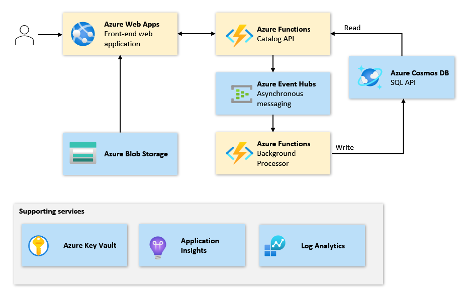

As Contoso Shoes starts designing their health model, the first step is to review their employee application: its architecture, the key Azure services involved, and how they contribute to the overall end-user experience.

Your task in this exercise is to design the health model structure of an internal employee application. The structure will consist of multiple layers, as described in [Layered health model](/training/modules/design-health-model-mission-critical-workload/2-what-is-health-modeling#layered-health-model).

## Application

The application works like other common e-commerce websites, including the main website of the Contoso Shoes store. Employees are able to browse a catalog of products, update individual items, and interact with other users through comments.

Contoso Shoes management has decided that it's critical for its employees to:

- Interact with the catalog by displaying a list of items and browsing items
- Create comments on individual items for others to see

The health model should capture these two operations, at a minimum.

## Architecture

The following diagram shows the architecture of the application. Ensure you have a good understanding of the individual components and their role within the functionality of the system.

### Components

The application architecture has the following components:

- Front-end internal web application: The user interface of this workload, which runs on Azure Web Apps.
  - Reads: Catalog API, Azure Blob Storage
  - Writes: Requests coming from end users, Catalog API

- Catalog API: The API layer that the front-end web application uses to perform data operations on both catalog items and comments. It doesn't do any database writes itself; instead, a message is sent to an event hub to be processed asynchronously. Hosted on Azure Functions.
  - Reads: Azure Cosmos DB
  - Writes: Azure Event Hubs

- Background processor: A component without any public endpoint, which is used for asynchronous processing of database updates. Hosted on Azure Functions.
  - Reads: Azure Event Hubs
  - Writes: Azure Cosmos DB

- Messaging bus: The messaging bus uses Azure Event Hubs to pass messages between the Catalog API and the background processor.

- Database: Data is persisted in Azure Cosmos DB. The Catalog API reads from the database directly, and writes are handled by the background processor. In addition, images are stored in Azure Blob Storage.

- Secrets: The application components of this workload use secrets to authorize access. Secrets are stored in Azure Key Vault. The Catalog API and background processor use connection strings to access the database and Azure Event Hubs, while the front-end web application uses an API key to call the Catalog API.

- Monitoring: Application components send all data measurements to Application Insights, backed with a Log Analytics workspace. The same workspace is used to collect other logs and metrics for this workload. (For this exercise, consider this deployment to be single-stamp.)

## Layered health model structure

As described in [Layered health modeling](/training/modules/design-health-model-mission-critical-workload/2-what-is-health-modeling#layered-health-model), a health model typically has a layered structure. The process of modeling health is a top-down design activity that starts with an architectural exercise to define all user flows and map dependencies between functional and logical components, which also implicitly map the dependencies between Azure resources. For this exercise, our health model has three layers: user flows, application components, and Azure resources.

Identifying user flows and building the health model is a conceptual exercise at this stage. Use pen and paper, or a blank document to note the individual layers and draw the structure.

### User flows

Going from top to bottom in the layered health structure, think about what the *user flows* would be, based on what you know about the application. Try to abstract the technical details and Azure services, and look at the end-user perspective. What processes were identified as critical? How is the application used to achieve business goals?

You should end up with at least two user flows in the top layer. If you can think of more, feel free to include them in your health model.

### Application components

After you've decided on the user flows to include, move down to the middle layer in the health model and start asking questions like: *"Which part of my application makes this flow work?"*, *"Which microservices/components contribute to fulfilling requests in this flow?"*, and *"Is this flow still going to work if this part goes down?*"

The aim is to identify application components on a technical level that contribute to each user flow. These components can be APIs, background workers, microservices, and so on.

This workload has at least three application components that contribute to the two user flows.

### Azure resources

The final and bottom layer of the health model contains the Azure resources that the individual application components use. If you look at the architecture diagram and read the component description, it should be clear what those resources are.

> [!NOTE]
> A real-world scenario will probably have more services with more complicated relationships. A key to building a successful health model is to identify which parts are critical and how each component contributes to the overall health of the system.

## Final health model structure

For the final step of this exercise, put the gathered information into a graphical representation of the health model structure. It should look similar to the following diagram:

Health model layers:

- User flows layer

  - List catalog items. Dependent on the front-end web application and the Catalog API
  - Add comment. Dependent on the front-end web application, Catalog API, and background processor

- Application components layer

  - Front-end web application. Dependent on Blob Storage and the Catalog API
  - Catalog API. Dependent on Azure Cosmos DB, Key Vault, and Event Hubs
  - Background processor. Dependent on Azure Cosmos DB, Key Vault, and Event Hubs

- Azure resources layer

  - Blob Storage
  - Azure Cosmos DB
  - Key Vault
  - Event Hubs
