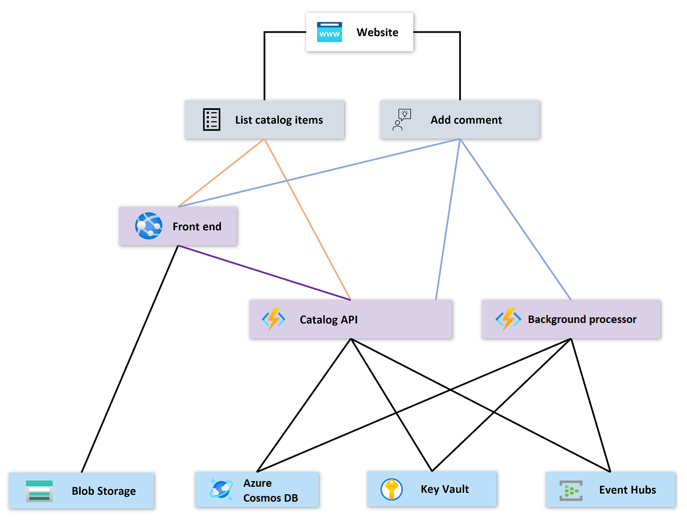

Contoso Shoes is starting their health modeling journey and the first step is always reviewing the application - its architecture, key Azure services involved, and how they contribute to the overall end user experience.

Your task in this exercise will be to design the health model structure of the employee application. The structure will consist of multiple layers, as explained in the _Layered application health_ section.

## The application

Let's start by reviewing what the application does and what's the architecture.

We're looking at a web application that works like other common e-commerce sites (including the main Contoso Shoes store). Employees are able to browse a catalog of products, update individual items, and since Contoso Shoes is a distributed company, there's a feature to interact with other users through comments.

As mentioned earlier, the application architecture is as follows:

> [!NOTE]
> You can go back to the [Introduction](./1-introduction.md) unit to review individual components and their purpose.

Contoso Shoes management decided that it's critical that the employees are able to:

- interact with the catalog - show a list of items and browse items,
- create comments on individual items for others to see.

At least these two operations should be captured in the health model.

## User flows

Going from top to bottom in the layered health structure, think about what the **User flows** would be, based on what you know about the application. Try to abstract the technical details and Azure services, and look at the end-user perspective.

You should end up with at least _two user flows_. If you can think about more, feel free to include them in your health model too.

## Application components

Once you're clear on the user flows, you can move down one layer and start asking questions like: _"Which part of my application makes this flow work?"_, _"Which microservices/components contribute to fulfilling requests in this flow?"_, _"Is this flow still going to work if this part goes down?"_

The aim is to identify application components, on a technical level, that contribute to each user flow. These are APIs, background workers, microservices, etc.

There are at least _three application components_ in this workload that contribute to the two user flows.

## Azure resources

Final layer of the health model would be actual Azure Resources that the individual application components use. If you look at the architecture diagram and read the component description, it should be clear what those are.

> [!NOTE]
> In a real-world scenario, there would be more services involved with more complicated relationships. A key to building a successful health model is to identify which parts are critical and how each component contributes to the overall health of the system.

## Final health model structure

Final step of this exercise is to put the information gathered in the process into a graphical representation of the health model structure. It should look similar to this:

User flows:

- List catalog items - depends on Frontend, and Catalog API
- Add comment - depends on Frontend, Catalog API, and Background Processor

Application components:

- Frontend - depends on Blob Storage, and Catalog API
- Catalog API - depends on Cosmos DB, Key Vault, and Event Hubs
- Background Processor - depends on Cosmos DB, Key Vault, and Event Hubs

Azure resources:

- Blob Storage
- Cosmos DB
- Key Vault
- Event Hubs