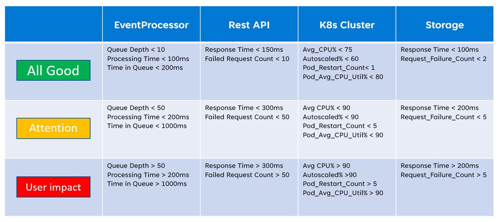

When you build a health model, you define application health in the context of key business requirements by quantifying "healthy" and "unhealthy" states in a layered and measurable format. Use a "traffic light" model to visually represent these healthy and unhealthy states, with green used to illustrate when key non-functional requirements are fully satisfied and resources are optimally utilized. Use "Green", "Amber, and "Red" to represent "Healthy", "Degraded", and "Unavailable" states.

Each layer of the health model should capture what the healthy and unhealthy states represent. It's important to distinguish between transient and non-transient failure states to qualify service degradation relative to unavailability. Metrics and metric thresholds for resources must be finely tuned in terms of what values represent healthy and unhealthy states, which are heavily influenced by encompassed application functionality and target non-functional requirements. To capture health states for an individual component, that component's distinct operational characteristics must be understood under a steady state that is reflective of production load. Performance testing is therefore a key capability to define and continually evaluate application health.

Represent health states using a granular health score for every distinct application component and every user flow by aggregating health scores for mapped dependent components, considering key non-functional requirements as coefficients:

- The health score for a user flow should be represented by the lowest score across all mapped components, factoring in relative attainment against non-functional requirements for the user flow.
- The model used to calculate health scores must consistently reflect operating health, and if not, the model should be adjusted and redeployed to reflect new learnings.
- Define health score thresholds to reflect health status.

When you implement a health model, it's important to define the health of individual components through the aggregation and interpretation of key resource-level metrics. The following table shows an example of you can use resource metrics to define health states:

The following diagram shows an example layered health model and demonstrates how a change in health state for a foundational component can have a cascading impact to user flows and overall application health:

