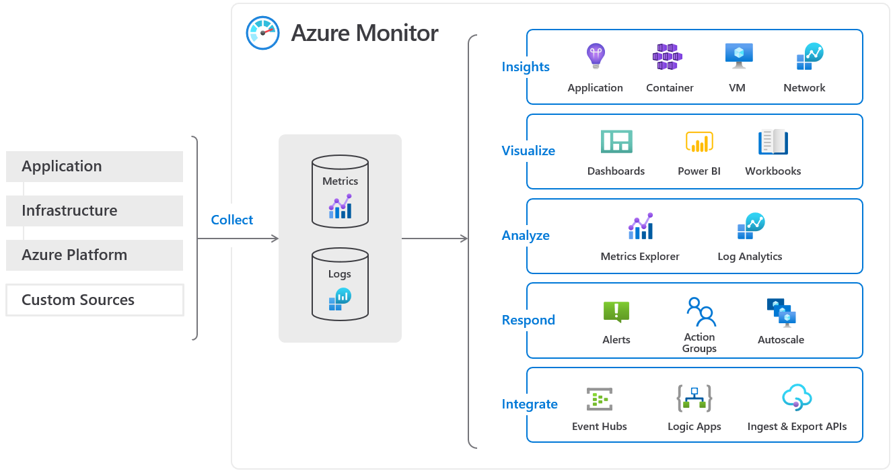
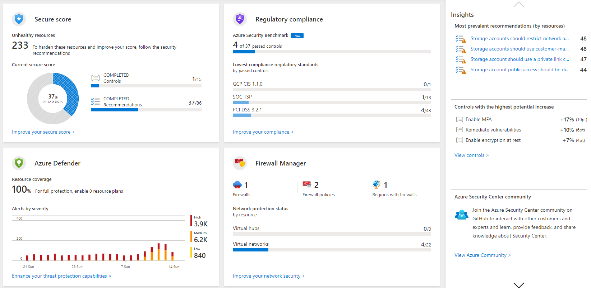
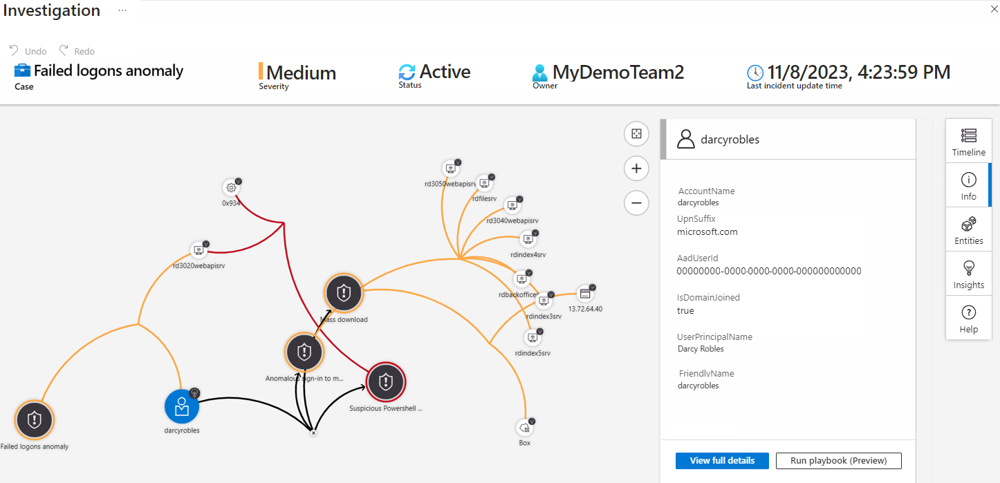

The reputation of your organization depends on the performance, reliability, and security of its systems. It's critical to monitor your systems closely to identify any performance problems or attacks before they can affect users. For example, if your payment system is unable to process user transactions during a high-volume holiday sales period, your customers will likely lose confidence in your business.

You'll explain the solutions in Azure that will enable you to monitor your organization's services.

## What is Azure Monitor?

Azure Monitor is a service for collecting, analyzing, and acting on telemetry from your cloud and on-premises environments. It helps you maximize the availability and performance of your applications and services. Azure Monitor enables you to detect and diagnose application, infrastructure, and platform issues. You can analyze metrics and logs from monitored resources. And it also supports operational workflows with alerts and automated actions, and enables you to create visualizations such as dashboards and reports.

Azure Monitor starts with collecting telemetry, this data includes application layer data and infrastructure performance data from VM guest operating systems and containers. Additionally, Azure Monitor collects directly from the Azure platform resources, and you can also ingest your own custom data using APIs. The collected data is stored in centralized and fully-managed data stores - *Azure Monitor Metrics* for numerical time-series values; and *Azure Monitor Log Analytics workspaces* for resource logs. Metrics are automatically collected and stored for Azure resources, but user configuration is required to send and store resource logs. After the data is collected, you can choose how you consume, analyze, and respond.

In most cases, you should start with Insights, which are guided monitoring and troubleshooting experiences for Azure resources. For example, you can use Azure Monitor for containers for your Kubernetes workloads. You may also visualize the data yourself with Azure dashboards in Portal, create business views with Power BI, or create interactive reports using workbooks. Use Azure Monitor for a detailed view of your application's health, along with the health of your infrastructure on a single screen.

You can further analyze the collected data using Metrics Explorer for charting and visual correlation and Log Analytics for ad hoc queries, trending, and pattern recognition. Azure Monitor enables you to manage and create alerts, notifications, and actions such as runbooks and autoscale based on metrics and logs. It’s also possible to integrate Azure Monitor with other tools using Event Hubs to export data or APIs for ingestion and export.

## What is Azure Security Center?

Azure Security Center is a service that manages the security of your infrastructure from a centralized location. Use Security Center to monitor the security of your workloads, whether they're on-premises or in the cloud.

Attacks are becoming more intelligent, and the number of people with the right security skills is low. Security Center helps you deal with these challenges because it provides you with tools that improve your protection against security threats. Use Security Center to monitor the health of your resources and implement recommendations.

Ease the configuration of your security. Security Center is natively integrated with other Azure services, such as PaaS services like Azure SQL Database. For IaaS services, enable automatic provisioning in Security Center.

Security Center creates an agent on each supported virtual machine as it's created. It then automatically starts collecting data from the machine. You use Security Center to reduce the complexity of configuring security in this way.

## What is Azure Sentinel?

You use Azure Sentinel to collect data on the devices, users, infrastructure, and applications across your enterprise. Built-in threat intelligence for detection and investigation can help reduce false positives. Use Sentinel to proactively hunt for threats and anomalies, and respond by using orchestration and automation.

You connect your data sources to Sentinel. These sources include Microsoft services such as Office 365 and Azure Advanced Threat Protection. These sources can also include external solutions, such as AWS CloudTrail or on-premises sources. The dashboard shows detailed information collected from your sources.

Incidents help you group and combine alerts that are related. You use incidents to reduce the noise generated because of the scale of the data. Incidents also help you to further investigate any anomalous activities or threats that have raised alerts.

Use playbooks to automate your response to alerts in Sentinel. You configure playbooks by using Azure Logic Apps. Your playbook details the steps to take when an alert is triggered in Sentinel.

Use hunting queries to look for threats across your enterprise before alerts are raised. Microsoft security researchers maintain built-in hunting queries that act as a base for you to build your own queries.

Use notebooks to automate your investigations. Notebooks are playbooks that can consist of investigation or hunting steps that you reuse or share with others. Use Azure Notebooks for Azure Sentinel to develop and run your notebooks. For example, you might use the **Guided hunting - Anomalous Office365 Exchange Sessions** notebook to hunt for anomalous activities in Office 365 across your enterprise.

Azure Sentinel and Azure Security Center use Azure Monitor Logs as their underlying logging data platform. These security solutions store their data in Log Analytics workspaces, which are centralized storage and management locations where your app, infrastructure, and security logs are collected and aggregated for analysis, troubleshooting, and auditing. This centralized approach enables you to perform correlation and run investigations across application performance, infrastructure performance, and security logs within the same data analytics service with a single user interface using the same query language. We recommend that you use as few workspaces as possible, and manage user and team access to subsets of log data using resource or workspace permissions. For more information, see [Designing your Azure Monitor Logs deployment](https://aka.ms/logsdesign)
