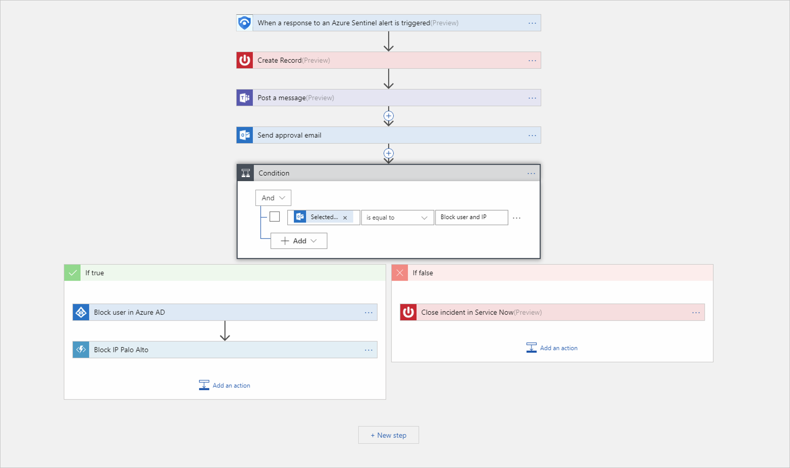

The reputation of your company depends on the reliability and security of its systems. It's critical to monitor your systems closely to identify any problems or attacks before they can affect users. For example, if a malicious user attacks your payment system, you need to know quickly to neutralize the threat, or your customers' personal data might be at risk.

You'll explain the solutions in Azure that will enable you to continuously monitor your organization's services.

## What is Azure Security Center?

Azure Security Center is a service that manages the security of your infrastructure from a centralized location. Use Security Center to monitor the security of your workloads, whether they're on-premises or in the cloud.

Attacks are becoming more intelligent, and the number of people with the right security skills is low. Security Center helps you deal with these challenges because it provides you with tools that:

- **Improve your protection against security threats**. Use Security Center to monitor the health of your resources and implement recommendations.

  

- **Ease the configuration of your security**. Security Center is natively integrated with other Azure services, such as PaaS services like Azure SQL Database. For IaaS services, enable automatic provisioning in Security Center.

  

Security Center creates an agent on each supported virtual machine as it's created. It then automatically starts collecting data from the machine. You use Security Center to reduce the complexity of configuring security in this way.

## What is Azure Application Insights?

You use Azure Application Insights to monitor and manage the performance of your applications. Application Insights automatically gathers information related to performance, errors, and exceptions in applications. You also use Application Insights to diagnose what has caused the problems that affect an application. The following example shows a detailed breakdown of an exception and what caused it.

Through usage analysis, you'll understand how users are using your application.

Use Application Insights to monitor the release pipelines for your application. You'll take appropriate action to resolve issues that affect your application before it's deployed to production. Application Insights can help improve your development lifecycle in this way.

## What is Azure Monitor?

Azure Monitor is the service for collecting, combining, and analyzing data from different sources.

All the application log data that Application Insights collects is stored in a workspace that Azure Monitor can access. You'll then have a central location to monitor and analyze the health and performance of all your applications.

Other services like Security Center also rely on Azure Monitor. Security Center, for example, collects security-related data from your virtual machines and other resources. Security Center stores this data in a workspace that you can access from Azure Monitor.  

Use Azure Monitor for a detailed view of your application's health, along with the health of your infrastructure.  

Through the Log Analytics feature in Azure Monitor, you analyze data by querying logs from your workspaces.

## What is Azure Sentinel?

You use Azure Sentinel to collect data on the devices, users, infrastructure, and applications across your enterprise. Built-in threat intelligence for detection and investigation can help reduce false positives. Use Sentinel to proactively hunt for threats and anomalies, and respond by using orchestration and automation.

You connect your data sources to Sentinel. These sources include Microsoft services such as Office 365 and Azure Advanced Threat Protection. These sources can also include external solutions, such as AWS CloudTrail or on-premises sources. The dashboard shows detailed information collected from your sources.

Incidents help you group and combine alerts that are related. You use incidents to reduce the noise generated because of the scale of the data. Incidents also help you to further investigate any anomalous activities or threats that have raised alerts.

Use playbooks to automate your response to alerts in Sentinel. You configure playbooks by using Azure Logic Apps. Your playbook details the steps to take when an alert is triggered in Sentinel.

Use hunting queries to look for threats across your enterprise before alerts are raised. Microsoft security researchers maintain built-in hunting queries that act as a base for you to build your own queries.

Use notebooks to automate your investigations. Notebooks are playbooks that can consist of investigation or hunting steps that you reuse or share with others. Use Azure Notebooks for Azure Sentinel to develop and run your notebooks. For example, you might use the **Guided hunting - Office365-Exploring** notebook to hunt for anomalous activities in Office 365 across your enterprise.

