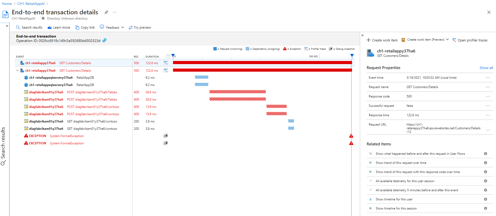
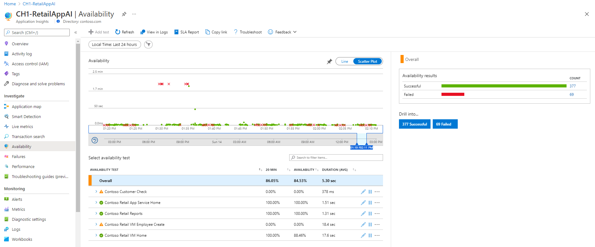
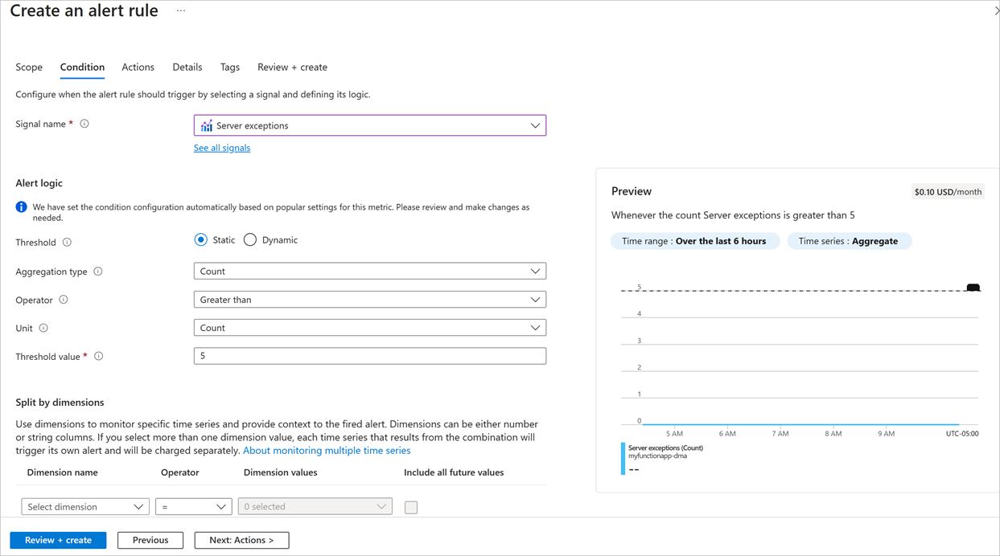

The last time issues arose on your financial organization's application, customers couldn't access their accounts. Also, the issues with the application weren't resolved quickly, so customer satisfaction was negatively affected. Your organization wants to avoid a repeat of these issues when it moves to Azure.

This unit describes how to integrate Azure Monitor Application Insights with your applications. You can use Application Insights to check the health of applications and resolve issues faster.

## Use Application Insights

You can use Application Insights to:

- Analyze and address issues and problems that affect your application's health and performance.
- Improve your application's development lifecycle.
- Assess your user experience and analyze users' behavior.

## Integrate Application Insights with your applications

To integrate Application Insights with your applications, you can set up an Application Insights resource in the Azure portal. You can also instrument your application with Application Insights. Instrumentation refers to enabling the collection of monitoring data from your app by using an agent or an SDK. Depending on your application’s language and platform, the approach to instrumentation will vary. In many cases, you can perform instrumentation without access to the source code using codeless attach in the Azure portal or by using an agent.

For example, in your .NET and .NET Core applications hosted on Azure App Services, you can enable the collection of monitoring data with Application Insights with a toggle in the Azure portal.

Application Insights automatically collect data about your application’s performance and health. You can view this data in the Application Insights resource in the Azure portal. From there you can get a list of all failures that have been collected and drill into each one, for example.

To continue your investigation to the root cause of the error or exception, you can drill into one of the problematic transactions for a detailed end-to-end transaction view that includes dependencies and exception details.

Application Insights also automatically detect app dependencies to support distributed tracing and create application topology views. You see this topology through the Application map option. You can view more details of each component in the map by selecting it. You can, among other things, view the slowest requests for an instance and investigate performance further. These detailed analytics help you understand the application better and respond to its needs.

## Monitor your applications' performance

You can further investigate slow transactions to identify slow requests and server-side dependencies. Drill down using the option to investigate performance from the application map, or by selecting **Performance** on the left.

This view allows you to isolate slow transactions by selecting the time range, operation name, and durations of interest. You're also prompted with automatically identified anomalies and the commonalities across transactions. From here, you can drill into an individual transaction for an end-to-end view of transaction details with a Gantt chart of dependencies. You can also gain visibility into page views and browser operations and dependencies if you instrument your web pages with Application Insights. Collecting this browser data requires adding some additional web-page code to your pages. After you add the script, you can access page views and their associated performance metrics via the **Browser** toggle.

## Analyzing user behavior

Instrumenting your web pages with Application Insights collects usage information to augment the server-side monitoring capabilities. Usage data includes number of users, sessions, events, browser version, OS version, and locations, all coming from the same browser-side JavaScript instrumentation. Usage data answers questions such as which pages of your app are the most popular, where users drop out, and the conversion and retention rates for specific pages.

The preceding example shows the most popular browser and versions. You can use this type of information to inform decisions for allocating functional and performance-testing resources.

## Monitor your application’s availability

You can create availability tests to monitor the health of your applications continuously. Availability tests allow you to check the health of your application from different geographic locations.

You can create an availability test in the Azure portal. You'll specify details like the frequency, the URL of your application, and locations from which to test it.

The preceding example shows the configuration of a test that sends a request to an application every five minutes. The test is done from five geographic locations. When you've created your availability test, you'll see how your application is doing across different locations. Each dot in the earlier example represents a test that was run. A red dot means that a test failed. You can find more information about a failed test when you select a dot. You'll then see a detailed breakdown of the test failure, including information on what might have caused it. Use the information to respond appropriately.

## Receive notifications and take action

You also need to configure alert rules for your application’s performance and availability. Use alert rules to dictate how alerts should be handled. You can specify the conditions that should trigger an alert. For example, Application Insights can send an alert if a specified number of locations are unavailable, or if a certain number of exceptions are observed. You can also specify who should be notified; Application Insights can send notifications through email or text message,  or use runbooks and webhooks to respond to alerts in an automated way.

