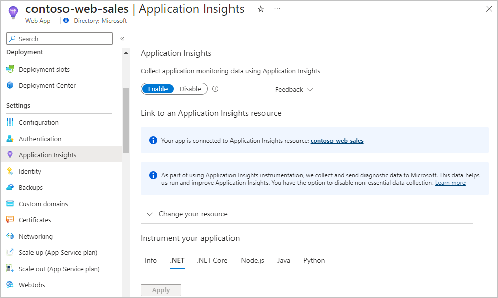
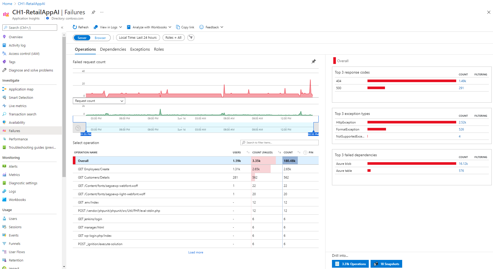
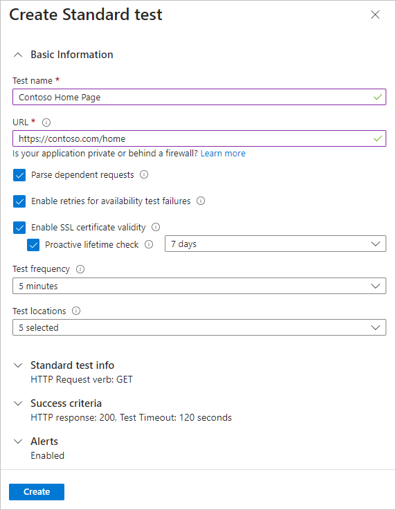

When issues arose on your financial organization's application, customers couldn't access their accounts. The application issues weren't resolved quickly, so customer satisfaction was negatively affected. Your organization wants to avoid a repeat of these issues when it moves to Azure.

This unit describes how to integrate Azure Monitor Application Insights with your applications. You can use Application Insights to check the health of applications and resolve issues faster.

## Use Application Insights

You can use Application Insights to:

- Analyze and address issues and problems that affect your application's health and performance.
- Improve your application's development lifecycle.
- Assess your user experience and analyze users' behavior.

## Integrate Application Insights with your applications

To integrate Application Insights with your applications, you can set up Application Insights in the Azure portal. You can also instrument your application with Application Insights. Instrumentation refers to enabling the collection of monitoring data from your app by using an agent or an SDK. The approach to instrumentation varies depending on your application's language and platform.

In many cases, you can implement instrumentation without access to application source code by using codeless attach in the Azure portal or by using an agent. For example, for your .NET and .NET Core applications hosted on Azure App Services, you can enable the collection of monitoring data with Application Insights by using a toggle in the Azure portal.

Application Insights automatically collects data about your application's performance and health, and displays this data in the Azure portal. You can select **Failures** in the Application Insights left navigation to get a list of all failures that have been collected for your app and drill into each one.

To continue your investigation into the root cause of the error or exception, you can drill into the problematic transaction for a detailed end-to-end transaction view that includes dependencies and exception details.

Application Insights also automatically detects app dependencies to support distributed tracing and create application topology views. You can see this topology by selecting **Application map** in the Application Insights left navigation. You can view more details of each component in the map by selecting it. For example, you can view the slowest requests for an instance and investigate performance further. These detailed analytics help you understand the application better and respond to its requirements.

## Monitor your applications' performance

You can further investigate slow transactions to identify slow requests and server-side dependencies. Drill down by using the option to investigate performance from the application map, or by selecting **Performance** from the Application Insights left navigation.

On the **Performance** screen, you can isolate slow transactions by selecting the time range, operation name, and durations of interest. You're also prompted with automatically identified anomalies and commonalities across transactions. From here, you can drill into an individual transaction for an end-to-end view of transaction details with a Gantt chart of dependencies.

You can also gain visibility into page views and browser operations and dependencies if you instrument your web pages with Application Insights. Collecting this browser data requires adding a script to your web pages. After you add the script, you can access page views and their associated performance metrics by selecting the **Browser** toggle.

## Analyze user behavior

Instrumenting your web pages with Application Insights collects usage information to augment the server-side monitoring capabilities. The same browser-side JavaScript instrumentation provides usage data including number of users, sessions, events, browser version, OS version, and locations. This usage data shows which pages of your app are the most popular, where users drop out, and the conversion and retention rates for specific pages.

The preceding example shows the most popular browsers and versions. You can use this type of information to inform decisions for allocating functional and performance-testing resources.

## Monitor your application's availability

On the Application Insights **Availability** page, you can continuously monitor your application health and check application health from different geographic locations.

To create an availability test in the Azure portal, select **Availability** from the Application Insights left navigation, and then select **Add Standard test**. On the **Create Standard test** screen, specify details like frequency, the URL of your application, and locations from which to test the app. The following example shows the configuration of a test that sends a request to an application every five minutes from five geographic locations.

After you create your availability test, you can see how your application is doing across different locations. Each dot in the following example represents a test that was run. A red dot means that the test failed. Select the dot to see a detailed breakdown of the test failure, including information on what might have caused it. You can use the information to respond appropriately.

## Get notifications and take action

You can also configure Application Insights alert rules to monitor your application's performance and availability. You can specify the conditions that should trigger an alert and dictate how to handle the alert. For example, Application Insights can send an alert if a specified number of locations are unavailable, or if a certain number of exceptions occur.

You can also specify who to notify about the alert. Application Insights can send notifications through email or text message, or use runbooks and webhooks to respond to alerts through automation.

