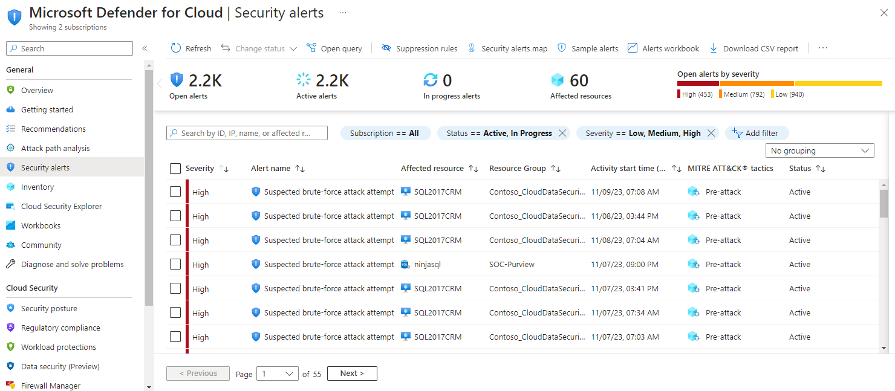
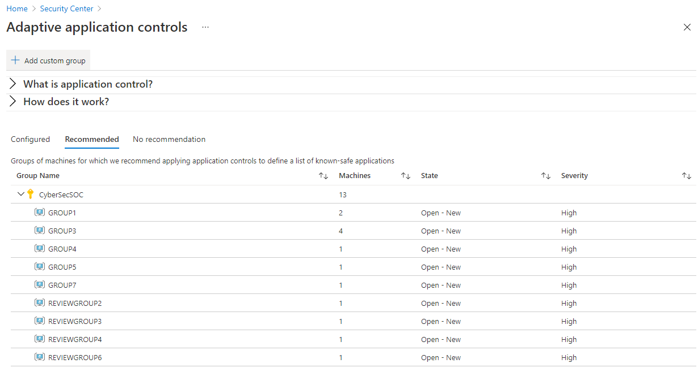
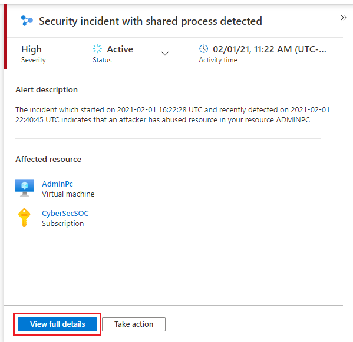
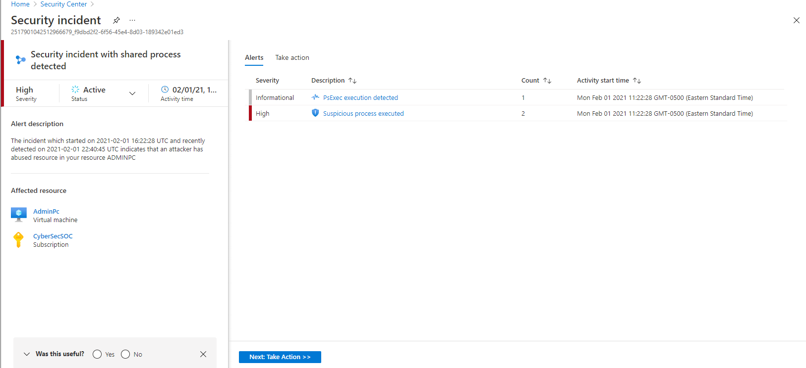
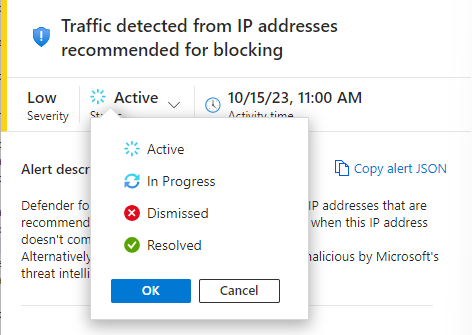
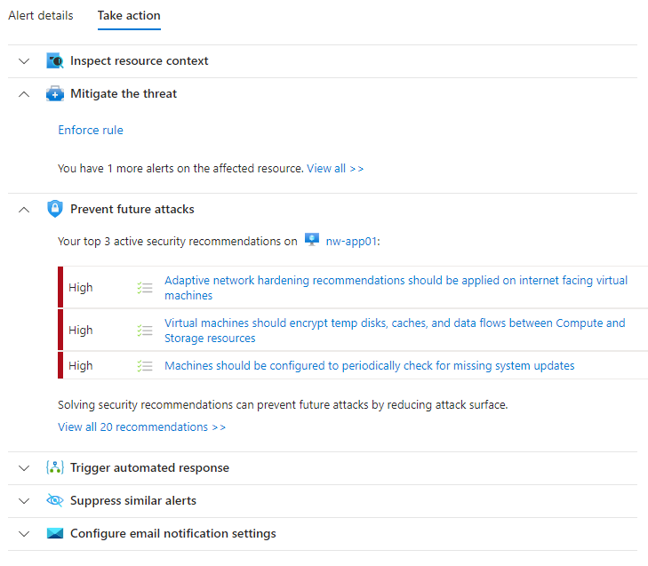

This unit provides information about how to protect resources and respond to threats by using Microsoft Defender for Cloud. Because your company is a financial organization, it needs to meet the highest standards for security. Each customer or partner transaction must be entirely protected from threats. Your company must also respond effectively to each potential threat. For example, if a virtual machine (VM) is compromised, you must act rapidly to address the issue. Microsoft Defender for Cloud helps you ensure that you're making the security configuration of your resources as secure as possible.

## Use Microsoft Defender for Cloud

You can use Defender for Cloud to:

- Understand your architecture's security posture.
- Identify and address risks and threats to your infrastructure.
- Secure a complex infrastructure with traditional in-house skills and capital.
- Secure an infrastructure that consists of on-premises and cloud resources.

## Understand your architecture's security posture

Defender for Cloud gives you detailed analyses of different components of your environment. These components include data security, network security, identity and access, and application security. This way, Defender for Cloud helps you understand the security of your architecture. You can then build and maintain better infrastructures. Defender for Cloud collects data from your machines to monitor for security vulnerabilities and threats by using Azure Monitor Logs. An agent reads various security-related configurations and event logs from the machine and copies the data to your Log Analytics workspace for analysis.

Defender for Cloud recommends ways to address the issues and risks that it uncovers. You can use recommendations like the one in the following screenshot to improve the security and compliance of your architecture.

## Protect against threats with Microsoft Defender for Cloud

You can use access and application controls in Defender for Cloud to help protect your resources. These controls block suspicious activity. For example, you can protect your virtual machines (VMs) through just-in-time (JIT) VM access. JIT is a feature that blocks persistent access to VMs. Your VMs are accessed only based on audited access that you configure.

You can enable JIT through the **Just in time VM access** option in the **Workload protections** section of Defender for Cloud in the Azure portal. You get a list of all VMs that already have JIT configured, and a list of VMs where JIT is not configured. Choose a VM in the **Not configured** list, and then select the **Enable JIT on (number) VMs** option to configure JIT for the VM.

Defender for Cloud shows you a list of default ports that JIT targets, or you can configure your own, as shown in the following screenshot:

You can control which applications are allowed to run on your VMs through adaptive application controls. In the background, Defender for Cloud uses machine learning to look at the processes running on your VM. Defender for Cloud creates exception rules for each resource group that holds your VMs, and gives recommendations.

You can configure adaptive controls by selecting the **Adaptive application controls** option in the **Microsoft Defender for Cloud, Advanced protection** section of the Microsoft Defender for Cloud menu. You get a list of resource groups that contain your VMs. The **Recommended** section lists the resource groups that Defender for Cloud recommends for adaptive application controls.

When you select a resource group, you use **Create application control rules** to target the VMs. You can also use **Create application control rules** to target the processes that should have the rule applied.

## Respond to threats with Defender for Cloud

Defender for Cloud gives you a centralized view of all of your security alerts. Defender for Cloud ranks security alerts based on their severity. Defender for Cloud also combines related alerts as much as possible into a single security incident.

You can view your security alerts through the **Security alerts** pane under the **General** section on the main menu.

You can drill down into specific security incidents by selecting an incident.

From here, you can get the list of alerts that the incident holds.

You can request more information about a specific alert by selecting the alert.

You're responsible for dismissing alerts if no action is required, such as if there are false positives. You also need to act to address known attacks, for example by blocking known malicious IP addresses. You must also decide which alerts require more investigation.

Defender for Cloud helps you respond to threats faster and in an automated way by taking action. Actions include mitigating the threat, preventing future attacks, triggering an automated response with Azure Logic Apps, or suppressing similar alerts.

