Your financial organization deals with customers and partners on a constant basis. Your company is also active across different regions in the world. Many transactions are undertaken across the enterprise on a daily basis. Each transaction, must be monitored and protected regardless of the type of transaction, and the device or users involved. You have been asked to extend your earlier investigation, to focus on enterprise-wide security and monitoring.

You'll detail how Azure Sentinel will help monitor and respond to security threats across your entire enterprise.

## Criteria for assessing Azure Sentinel

You use Azure Sentinel if:

- You want a detailed overview of your enterprise, potentially across multiple clouds, and on-premises locations.
- You want to avoid having to rely on complex and disparate tools.
- You want to use enterprise-grade AI, built by experts to identify, and handle threats across your enterprise.

## Connect your data sources

You create an Azure Sentinel resource in the Azure portal. The process for creating this resource involves creating a Log Analytics workspace, then adding it to Sentinel.

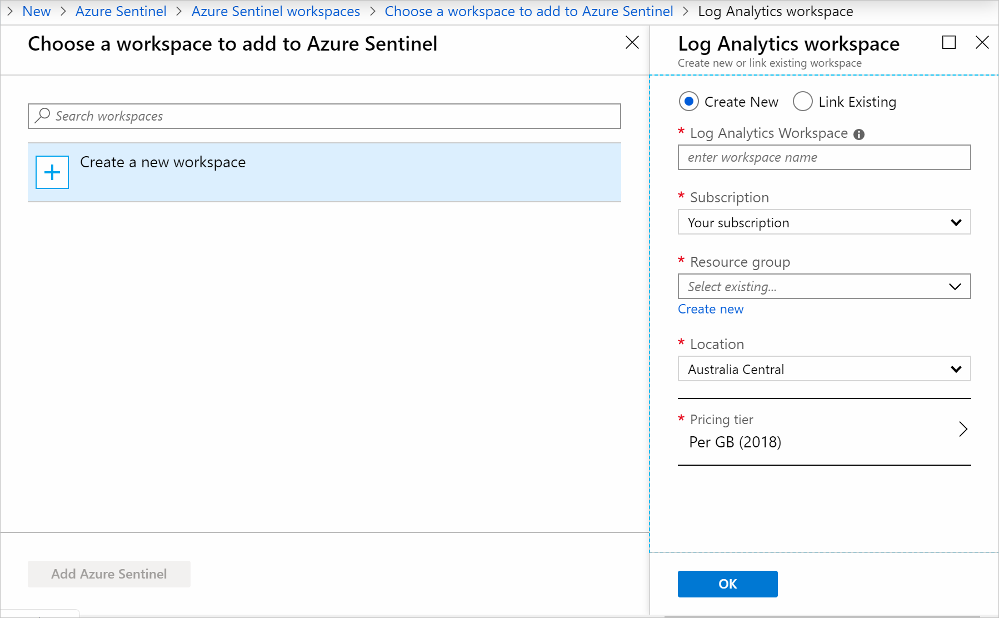

When you've created a Sentinel resource, you'll need to connect data sources for your enterprise. Sentinel naturally integrates with Microsoft solutions, including Azure Active Directory and Office 365, through connectors. It also comes with connectors for non-Microsoft solutions. Sentinel also has a REST API that allows you to connect to other data sources.

Use the Sentinel dashboard to view all of your data connectors.  

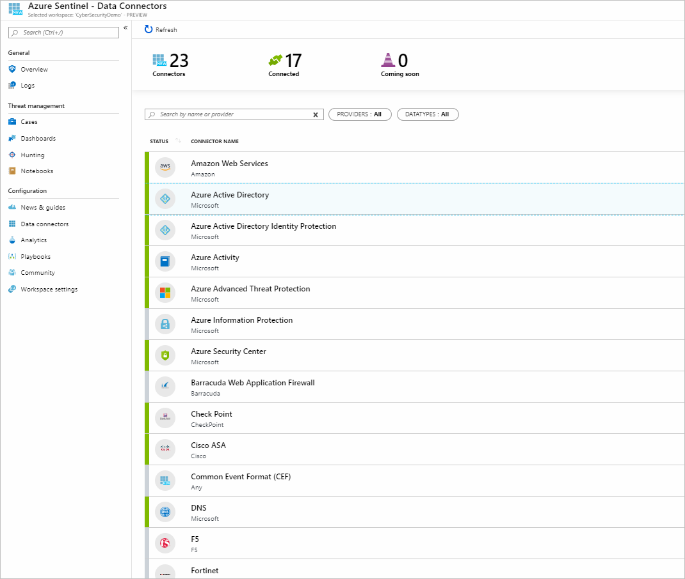

You'll need to choose the appropriate data connector for your data source.


From there, you'll need to look at the prerequisites for your connector and address them to successfully connect your data source.

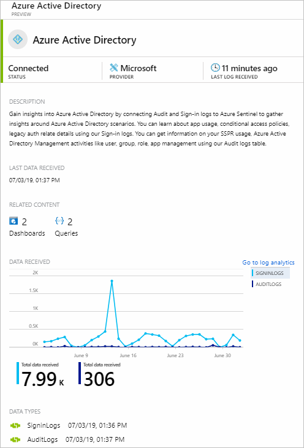

When you connect the data source, your logs will be synced to Sentinel. You'll see a summary of the data that's been collected in the **DATA RECEIVED** graph for your connector. You'll also see the different data types that have been collected for the source. For example, the Azure Active Directory connector collects sign-in logs and audit logs for you.

## Use alerts to monitor your enterprise

When your data sources have been connected, Sentinel begins to monitor your enterprise. You'll configure alert rules that you use to investigate anomalies and threats more intelligently.

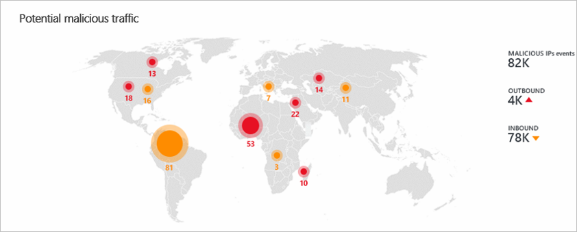

You'll need to create alert rules. These rules allow you to specify the threats and activities that should raise alerts. You can respond manually or by using playbooks for automated responses.


The analytics pane of your Sentinel dashboard allows you to view all the rules that you have in place. The pane also lets you create new rules.


When you create a rule, you'll need to specify whether it should be enabled or disabled at the outset. You'll also specify the severity of the alert, along with a rule query. For example, the following query is used to discover if a suspicious number of virtual machines are created or updated on Azure, or if a suspicious number of deployments for resources have occurred:

```kusto
AzureActivity
 | where OperationName == "Create or Update Virtual Machine" or OperationName == "Create Deployment"
 | where ActivityStatus == "Succeeded"
 | make-series dcount(ResourceId)  default=0 on EventSubmissionTimestamp in range(ago(7d), now(), 1d) by Caller
```

You set how often the query should run, and which period of data to look up, using the fields in the query scheduling section. You also specify when an alert is raised, using the alert threshold section.

## Investigate incidents

Sentinel combines your generated alerts into incidents for further investigation. An incident also includes the information and evidence you need to investigate your alerts.

Use the **Incidents** pane to see details about your incidents, such as how many you've closed and how many remain open. You also use the pane to find out when an incident happened, and determine its severity.

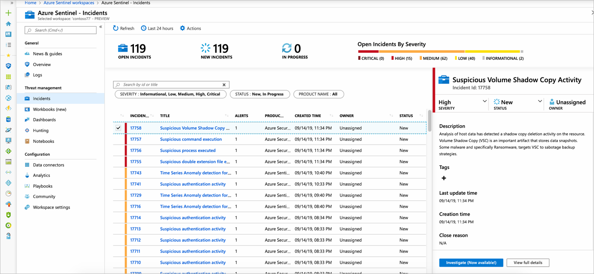

You select an incident to start to investigate it. You'll see information about the incident on the right side, and view more details when you select **View full details**.

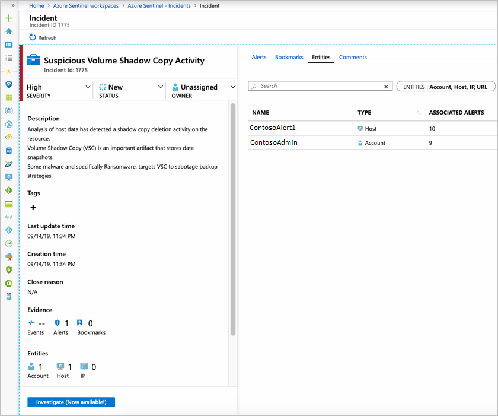

You see that this incident has multiple entities that have been mapped to it. When you want to investigate an incident, you'll set its status from **New** to **In progress**, and assign it to an owner.


You'll then be ready to **Investigate**. You'll get an investigation map, and use it to get a better idea of what caused an incident and the affected scope. Use the map to correlate data surrounding an incident.

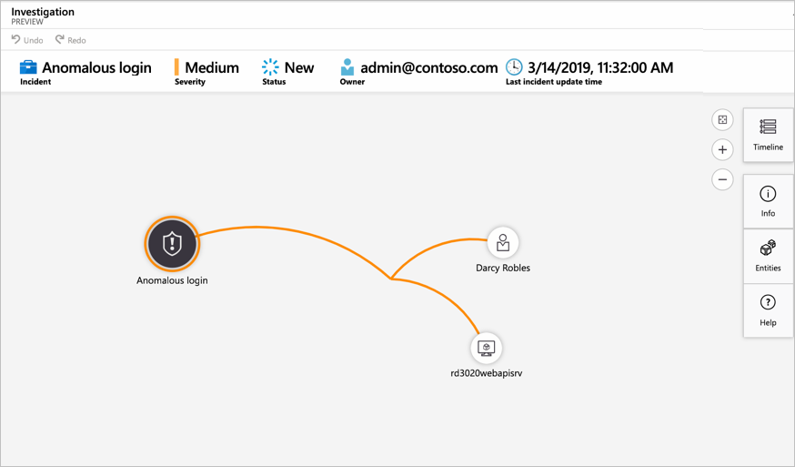

The investigation map lets you drill down into an incident. You can, for example, get details about a user who is identified as part of an incident. 

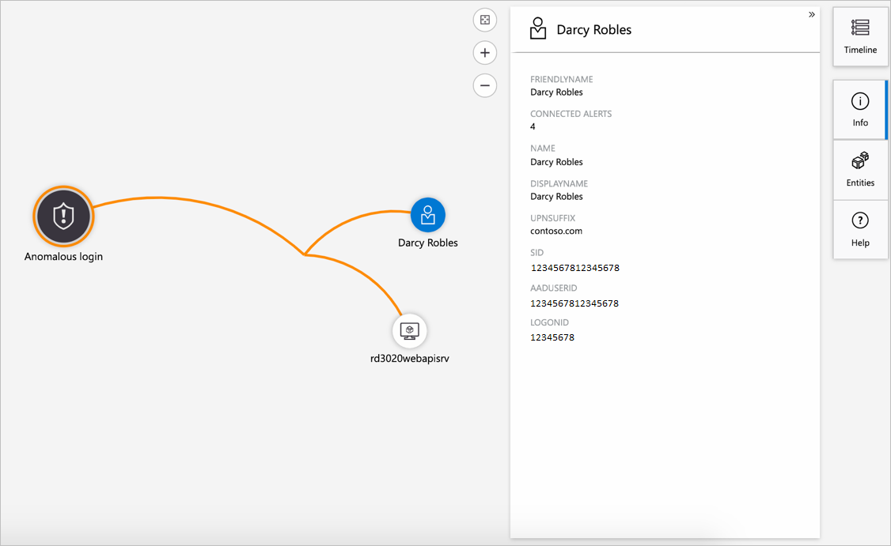

If you hover over an entity, you'll also see a list of **exploration queries**, designed by Microsoft security analysts and experts. You use **exploration queries** to investigate more effectively.

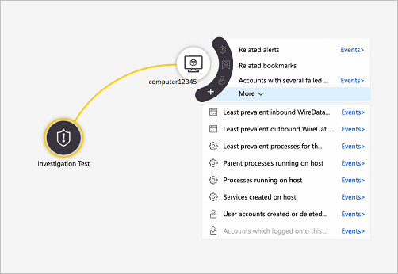

The investigation map also gives you a timeline you can use to understand which event occurred at any given time. Use the timeline feature to understand the path a particular threat might have taken over time.

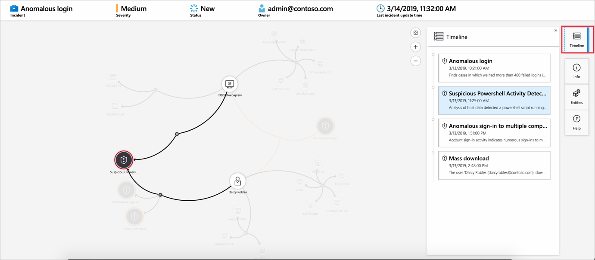

## Respond to threats with playbooks

Playbooks can help you automatically respond to threats in Sentinel. You create a new playbook through the **Playbooks** pane in your Sentinel dashboard.


You'll need to add a new playbook by creating a Logic App.


 You'll use the Logic App Designer and configure a new blank Logic App.


You'll need to search for "Azure Sentinel", to find its related connectors and triggers.


Choose the trigger you want, then you can put together a step-by-step process detailing what should happen when a response to a Sentinel alert is triggered. You've then configured a playbook.


When you've configured your playbook, you can point to it in your alert rules. The alert rule below, for example, triggers a playbook called **ProcessExecuted**.

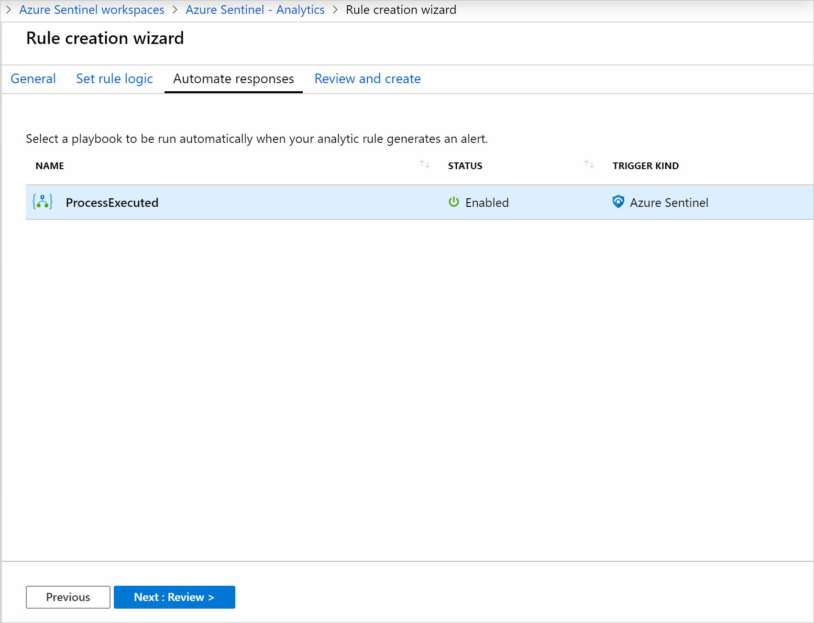
