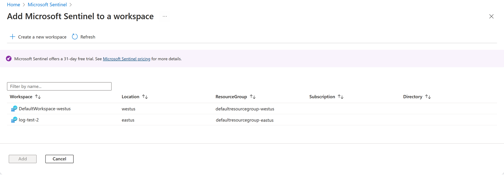
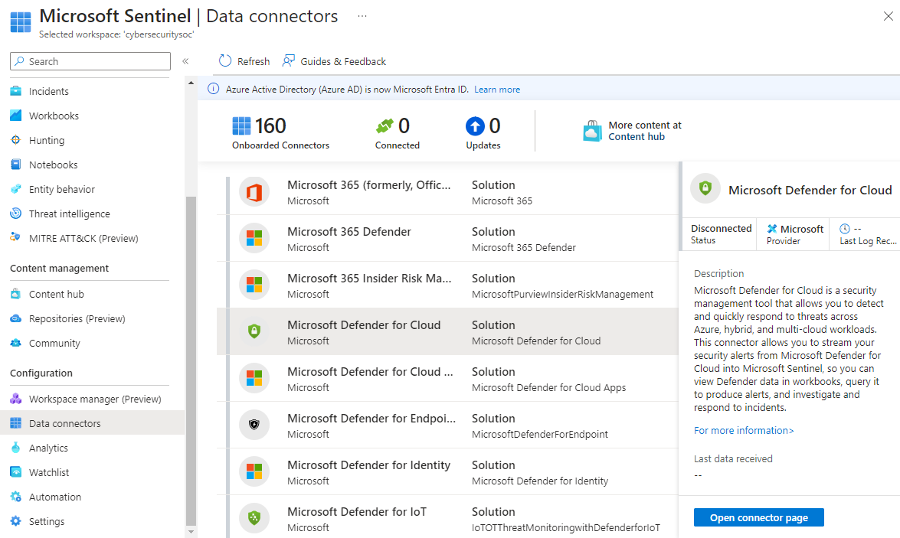
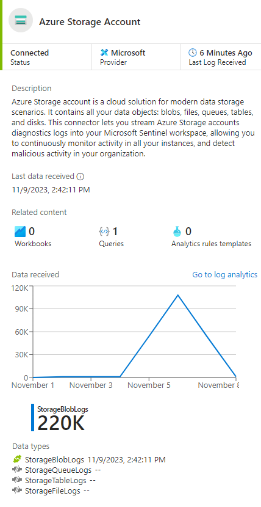
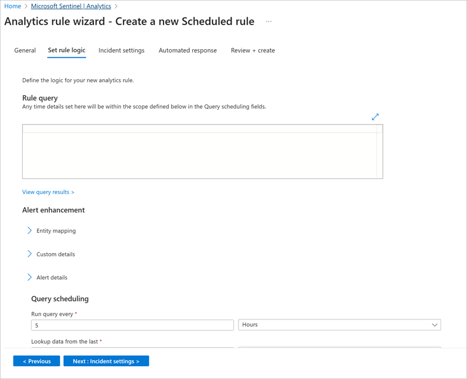
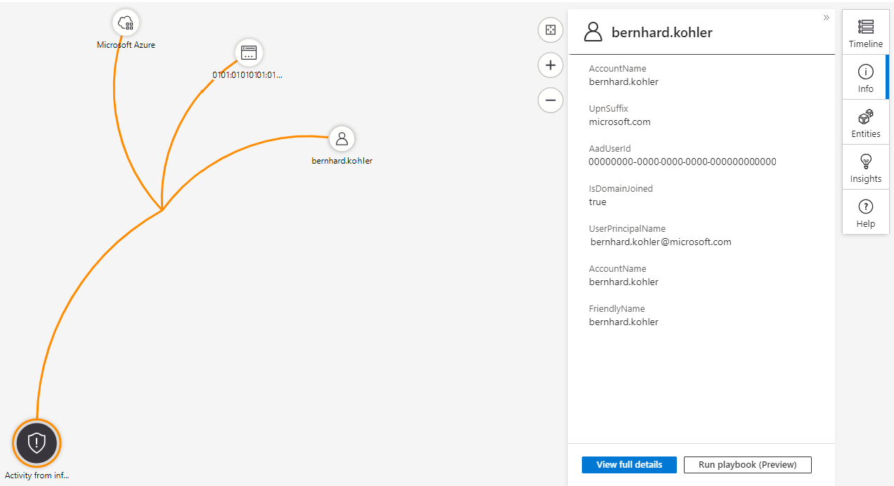
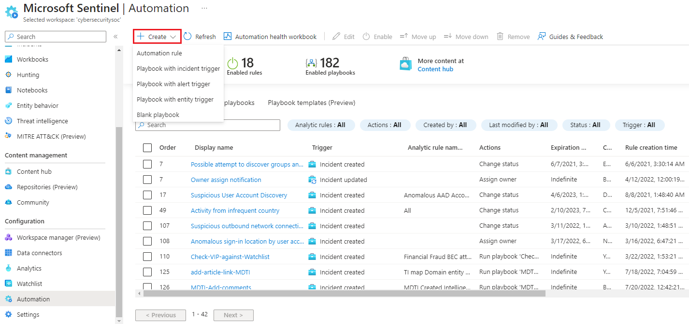

Your financial organization deals with customers and partners on a constant basis. Your organization is also active across different regions in the world. Many transactions happen every day. Each transaction must be monitored and protected regardless of its type, and regardless of the device or users involved.

You've been asked to extend your earlier investigation to focus on enterprise-wide security and monitoring. This unit details how Microsoft Sentinel helps monitor and respond to security threats across your organization.

## Use Microsoft Sentinel

You can use Microsoft Sentinel to:

- Get a detailed overview of your organization, potentially across multiple clouds and on-premises locations.
- Avoid reliance on complex and disparate tools.
- Use enterprise-grade AI, built by experts, to identify and handle threats across your organization.

## Connect your data sources

You can create a Microsoft Sentinel resource in the Azure portal. The process for creating this resource involves creating a Log Analytics workspace, then adding it to Microsoft Sentinel.



After you create a Microsoft Sentinel resource, you need to connect data sources for your enterprise. Microsoft Sentinel integrates with Microsoft solutions, including Microsoft Entra ID and Office 365, through connectors. Microsoft Sentinel also comes with connectors for non-Microsoft solutions, and has a REST API that lets you connect to other data sources.

Use the Microsoft Sentinel dashboard to view all of your data connectors.  



Choose the appropriate data connector for your data source. Next, look at the prerequisites for your connector, and address them to successfully connect your data source.



When you connect the data source, your logs are synced to Microsoft Sentinel. You get a summary of the data that's been collected in the **DATA RECEIVED** graph for your connector. You also get the different data types that have been collected for the source. For example, the Microsoft Entra connector collects sign-in logs and audit logs for you.

## Use alerts to monitor your enterprise

When your data sources have been connected, Microsoft Sentinel begins to monitor your enterprise. You can configure alert rules to investigate anomalies and threats more intelligently.


You can create alert rules to specify the threats and activities that should raise alerts. You can respond manually or by using playbooks for automated responses.


In the **Analytics** pane of your Sentinel dashboard, you can view all the rules you have in place and create new rules.



When you create a rule, you need to specify whether it should be enabled or disabled, the severity of the alert, and a rule query. For example, you can run the following query to discover if a suspicious number of virtual machines are created or updated on Azure, or if a suspicious number of deployments for resources have occurred.

```kusto
AzureActivity
 | where OperationName == "Create or Update Virtual Machine" or OperationName == "Create Deployment"
 | where ActivityStatus == "Succeeded"
 | make-series dcount(ResourceId)  default=0 on EventSubmissionTimestamp in range(ago(7d), now(), 1d) by Caller
```

In the query scheduling section, you can set how often the query should run and which period of data to look up. In the alert threshold section, you can specify the level at which an alert is raised.

## Investigate incidents

Microsoft Sentinel combines your generated alerts into incidents for further investigation.

Use the **Incidents** pane to see details about your incidents, such as how many you've closed and how many remain open. You can also use the pane to find out when an incident happened and to determine its severity.


You can select an incident to start to investigate it. You get information about the incident on the right side. Select **View full details** to get more information.


You discover that multiple entities have been mapped to this incident. When you want to investigate an incident, you update its status from **New** to **In progress** and assign it to an owner.


You're then ready to investigate. When you select **Investigate**, you get an investigation map to help you understand what caused an incident and the affected scope. You also use the map to correlate data surrounding an incident.


The investigation map lets you drill down into an incident. For example, you can get details about a user who's identified as part of the incident.



If you hover over an entity, you also get a list of *exploration queries* designed by Microsoft security analysts and experts. You can use exploration queries to investigate more effectively.


The investigation map also gives you a timeline that helps you understand which event occurred at a particular time. Use the timeline feature to understand the path that a threat might have taken over time.


## Respond to threats with playbooks

Playbooks can help you automatically respond to threats in Microsoft Sentinel. You can create a new playbook through the **Automation** pane in your Microsoft Sentinel dashboard.



You can add a new playbook with an incident trigger, an alert trigger, or an entity trigger, or you can create a blank playbook.
