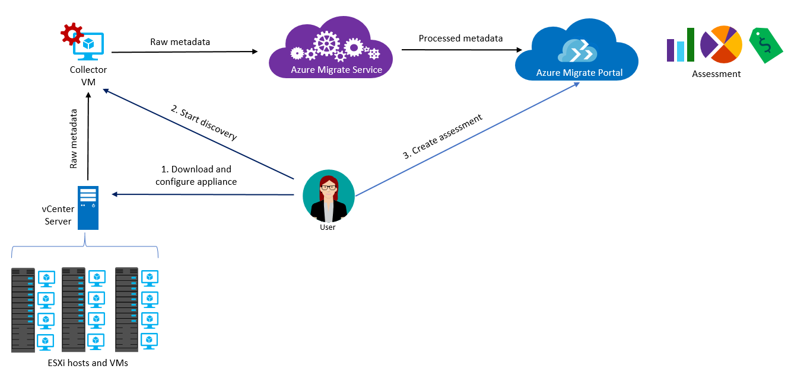

Azure Migration enables you to assess your current on-premise workloads. Once assesed, Azure Migration will then make recommendations on the size of VM you'll need to provision.

In your role in the business, you have been asked to plan the migration of their on-premise environment to Azure. As the server workloads are primarily VMware-based, you want to begin with those machines. You want to assess readiness for the move to Azure and identify estimated costs for the resources those machines will consume, so that budgets can be set by the management team.

In this unit, you will look at Azure Migrate, a service you use to assess readiness and assist with migration to Azure from an on-premise environment.

## What is Azure Migrate?

Azure Migrate is a service provided by Microsoft that allows the assessment of on-premise VMware virtual machines for their suitability to run in Azure. The service helps with the performance-based sizing calculations (virtual machine sizing, compute/storage) of those machines planned to be migrated, and this then allows you to estimate the ongoing cost of running the service. Finally, the service allows the visualization of dependencies for those machines and helps you to create groups, so they can be assessed and ultimately migrated to Azure together.

However, Azure Migrate has limitations and can currently only be used to assess VMware-based virtual machines. When you use Azure Migrate, the assessments produced are created within a **Project**, which is set up within the Azure portal. Each project has the capacity to discover up to 1,500 VMs with extra projects being created to assess more when required. Up to 20 projects can be created per Azure subscription.

## Customizing an assessment

When you first set up an assessment, it can be customized to your specific requirements. Some of the settings available are explored below:

- **Target location** - Specifies the location you wish to migrate to.
- **Storage type**- Specifies the type of disk you wish to allocate to the virtual machines that are part of your assessment. The options are premium disks (the default), standard SSD or standard HDD disks. Premium managed disks are, in the majority of scenarios, likely to be the most suitable as they guarantee a 99.9% SLA (Service Level Agreement) for the machine. By contrast, Test/Dev machines may be more suited to standard SSD or standard HDD disks because they are cheaper and don't need the SLA that's required for a production machine.
- **Reserved instance** - Specifies whether you already have a reserved instance in Azure that's waiting for your migration to take place. When you use this method to set up an environment, you would pre-purchase a region, type of VM, and subscription period to achieve a saving over other pricing models.
- **Sizing criteria** - Choose whether the machines are sized either by their performance history – which is the default – or as on-premise machines without considering the historical performance data.
- **Performance history** - Specifies the timescale that the period of performance history should be based on – the default being the last day.
- **Comfort factor** - Specifies a buffer on top of the collected statistics from the assessment for the virtual machine. It focuses on CPU, memory, disk and network and, amongst other things, takes into account any short-term spikes in performance and headroom for future growth.
- **Virtual machine series**- Specifies what series of virtual machine are available as targets for the assessment. For example, a type A VM is most suited to low compute powered test or development machines and a type H is preferred for high-performance computing. If there were no workloads you wished to run as a type A virtual machine, that could be excluded here.
- **Virtual machine uptime**- If the virtual machines being assessed are not due to be run 24 hours per day 7 days a week when they reach their target location in Azure, the actual uptime can be specified so that costs are calculated accordingly.

## Working with Azure Migrate

You've learned about the customizations that are available when you're running an assessment, now you'll see how Azure Migrate works and look at some of the relevant considerations during its initial setup.

Before creating a **Project**, you may wish to define the various types of VM workloads you have into different groups, so they're assessed, and potentially migrated together. For example, you might group all servers that run a common application. Once the group is defined, you create the assessment in your project.

After you create a **Project** and the required customizations are in place, you'll download the **Collector Appliance**, which carries out the discovery of your environment. You'll find the appliance within the **Discover Machines** link in the project. The Collector Appliance is in the OVA (Open Virtualization Appliance) format and should be imported as a virtual machine into your on-premises vCenter server. Once imported, the appliance can be connected to the vCenter.

Once inside the Collector Appliance, you run the collector to start the discovery. The collector uses VMware PowerCLI cmdlets to perform an agentless data collection on your VMware estate. The collector collects data from VM cores, memory, disk sizes, and network adapters. Where applicable the collector also gathers performance data like CPU and memory usage, disk IOPS, disk throughput, and network output.

When data collection is complete, it's pushed to your Azure Migrate project where you can view it in the portal or download for review.

Azure Migrate requires that you open port 443 between:
- The collector and the Azure Migrate service
- The collector and the vCenter Server
- The on-premise VM and Log Analytics Workplace

You'll see an overview diagram of the service below:

<!-- TODO: Insert picture similar to this, Azure Migrate Architecture -->

