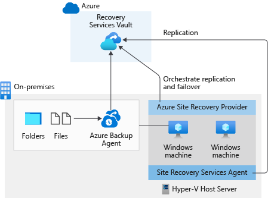

You can use Azure Site Recovery as part of your organization's disaster recovery process.

Your organization has multiple workloads, some running in the cloud and some remaining on-premises. To protect these workloads, you'll need to understand how to use Site Recovery as part of your BCDR plan, and how it can be used with other Azure solutions.

In this unit, you'll see how Site Recovery simplifies your BCDR process. You'll see the different types of machines and scenarios that are supported with Site Recovery. And you'll learn how to integrate your existing network with Site Recovery.

## Simplify your BCDR with Site Recovery

Site Recovery helps you simplify your BCDR. You can configure and manage your replication, failover, and failback, all through the Azure portal, Azure CLI, or Azure PowerShell. Use Site Recovery to replicate different types of targets. For example, Site Recovery can help you configure disaster recovery for Azure virtual machines. You can replicate Azure virtual machines from a primary to a secondary region. Your on-premises virtual machines can be replicated too, along with workloads such as SQL Server.

When you replicate over to Azure, the replicated virtual machine disks go into Azure storage and are kept resilient as a result. If a failover is triggered, Azure virtual machines are created for you, using the disks replicated from the source.

Site Recovery helps you meet your recovery time objective because it can perform continuous replication for your virtual machines. Replication can occur as often as every 30 seconds for your virtual machines. This frequency means reduced recovery time objective (RTO).

Site Recovery can recover to application-consistent snapshots. Site Recovery takes snapshots of all data in memory and on disk, and all transactions in process.

Use Site Recovery's recovery plans to group your virtual machines, add scripts, manual actions, and failover, and recover multi-tier applications that are spread across different virtual machines. You can set up Azure automation runbooks to work with your recovery plans and automate steps necessary to recover systems.

Always test your disaster recovery plan. Site Recovery lets you run disaster recovery tests with no disruption to your running replication.

If you're using other BCDR technologies, you may be able to integrate them too. For example, if you're using SQL Server Always On to protect databases, you can use Site Recovery to help manage failover of your availability groups.

## Implement a solution using Site Recovery and Azure Backup

Let's look at a solution that incorporates Azure Backup and Site Recovery.

Here we have an on-premises environment that has a Hyper-V host server for hosting virtual machines. You want to back up all the files and folders in this virtual machine to Azure. You also want to protect any workloads running on the virtual machine, and keep running them even if the virtual machine fails. Azure Backup and Site Recovery can be used together as part of a single solution.

You can configure both backup and site recovery for your infrastructure from a Recovery Services vault. For Azure Backup, identify where workloads are running, and what you want to back up. In this example, workloads are running on-premises, and you would be backing up files and folders. You then install any necessary agents before initiating or scheduling a backup into Azure.

For Site Recovery, set your protection goal to define where machines are located, and where you want to replicate them. You then run a deployment planner to help Site Recovery estimate whether you'll meet network bandwidth, storage capacity, and other requirements. You then prepare your source and target environments by installing a configuration server, if necessary. Finally, you'll enable replication and protect your virtual machines.

In this scenario, Azure Backup periodically backs up the files and folders on the Windows machine to Azure. This process ensures they are secure and retrievable even if the whole on-premises environment stops functioning. Separately, Site Recovery will be used to protect running workloads and keep them running. Because Site Recovery can replicate frequently, the RTO for your workloads can be reduced.

To configure the backup portion of your solution in this scenario, and to protect files and folders, you download and install the Microsoft Azure Recovery Services (MARS) agent. You can then create backup policies and automatically back up your data on a scheduled basis. The MARS agent also lets you restore all your data to either the same source machine, or to an entirely different machine. With Azure Backup, your data is also encrypted before it's backed up.

To set up Site Recovery, you install the Site Recovery Services agent and a Site Recovery Provider on the Hyper-V server. These tools are used for replication and orchestration of failover to Azure. When a failover is triggered, new virtual machines can be created for you based on the machines that have been protected by Site Recovery.

## Integrate your on-premises network with Site Recovery

You can keep your private IP addresses from on-premises machines and use them for target Azure machines. You create a virtual network in Azure where your virtual machines will be provisioned when failover is triggered. This network acts as an extension of your on-premises network. As part of your failover, you'll need establish or configure a site-to-site VPN connection or leverage ExpressRoute for connectivity between Azure and on-premises networks.

## Protect different scenarios with Site Recovery

Site Recovery allows replication of different types of machines in different scenarios. You can protect:

- Azure virtual machines and replicate them from a source region to different target region.
- On-premises virtual machines to Azure, whether they're Hyper-V or VMware based.
- Physical servers running Linux or Windows.
- Virtual machines hosted on other cloud providers.

You can also replicate both Hyper-V and VMware-based machines (managed by System Center), and your physical servers to your own secondary site. Site Recovery replicates any of your workloads that are running on the machines that are supported.
