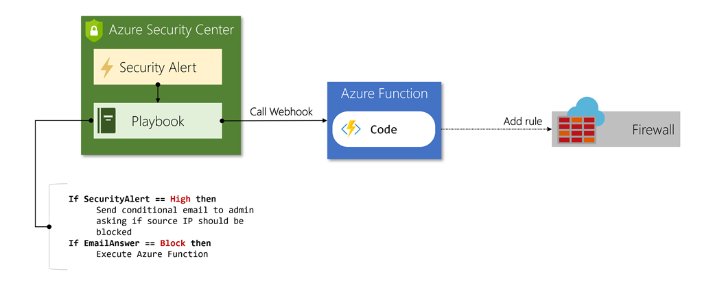

Often, the response for a specific security threat is well-known, and if performed quickly, can turn an outage or data disclosure into a minor annoyance. For example, when a denial-of-service attack is detected from an IP range, a typical response might be to block that IP range at the firewall.

Azure Security Center provides a new preview feature called _Playbooks_ to execute these sorts of responses when specific security alerts are detected.

> [!NOTE]
> Sometimes, an incident response plan is referred to as a security playbook. Azure Security Center uses this term specifically to represent these automated actions, not as your overall response plan.

## What is security playbook in Azure Security Center?

Security playbook is a collection of procedures grouped together that the security response team can execute with a single click in Security Center when a certain alert is detected. These actions are _not_ automatically triggered - they require human interaction to run.

Security playbooks are built on **Azure Logic Apps**. You can easily customize the logic and workflow using the visual workflow designer. You can either start with an existing Logic App, or create a new Logic App and use Security Center to trigger it when an alert is generated.

Some of the pre-built actions are:

- Create an automated incident report in another system, filling in fields from the active alert
- Email a distribution group with details about the active alert(s)
- Send a notification to a Teams or Slack channel

However, because Logic Apps can integrate Azure Functions and webhooks, the possible actions are endless. Imagine a case where a client is misusing your service and it's generating an alert in Security Center. We can create a custom Azure Function to take the source IP address from the alert and create a rule in our firewall to block all inbound traffic from that address. A visual representation of this might look something like this:

