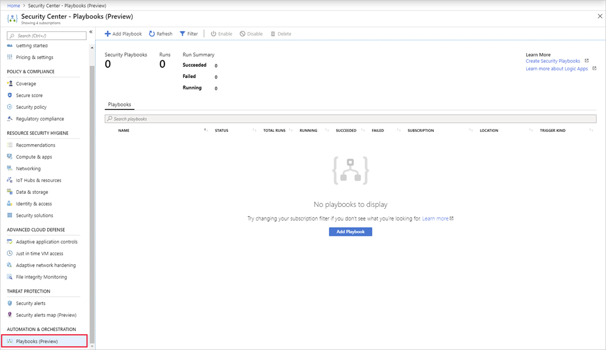
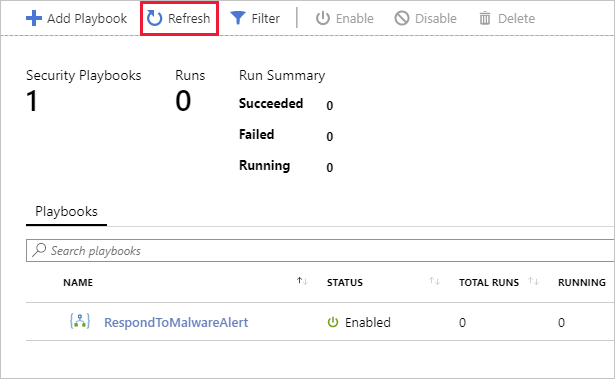
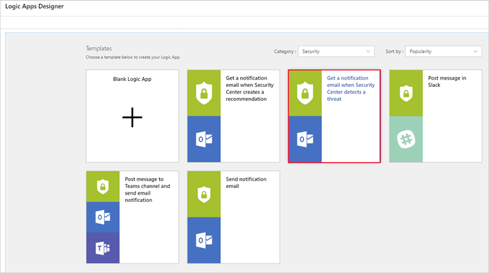
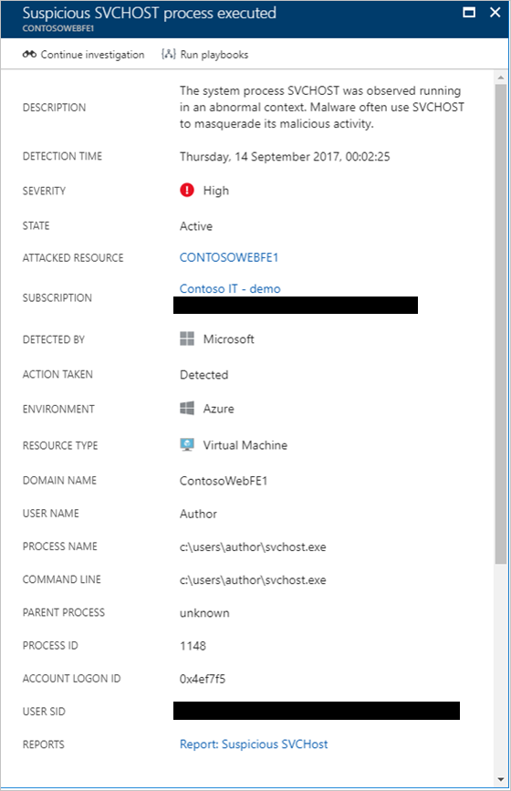

Security playbooks are created directly in the Security Center portal. You will need an Office 365 email account to use this specific set of instructions - if you don't have one, try changing the instructions below to use a different template, or create a Blank Logic App.

1. Under **Automation & Orchestration** in the Azure Security Center left panel, select **Playbooks (Preview).**

    

1. Select the **Add** button to create a new Logic App to use as a playbook.

1. In the **Logic App** panel, enter the following information:
    - **Name**: _RespondToMalwareAlert_
    - **Subscription**: _Concierge Subscription_
    - **Resource group**: select _Use existing_ and pick <rgn>[Learn resource group]</rgn> from the drop-down list
    - **Location**: select any valid location near you - if it fails to create, try a different location
    - **Log Analytics**: select _Off_

1. Select **Create** to create the Logic app. This will return you to the Playbooks screen. You can select the **Refresh** button from the top toolbar until the app shows up.

    

1. Select your logic app to edit it. The **Logic Apps Designer** will appear.

1. Select **Get a notification email when Security Center detects a threat** as shown below. You could also select **Blank Logic App** if you wanted to create some custom logic to run in response to an alert.

    

1. Select **Use this template** to create the app.

1. Provide credentials for Office 365 to connect your email account.

1. Select **Create** on the **Azure Security Center Alert** connection.

1. Specify a target email address to send the notification to.

1. You can use the **+ Next step** to create additional logic steps in the flow. In this case, we don't need any more so select **Save** from the menu at the top.

## Run a security playbook

You can run playbooks from the Security Center dashboard.

1. Navigate back to the Security Center dashboard. You can use the breadcrumb bar at the top to back up.

1. Under **Threat Detection**, select **Security incidents & alerts**.

1. Select an alert and at the top of the alert's page, select the **Run playbooks** button.

    

1. In the Playbooks page, select the playbook that you want to run, and select the **Run** button. If you want to see the playbook before triggering, you can select it, and the designer will open.

