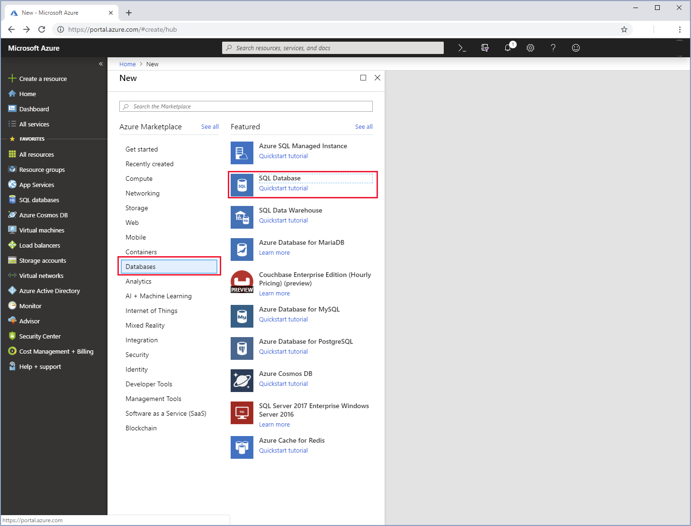
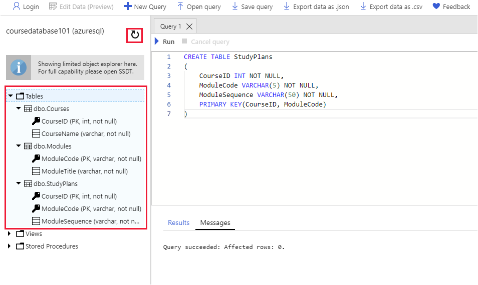

Azure SQL Database runs as a cloud service. The simplest way to create a database is to use the Azure portal. You can import data to a database in many different ways, but if you want to insert a large number of rows quickly, use the bulk copy command, **bcp**. Once you have the data in your tables, you can run some queries. The Azure portal provides the Query Editor for defining queries graphically, or you can use the **sqlcmd** utility from the Cloud Shell if you're familiar with SQL.

The educational institute currently stores their data in a series of comma-delimited files. You need to migrate this data to Azure SQL Database.

In this exercise, you'll create an instance of the Azure SQL Database service and a database. Next, you'll create tables and import data into the database. Finally, you'll query the data using the Query Editor and the **sqlcmd** utility.

## Create an Azure SQL Database instance and database

[!include[](../../../includes/azure-sandbox-activate.md)]

1. Sign in to the [Azure portal](https://portal.azure.com/learn.docs.microsoft.com?azure-portal=true) using your MSLearn account.

1. In the left-hand pane, click **+ Create a resource**, select **Databases**, and then click **SQL Database**.

    [!include[](../../../includes/azure-sandbox-regions-first-mention-note-friendly.md)]

    

1. On the **Create SQL Database** page, specify the values in the following table for the properties of the database.

    > [!NOTE]
    > The database must have a unique name. We suggest using something like **coursedatabase*nnn*** where *nnn* is a random number. Use this name wherever you see *\<your-database-name\>* in this exercise.

    | Property  | Value  |
    |---|---|
    | Subscription | Concierge Subscription  |
    | Resource Group | Use the existing resource group |
    | Database name | *\<your-database-name\>* |
    | Server | Click **Create new**, and enter the details shown in the table below |
    | Want to use SQL elastic pool? | No |
    | Compute + storage | Standard S0 |

    For the server, specify the following details in the **New server** pane, and then click **Select**:

    | Property  | Value  |
    |---|---|
    | Server name | courseserver*nnn*  (use the same number that you selected for the database) |
    | Server admin login | azuresql |
    | Password | Pa55w.rd |
    | Confirm password | Pa55w.rd |
    | Location | Accept the default location |
    | Allow Azure services to access server | Selected |

1. Click **Review + create**.

1. Click **Create**, and wait for the server and database to be created before continuing.

## Create the tables

1. In the left-hand pane of the Azure portal, click **SQL databases**

1. On the **SQL databases** page, click ***\<your-database-name\>***

1. On the ***\<your-database-name\>*** page, under **Overview**, click **Query editor**.

    

1. On the ***\<your-database-name\>* - Query editor** page, enter the following details, and then click **OK** to connect to database service:

    | Property  | Value  |
    |---|---|
    | Authorization type | SQL server authentication |
    | Login | azuresql |
    | Password | Pa55w.rd |

1. In the **Query 1** pane, enter the following SQL statement, and then click **Run**. This statement creates a new table for holding course information. Verify that the statement runs without any errors:

    ```SQL
    CREATE TABLE Courses
    (
        CourseID INT NOT NULL PRIMARY KEY,
        CourseName VARCHAR(50) NOT NULL
    )
    ```

    

1. Overwrite the existing statement with the following statement that creates a table for holding modules. Click **Run** and verify that the statement runs without any errors. A student taking a course has to complete a number of modules.

    ```SQL
    CREATE TABLE Modules
    (
        ModuleCode VARCHAR(5) NOT NULL PRIMARY KEY,
        ModuleTitle VARCHAR(50) NOT NULL
    )
    ```

1. Change the statement to create another table named **StudyPlans**, and then click **Run**. This table maps courses to modules; it indicates which modules a student has to pass to complete a course successfully. The **ModuleSequence** column specifies the order in which the student should take each module. For example, the student should take module CS101, *Introduction to Computer Science*, before attempting module CS102, *Java Programming*.

    ```SQL
    CREATE TABLE StudyPlans
    (
        CourseID INT NOT NULL,
        ModuleCode VARCHAR(5) NOT NULL,
        ModuleSequence VARCHAR(50) NOT NULL,
        PRIMARY KEY(CourseID, ModuleCode)
    )
    ```

1. In the database window, click the **Refresh** button in the toolbar. Then expand **Tables**, and expand each table in turn. You should see the three tables, **dbo.Courses**, **dbo.Modules**, and **dbo.StudyPlans**, together with the columns and primary key for each table.

    > [NOTE!]
    > *dbo* stands for *database owner*, and is the default schema in the database. All three tables were created in this schema.

    

## Import the data

## Query the data
