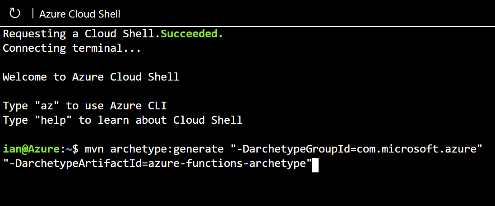

In the previous unit, you learned how you can use Maven archetypes to create Java projects, and how you can set up your development projects using the `azure-functions-archetype` to create Azure Function projects.

In order to begin the process of simplifying your company's event reporting, you want to create a Java application to help you understand the steps you'll need to take to move your event reporting logic into Azure Functions.

In this exercise, you'll create an Azure Function using the Maven archetype using the Azure Cloud Shell, and you'll verify that all of the project files are correctly configured.

## Create an Azure Function with Maven

You're now going to create an Azure Function using Maven. This exercise will use the Azure Cloud Shell available from your sandbox.

1. Activate the sandbox, and wait for the Azure Cloud Shell terminal to open.

1. Run the following Maven command to build a new project using the `azure-functions-archetype`:

    ```bash
    mvn archetype:generate \
      -DarchetypeGroupId="com.microsoft.azure" \
      -DarchetypeArtifactId="azure-functions-archetype"
    ```

    The following screenshot illustrates what that command will look like in the Cloud Shell.

    

    Maven downloads all of the required artifacts and libraries, and prompts you to enter the values that are necessary to customize your application. Use the following table to specify the correct values.

    | Field | Value | Description |
    |---|---|---|
    | `groupId` | *com.contoso.functions* | Specifies the group ID for your application, in reverse domain format. |
    | `artifactId` | *event-reporting* | Specifies the artifact ID for your application, which is typically your function name. |
    | `version` | *Accept the default* | Specifies the version for your application; for this exercise, the default is fine. |
    | `package` | *Accept the default* | Specifies the name of the Java package for your application. |

1. Maven prompts you to confirm the properties for the configuration of the Azure Function. Enter **Y** to confirm and press return.

1. When Maven has finished building your project, you'll see a summary of the parameters you specified in the confirmation message. 

    ```output
    [INFO] ----------------------------------------------------------------------------
    [INFO] Using following parameters for creating project from Archetype: azure-functions-archetype:1.26
    [INFO] ----------------------------------------------------------------------------
    [INFO] Parameter: groupId, Value: com.contoso.functions
    [INFO] Parameter: artifactId, Value: event-reporting
    [INFO] Parameter: version, Value: 1.0-SNAPSHOT
    [INFO] Parameter: package, Value: com.contoso.functions
    [INFO] Parameter: packageInPathFormat, Value: com/contoso/functions
    [INFO] Parameter: package, Value: com.contoso.functions
    [INFO] Parameter: version, Value: 1.0-SNAPSHOT
    [INFO] Parameter: groupId, Value: com.contoso.functions
    [INFO] Parameter: docker, Value: false
    [INFO] Parameter: artifactId, Value: event-reporting
    [INFO] Executing META-INF/archetype-post-generate.groovy post-generation script
    [INFO] Project created from Archetype in dir: /home/user/event-reporting
    [INFO] ------------------------------------------------------------------------
    [INFO] BUILD SUCCESS
    [INFO] ------------------------------------------------------------------------
    [INFO] Total time: 03:49 min
    [INFO] Finished at: 2020-01-11T01:10:10+00:00
    [INFO] Final Memory: 23M/142M
    [INFO] ------------------------------------------------------------------------
    ```

Congratulations! You've created your Azure Function.

<!-- NOTE: These values were required for the 1.24 version of the archetype.
    | `appName` | *Accept the default* |
    | `appRegion` | *Accept the default* |
    | `resourceGroup` | *<rgn>[sandbox resource group name]</rgn>* |
    | `docker` | *Accept the default* |
-->
