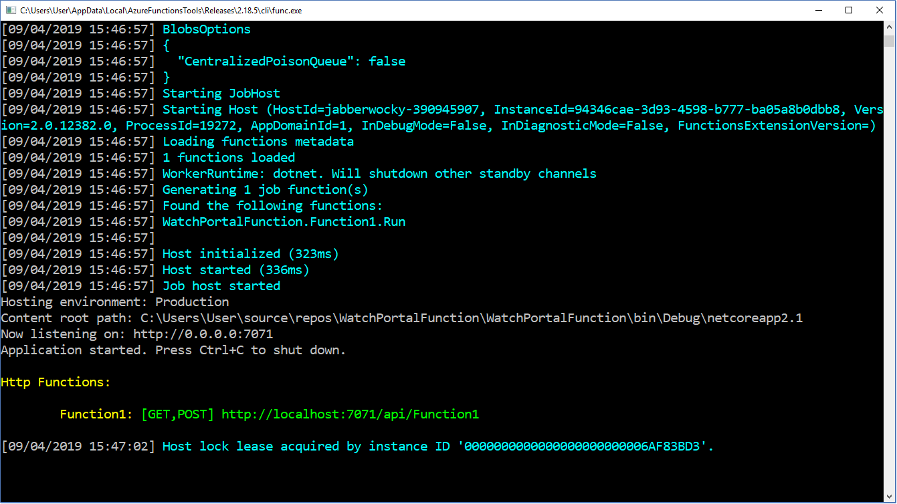
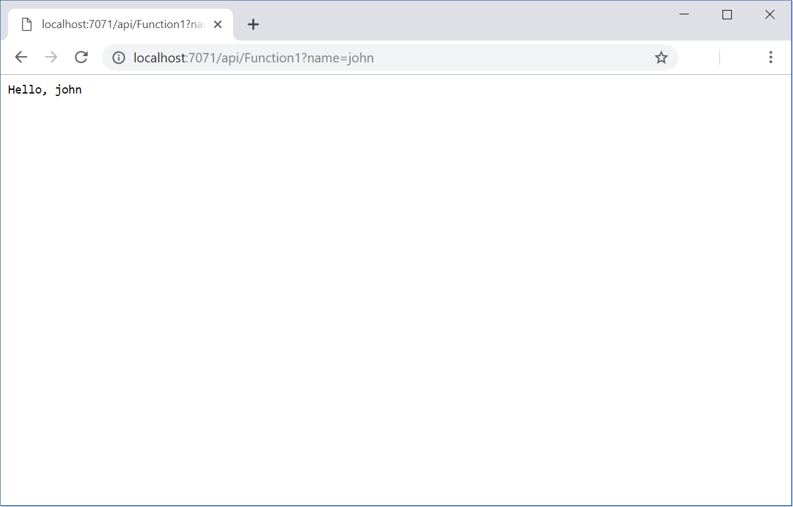

You can write, debug, and deploy an Azure Function from within the Azure portal. However, there are many scenarios when writing functions directly in the production, staging, or test environments might not be suitable. For example, you could be writing automated unit tests for Azure Functions, or using on-demand deployment of Azure Functions to Azure Function Apps in Azure. Additionally, many developers prefer to use their favorite code editor and development tools rather than the environment provided by the Azure portal. Developing functions with Visual Studio enables you to manage Azure Functions code with code of other services inside the same projects.

In the luxury watch online website scenario, the developers are already familiar with Visual Studio 2019 (hereafter referred to as Visual Studio). So, you decide to use Visual Studio as the primary development environment for creating Azure Functions. Additionally, Visual Studio provides an excellent environment for testing your functions locally before deploying them to Azure.

In this unit, you'll learn about the tools available with Visual Studio for building Azure Functions. To build and test an Azure Function locally, you'll see how to install these tools, and use them.

## Modify Visual Studio Install

Upon loading Visual Studio 2019, go to **Visual Studio Installer**, and select **Modify.** The **Modifying - Visual Studio** page appears.

:::image type="content" source="../media/2-visual-studio-installer-modify.png" alt-text="Screenshot of the Visual Studio Installer page with Modify button." loc-scope="vs":::

The **Modifying - Visual Studio** page appears. Under the **Workloads** tab, select the **ASP.NET and Web development** and **Azure development** boxes, and then select **Modify**.

:::image type="content" source="../media/2-visual-studio-workloads.png" alt-text="Screenshot of the Visual Studio Modifying page with Workloads tab." loc-scope="vs":::

## Azure Functions Tools extension for Visual Studio

The Azure Functions Tools are a Visual Studio extension that enable you to create, test, and deploy Azure Functions in your local development environment. To quickly create a new Azure Function App, this extension provides a template that you can use. You can then deploy an Azure Function directly to Azure from Visual Studio. The **Azure Functions and Web Jobs Tools** extension is included in Visual Studio 2019.

## Azure Function App

An Azure Function App hosts one or more Azure Functions. It provides the environment and runtime for the functions.

An Azure Function is triggered by an event rather than being called directly from an app. You specify the type of event that will trigger the functions in your Azure Function App. The events available include:

- **Blob trigger**. This type of function runs when a file is uploaded or modified in Azure Blob storage.
- **Event Hub trigger**. An Event Hub trigger runs the function when an Event Hub receives a message.
- **Azure Cosmos DB trigger**. This trigger runs when a document is added to, or modified in, an Azure Cosmos DB database. You can use this trigger to integrate Azure Cosmos DB with other services. For example, if a document representing a customer's order is added to a database, you could use a trigger to send a copy of the order to a queue for processing.
- **Http trigger**. An HTTP trigger runs the function when an HTTP request occurs in a web app. You can also use this trigger to respond to webhooks. A webhook is a callback that occurs when an item hosted by a website is modified. For example, you can create an Azure Function that is fired by a webhook from a GitHub repository when an item in the repository changes.
- **Queue trigger**. This trigger fires the function when a new item is added to an Azure Storage Queue.
- **Service Bus Queue trigger**. Use this trigger to run the function when a new item is added to an Azure Service Bus Queue.
- **Service Bus Topic trigger**. This trigger runs the function in response to a new message arriving on a Service Bus Topic.
- **Timer trigger**. Use this event to run the Azure Function at regular intervals, following a schedule that you define.

:::image type="content" source="../media/2-function-triggers.png" alt-text="Screenshot showing the Azure Function triggers available, with HTTP Trigger highlighted." loc-scope="vs":::

Azure currently provides three versions of the runtime environment required to run Azure Functions. Version 1 (v1) uses the .NET Framework 4.7; version 2 (v2x) runs using .NET Core 2; version 3  (v3x) contains JavaScript and .NET changes. Using v2 triggers enables you to develop and host the trigger in different environments. Version 1 triggers can only be created using Windows. Use v2 triggers wherever possible.

An Azure Function App stores management information, code, and logs in Azure Storage. Create a Storage Account to hold this data. The storage account must support Azure Blob, Queue, Files, and Table storage; use a general Azure Storage account for this purpose. You specify which storage account to use for the function using the dialog previously shown.

An Azure Function can perform privileged or sensitive operations. An Azure Function triggered by an HTTP request could be exposed publicly. You might need to limit the ability to run this function to selected groups of users. You protect an Azure Function by specifying the access rights required to trigger the function. An Azure Function triggered by an HTTP request supports three levels of access rights:

- **Anonymous**. No authentication is required, and any user can trigger the function.
- **Function**. The HTTP request must provide a key that enables the Azure Function runtime to authorize the request. You create this key separately, and you can maintain it using the Azure portal.
- **Admin**. This is similar to **Function** inasmuch as the user must specify a key with the HTTP request that triggers the function. The difference is that the key is an *admin* key. This key can be used to access any function in the function app. As with a function key, you create this key separately.

If you're creating a function triggered by events other than HTTP requests, you're required to provide a connection string and other details necessary for the function app to access the resource triggering the event. For example, if you're writing a function triggered by a Blob storage event, you must specify the connection string for the corresponding Blob storage account.

## Structure of an Azure Function

An Azure Function is implemented as a static class. The class provides a static, asynchronous method named `Run`, which acts as the entry point for the class.

The parameters passed to the `Run` method provide the context for the trigger. In the case of an HTTP trigger, the function receives an *HttpRequest* object. This object contains the header and body of the request. You can access the data in the request using the same techniques available in any HTTP app. The attributes applied to this function specify the authorization requirements (*Anonymous* in this case), and the HTTP operations to which the Azure function responds (*GET* and *POST*).

The following example code generated by Visual Studio examines the query string provided as part of the URL for the request and looks for a parameter called *name*. The code also uses a *StreamReader* to deserialize the body of the request and attempts to read the value of a property also called *name* from the request. If *name* is found either in the query string or the body of the request, it's returned in the response; otherwise, the function generates an error response with the message *Please pass a name on the query string or in the request body*.

```csharp
public static class Function1
{
    [FunctionName("Function1")]
    public static async Task<IActionResult> Run(
        [HttpTrigger(AuthorizationLevel.Anonymous, "get", "post", Route = null)] HttpRequest req,
        ILogger log)
    {
        log.LogInformation("C# HTTP trigger function processed a request.");

        string name = req.Query["name"];

        string requestBody = await new StreamReader(req.Body).ReadToEndAsync();
        dynamic data = JsonConvert.DeserializeObject(requestBody);
        name = name ?? data?.name;

        return name != null
            ? (ActionResult)new OkObjectResult($"Hello, {name}")
            : new BadRequestObjectResult("Please pass a name on the query string or in the request body");
    }
}
```

The function returns a value containing any output data and results, wrapped in an *IActionResult* object. The value is returned in the body of the HTTP response for the request.

Different types of trigger receive different input parameters and return types. The next example shows the code generated for a Blob trigger. In this example, the contents of the blob is made accessible through a *Stream* object, and the name of the blob is also provided. No data is returned by the trigger; its purpose is to read and process the data in the named blob.

```csharp
public static class Function2
{
    [FunctionName("Function2")]
    public static void Run([BlobTrigger("samples-workitems/{name}", Connection = "xxxxxxxxxxxxxxxxxxxxxxx")]Stream myBlob, string name, ILogger log)
    {
        log.LogInformation($"C# Blob trigger function Processed blob\n Name:{name} \n Size: {myBlob.Length} Bytes");
    }
}
```

In all cases, an Azure Function is passed an *ILogger* parameter. The function can use this parameter to write log messages, which the function app will write to storage for later analysis.

An Azure Function also contains metadata that specify the type of the trigger and any other specific information and security requirements. You can modify this metadata using the *HttpTrigger*, *BlobTrigger*, or other trigger attributes, as shown in the examples. The *FunctionName* attribute that precedes the function is an identifier for the function used by the function app. This name doesn't have to be the same as the name of the function, but it's good practice to keep them synchronized to avoid confusion.

## Test an Azure Function App locally

You can use the Visual Debugger to build and test the Azure Function App locally. Press <kbd>F5</kbd>, or on the **Debug** menu, select **Start Debugging**. The local version of the Function Runtime will start. Your functions will be available for testing. The example shows the runtime hosting the *Function1*. This is the function triggered by an HTTP event. The URL indicates the endpoint to which the function is currently attached.



If you open a web browser and visit this URL, you'll trigger the function. The following image shows the response generated by an HTTP GET request that doesn't include a body. You can see the message generated by the code that returns the *BadRequestObjectResult* object from the function:

:::image type="content" source="../media/2-bad-request.png" alt-text="Screenshot showing the Azure Function Runtime." loc-scope="other"::: <!-- no-loc -->

If you provide a query string that includes a *name* parameter, the value is read and processed by the function.



While the code is running, you'll see trace messages appearing in the Function Runtime window. You can use standard debugging features in Visual Studio if you need to set breakpoints and examine the flow of control in a function.
