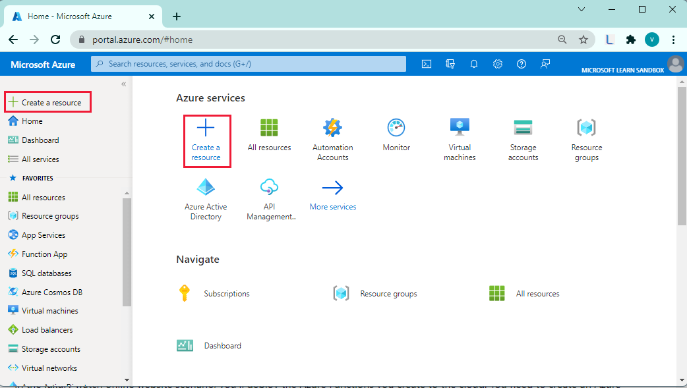
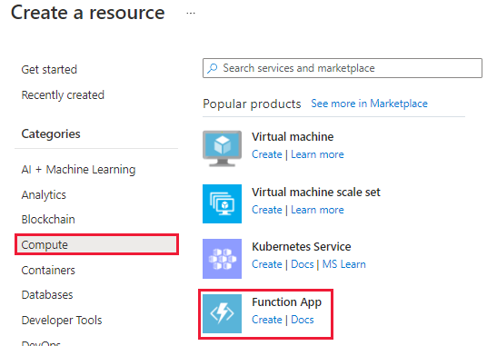

The **Publish** wizard in the Azure Functions template provides the most straightforward way to deploy Azure Functions, especially for testing purposes.

In the luxury watch online website scenario, you've decided to use Visual Studio to deploy your functions to an Azure Function App in the cloud. First, you'll create an Azure Function App, and to deploy your functions, in Visual Studio, you'll use the **Publish** wizard.

In this exercise, you'll see how to use the Azure portal to create an Azure Function App. Then, you'll deploy the **WatchInfo** function. Lastly, you'll test the function to verify that it has been deployed correctly.

## Create an Azure Function App using the Azure portal

1. Sign into the [Azure portal](https://portal.azure.com/learn.docs.microsoft.com?azure-portal=true) using the same account you activated the sandbox with.

1. From the Azure portal home page, under **Azure services**, select **Create a resource**.

    

    The **Create a resource** pane appears.

1. In the left menu pane, select **Compute**, and under *Popular services*, select **Function App**.

    

    <!-- [!include] -->

    The **Create Function App** pane appears.

1. On the **Basics** tab, enter the following values for each setting.

    > [!NOTE]
    > The function app must have a unique name. We suggest using something like **\<*your name or initials*\>watchfunctions**. In this exercise, use this name wherever you see *\<your-function-app-name\>*.

    | Setting | Value |
    | --- | --- |
    | **Project Details** |
    | Subscription | Concierge Subscription  |
    | Resource Group | From the dropdown list, select the existing resource group <rgn>[Sandbox resource group]</rgn> |
    | **Instance Details** |
    | Function App name | *\<your-function-app-name\>* |
    | Publish | Code |
    | Runtime stack | .NET |
    | Version     | 3.1 |
    | Region     | Accept the default location |

1. Select **Next : Hosting**.

1. On the **Hosting** tab, enter the following values for each setting.

    | Setting  | Value |
    | --------- | --------- |
    | **Storage** |
    | Storage account | *Accept the default name* |
    | **Operating system** |
    | Operating System | Windows |
    | **Plan** |
    | Plan type | Consumption (Serverless) |

1. Select **Review + create**, and then select **Create**. Wait while the Function App is created before continuing.

1. After deployment completes, select **Go to resource**. Your Function App pane appears.

## Deploy the WatchInfo function to the Azure Function App

1. On your desktop, return to Visual Studio.

1. In the **Solution Explorer** window, right-click the **WatchPortalFunction** project, and then select **Publish**.

    :::image type="content" source="../media/5-start-publish-from-visual-studio.png" alt-text="Screenshot of Visual Studio, showing the Publish option for the WatchPortalFunctions project." loc-scope="vs":::

    The **Publish** window appears.

1. Select **Azure**, and then select **Next**.

    :::image type="content" source="../media/5-publish-target.png" alt-text="Screenshot of the Publish target window. The user has chosen the Azure option." loc-scope="vs":::

    The **Publish** window reappears.

1. In the **Subscription** dropdown list, select **Concierge Subscription**. In the **View** dropdown list, select **Resource group**, and on top of the **Function Apps** field, select the **+** (Create a new Azure Function) icon.

    :::image type="content" source="../media/5-publish-functions-instance.png" alt-text="Screenshot of the Publish Functions instance window. The user to select Function Apps." loc-scope="vs":::

    The **Function App (Windows)** window appears.

1. Maintain all the default selections but ensure the **Location** field matches what you previously specified in the Azure portal, and then select **Create**.

    :::image type="content" source="../media/5-function-app-windows.png" alt-text="Screenshot of the Function App (Windows) window. The user to select Create." loc-scope="vs":::

    The **Publish** window reappears with the Azure Function App displayed.

1. Select **Finish**.

    :::image type="content" source="../media/5-function-app-publish.png" alt-text="Screenshot of the Function App (Windows) window. The user to select Finish." loc-scope="vs":::

    The **Publish** window reappears again.

1. Select **Publish**.

    :::image type="content" source="../media/5-visual-studio-publish.png" alt-text="[Screenshot of Visual Studio. The user to select Finish." loc-scope="vs":::

    Wait for your functions to be deployed. The **Output** window in Visual Studio shows the progress of the build and publish processes. If everything works, the final two messages should be **Build succeeded** and **Publish succeeded**.

    :::image type="content" source="../media/5-output-window.png" alt-text="Screenshot of the Output window in Visual Studio. The final two messages indicate that the functions were published successfully." loc-scope="vs":::

## Verify the functions have been deployed

1. Return to the Azure portal. Your Function App pane appears.

1. In the middle menu pane, under **Functions**, select **Functions**. The **Functions** pane appears for your Function App.

1. Verify that the **Function1** and  **WatchInfo** functions are listed.

1. In the middle menu pane, select **Overview** and check that the **Status** of the Azure Function App is listed as **Running**.

    :::image type="content" source="../media/5-functions-app.png" alt-text="Screenshot of the Azure Function App in the portal, showing the Function1 and WatchInfo functions." loc-scope="other"::: <!-- no-loc -->

    > [!NOTE]
    > The functions are marked as *Read Only*. You cannot modify their settings or configuration from the Azure portal because you published them from Visual Studio. If you need to update either of these functions, make the changes in Visual Studio and publish them again.

1. In that same Function App pane, select the **URL** (highlighted in the previous image). A browser window opens, and confirms that the Functions app is up and running.

    

1. Append the URL of the **watchinfo** function, `/api/watchinfo` to the URL in the browser, and refresh the display. This invokes the **WatchInfo** function without a query string. You'll see the error response with the message *Please provide a watch model in the query string*.

    :::image type="content" source="../media/5-function-error.png" alt-text="Screenshot of web browser window showing the error message from the function." loc-scope="other"::: <!-- no-loc -->

1. Add the query string `?model=abc`  to the URL and refresh the browser window. This time, you'll see the details of the watch model returned by the function.

    :::image type="content" source="../media/5-function-success.png" alt-text="Screenshot of web browser window showing the details of the watch model returned by the function." loc-scope="other"::: <!-- no-loc -->

You've now created an Azure Function App in the cloud, and published your functions to this app from Visual Studio.
