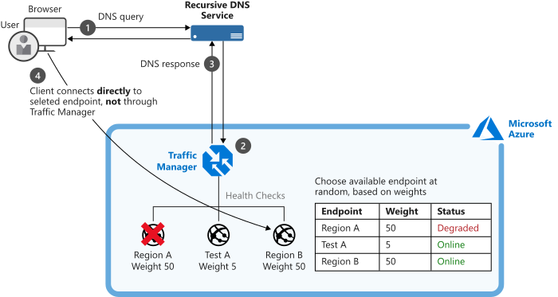
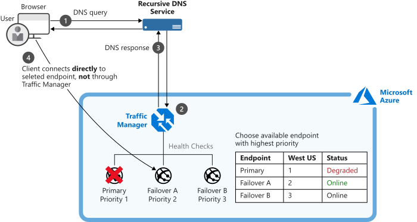

Your customers require 24x7 availability of your company's streaming music application. Cloud services in one region might become unavailable because of technical issues, such as planned maintenance or scheduled security updates. In these scenarios, your company wants to have a failover endpoint so your customers can continue to access its services. To manage routing traffic and to handle these situations, you've decided to implement Azure Traffic Manager.

## How Traffic Manager works

When a client attempts to connect to a service, first it resolves the DNS name of the service as an IP address. The client then connects to that IP address to access the service.

Traffic Manager uses DNS to direct clients to a specific service endpoint IP address based on the rules of the traffic routing method that's used. Clients connect directly to the selected endpoint. Traffic Manager isn't a proxy or gateway. Traffic Manager doesn't see the traffic that passes between the clients and the service; it just gives clients the IP address of where they need to go.

## Traffic Manager endpoints

Endpoints are the destination location that is returned to the client. You configure each application deployment as an 'endpoint' in Traffic Manager. When Traffic Manager receives a DNS request, it chooses an available endpoint to return in the DNS response. There are three types of endpoint supported by Traffic Manager:

- **Azure endpoints** are used for services hosted in Azure. These can be services like Azure App Service, as well as public IP resources that are associated with load balancers or virtual machines.
- **External endpoints** are used for IPv4/IPv6 addresses, FQDNs, or for services hosted outside Azure that can either be on-premises or with a different hosting provider.
- **Nested endpoints** are used to combine Traffic Manager profiles to create more flexible traffic-routing schemes to support the needs of larger, more complex deployments.

There is no restriction on how endpoints of different types are combined in a single Traffic Manager profile. Each profile can contain any mix of endpoint types.

## Traffic Manager routing methods

Traffic Manager supports different methods for choosing how traffic is routed to multiple endpoints. Traffic Manager applies a traffic routing method to each DNS query it receives and determines which endpoint is returned in the response. You can choose from six traffic routing methods.

### Weighted routing

Choose weighted when you want to distribute traffic across a set of endpoints, either evenly or based on different weights. The weight is an integer from 1 to 1,000. For each DNS query received, Traffic Manager randomly chooses an available endpoint. The probability of choosing an endpoint is based on the weights assigned to all available endpoints.

### Performance routing

If you have endpoints in different geographic locations, you can use performance routing to send users to the endpoint that has the best performance for the user. To choose the best endpoint to use, this routing method uses an internet latency table, which actively tracks network latencies to the endpoints from locations around the globe. When a user makes a request, Traffic Manager returns the best performing endpoint based on the location of the request.

### Geographic routing

With the geographic routing method, users are directed to specific endpoints based on where their DNS query originates. Using this method allows you to geo-fence content to specific user regions. For example, European users can be directed to an endpoint in Europe that has specific terms and conditions for regional compliance. Users in China can be directed to an endpoint that has been localized in Mandarin.

### Multivalue routing

You can use the multivalue routing method to get multiple healthy endpoints in a single DNS query response. The caller can make client-side retries with other endpoints if an endpoint is unresponsive. This pattern can increase the availability of a service and reduce the latency associated with a new DNS query to obtain a healthy endpoint.

### Subnet routing

This method maps the set of user IP address ranges to specific endpoints within a Traffic Manager profile. When a request is received, the endpoint returned will be the one mapped for that request's source IP address. For example, using subnet routing, a customer can route all requests from their corporate office to a different endpoint, where they might be testing an internal-only version of the app. Another scenario is if you want to provide a different experience to users who connect from a specific ISP (for example, to block users from a specific ISP).

### Priority routing

The Traffic Manager profile contains a prioritized list of service endpoints. By default, Traffic Manager sends all traffic to the primary (highest-priority) endpoint. If the primary endpoint isn't available, Traffic Manager routes the traffic to the second endpoint. If both the primary and secondary endpoints are not available, the traffic goes to the third endpoint, and so on. Availability of the endpoint is based on the configured status (enabled or disabled) and the ongoing endpoint monitoring that is set up.

