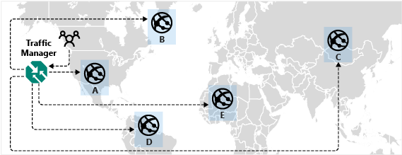

The music-streaming app has users in different regions around the world. Some users are located far from where the application is deployed. Streaming performance is partially dependent on the distance between a user's device and the host. To offer the best possible performance to your users, you deploy your application in multiple regions. As you add regions, you'd like Traffic Manager to automatically direct the traffic to the best-performing endpoint.

The *performance* traffic routing method connects users with the server that performs best for them. It might be better performing because it's physically closer to the user, but it might also be due to congestion or internet network connectivity. Azure stores historical DNS query latency for connecting clients in an internet latency table. Azure can use this information to direct traffic to the fastest-responding server, which is the server with the lowest latency. Traffic Manager maintains the internet latency table by tracking the roundtrip time between IP address ranges and each Azure datacenter. If an endpoint becomes unavailable, Traffic Manager doesn't include it in DNS query responses.

You don't have to do anything more than configure a Traffic Manager profile and select **Performance** as the routing method. Endpoints don't need to be prioritized; Traffic Manager will route all the traffic automatically to the fastest responding server.

In the following example, if endpoint A stopped performing as efficiently as endpoint B, customer traffic is automatically routed to endpoint B.

Client traffic is routed consistently. A client is directed to the same endpoint for each request it makes if nothing changes in the underlying servers and networking. If you need more granular control (for example, to choose a preferred failover within a region), you can use Traffic Manager in a nested configuration.
